# 네비게이션 주행 엔진 설계

> 작성일: 2026-03-30
> 기반 문서: 01_Requirements.md

---

## 1. 전체 아키텍처

### 1.1 계층 구조

```
┌─────────────────────────────────────────────────────────┐
│  Layer 3: Presentation (UIKit + SwiftUI)                 │
│  ┌──────────────┐  ┌──────────────┐  ┌───────────────┐  │
│  │ManeuverBanner│  │  BottomBar   │  │  Speedometer  │  │
│  └──────┬───────┘  └──────┬───────┘  └───────┬───────┘  │
│         └──────────────────┼──────────────────┘          │
│                            │ NavigationGuide (구독)       │
├────────────────────────────┼─────────────────────────────┤
│  Layer 2: Bridge                                         │
│  ┌─────────────────────────┴─────────────────────────┐  │
│  │          NavigationSessionManager (싱글톤)          │  │
│  │  guidePublisher: CurrentValueSubject<Guide, Never> │  │
│  └─────────────────────────┬─────────────────────────┘  │
│                            │                             │
│  ┌─────────────┐  ┌───────┴────────┐  ┌──────────────┐ │
│  │  iPhone UI  │  │ NavigationEngine│  │  CarPlay UI  │ │
│  │ (구독자)     │  │  (발행자)       │  │  (구독자)     │ │
│  └─────────────┘  └───────┬────────┘  └──────────────┘ │
├────────────────────────────┼─────────────────────────────┤
│  Layer 1: Core Engine (순수 Swift, UI 무관)               │
│  ┌──────────────┐  ┌──────┴───────┐  ┌──────────────┐  │
│  │  MapMatcher   │  │ RouteTracker │  │  VoiceEngine │  │
│  │ (폴리라인스냅) │  │ (스텝 진행)   │  │ (트리거 판정) │  │
│  └──────┬───────┘  └──────┬───────┘  └──────┬───────┘  │
│  ┌──────┴───────┐  ┌──────┴───────┐  ┌──────┴───────┐  │
│  │OffRouteDetect│  │DeadReckoning │  │ StateManager │  │
│  │ (이탈 감지)   │  │ (GPS 손실)   │  │ (상태 머신)   │  │
│  └──────────────┘  └──────────────┘  └──────────────┘  │
└─────────────────────────────────────────────────────────┘
```

### 1.2 데이터 플로우 (GPS valid/invalid 분기)

```
GPSProvider (1초 틱 보장)
    │ GPSData
    ▼
NavigationEngine.tick(gps:)              ← Background 스레드
    │
    ├─ if GPS valid:
    │   ├─ [1] MapMatcher.match(gps)
    │   │       → MatchResult (매칭 좌표, 세그먼트 인덱스, 성공/실패)
    │   │       매칭 성공 시 → DeadReckoning.updateLastValid()
    │   │
    │   ├─ [2] OffRouteDetector.update(matchResult, gpsAccuracy)
    │   │       → 이탈 여부 (연속 3회 실패 시)
    │   │
    │   └─ matchedPosition = matchResult.coordinate
    │
    ├─ if GPS invalid:
    │   ├─ [1] DeadReckoning.estimate()
    │   │       → DeadReckoningResult (추정 좌표, heading, segmentIndex)
    │   │       맵매칭/이탈감지 스킵 (터널 등에서 오판 방지)
    │   │
    │   └─ matchedPosition = deadReckoningResult.coordinate
    │
    ├─ [3] RouteTracker.update(matchedPosition)
    │       → RouteProgress (currentStep, nextStep, 남은 거리/시간/ETA)
    │
    ├─ [4] StateManager.update(matchResult, offRoute, remainingDistance)
    │       → NavigationState 전이
    │
    ├─ [5] VoiceEngine.check(distanceToManeuver, speed, stepIndex, step, provider)
    │       → VoiceCommand? (트리거 판정만, 재생은 Presentation)
    │
    └─ [6] NavigationGuide 조립 → guidePublisher.send()
         │
         │  조립 데이터 소스:
         │  ┌──────────────────────┬──────────────────────────┐
         │  │ NavigationGuide 필드  │ 소스                      │
         │  ├──────────────────────┼──────────────────────────┤
         │  │ state                │ [4] StateManager          │
         │  │ currentManeuver      │ [3] RouteProgress → 변환  │
         │  │ nextManeuver         │ [3] RouteProgress → 변환  │
         │  │ remainingDistance     │ [3] RouteProgress         │
         │  │ remainingTime        │ [3] RouteProgress         │
         │  │ eta                  │ [3] RouteProgress         │
         │  │ matchedPosition      │ [1] MatchResult 또는      │
         │  │                      │     DeadReckoningResult   │
         │  │ heading              │ 세그먼트 방향 또는 DR heading│
         │  │ speed                │ GPSData.speed             │
         │  │ isGPSValid           │ GPSData.isValid           │
         │  │ voiceCommand         │ [5] VoiceEngine           │
         │  └──────────────────────┴──────────────────────────┘
                                     │
                          ┌──────────┼──────────┐
                          ▼          ▼          ▼
                     iPhone UI   CarPlay    VoiceTTS
                    (MainActor) (MainActor) (MainActor)
```

### 1.3 엔진 1틱 시퀀스 다이어그램

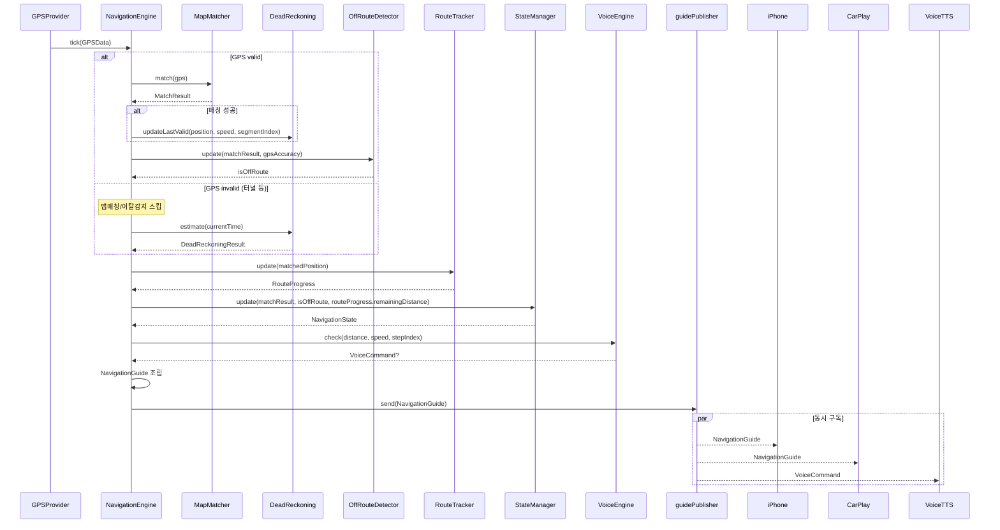

---

## 2. 핵심 데이터 모델

### 2.1 GPSData (엔진 입력)

```swift
struct GPSData: Sendable {
    let coordinate: CLLocationCoordinate2D
    let heading: CLLocationDirection          // 0~360
    let speed: CLLocationSpeed                // m/s
    let accuracy: CLLocationAccuracy          // meters
    let timestamp: Date
    let isValid: Bool                         // GPS 수신 여부
}
```

### 2.2 NavigationGuide (엔진 출력 — 단일 구조체)

```swift
struct NavigationGuide: Sendable {
    let state: NavigationState
    let currentManeuver: ManeuverInfo?
    let nextManeuver: ManeuverInfo?
    let remainingDistance: CLLocationDistance
    let remainingTime: TimeInterval
    let eta: Date
    let matchedPosition: CLLocationCoordinate2D
    let heading: CLLocationDirection
    let speed: CLLocationSpeed
    let isGPSValid: Bool
    let voiceCommand: VoiceCommand?
}
```

### 2.3 NavigationGuide → UI 매핑

```
NavigationGuide
    │
    ├─ state ──────────────→ 전체 UI 상태 제어
    │                         .preparing → 로딩 표시
    │                         .navigating → 정상 주행 UI
    │                         .rerouting → 재탐색 배너 + raw GPS + "--" 표시
    │                         .arrived → 도착 팝업
    │
    ├─ currentManeuver ────→ ManeuverBanner (상단)
    │   ├─ turnType.iconName → 회전 아이콘 (SF Symbol)
    │   ├─ distance ────────→ "300m"
    │   ├─ instruction ────→ "우회전하세요"
    │   └─ roadName ───────→ "테헤란로 방면" (있으면)
    │
    ├─ nextManeuver ───────→ ManeuverBanner 하단 (간략)
    │   └─ "이후 1.2km 좌회전"
    │
    ├─ remainingDistance ──→ BottomBar "12.5km" (rerouting 시 "--")
    ├─ remainingTime ─────→ BottomBar "18분" (rerouting 시 "--")
    ├─ eta ───────────────→ BottomBar "14:32 도착" (rerouting 시 "--:--")
    │
    ├─ speed ─────────────→ Speedometer "58km/h"
    │
    ├─ matchedPosition ───→ LocationInterpolator.setTarget()
    ├─ heading ───────────→ LocationInterpolator.setTarget()
    │                         → CADisplayLink 60fps 보간
    │                         → vehicleAnnotation.coordinate
    │                         → mapView.camera
    │
    ├─ isGPSValid ────────→ GPS 상태 아이콘 표시/숨김
    │
    └─ voiceCommand ──────→ VoiceTTSPlayer.enqueue()
```

### 2.4 ManeuverInfo

```swift
struct ManeuverInfo: Sendable {
    let instruction: String
    let distance: CLLocationDistance
    let turnType: TurnType
    let roadName: String?
}
```

### 2.5 TurnType + 아이콘 매핑

```swift
enum TurnType: Sendable {
    case straight, leftTurn, rightTurn, uTurn
    case leftMerge, rightMerge, leftExit, rightExit
    case destination
    case unknown(String)

    var iconName: String { ... }  // SF Symbol
}
```

```
TurnType          SF Symbol                    표시
─────────         ──────────                   ────
straight          arrow.up                      ↑
leftTurn          arrow.turn.up.left            ↰
rightTurn         arrow.turn.up.right           ↱
uTurn             arrow.uturn.left              ↶
leftMerge         arrow.merge                   ⤙
rightMerge        arrow.merge                   ⤚
leftExit          arrow.turn.up.left            ↰
rightExit         arrow.turn.up.right           ↱
destination       mappin.circle.fill            📍
unknown           arrow.up                      ↑
```

### 2.6 Apple 데이터 누락 필드 처리

```
┌──────────┬────────────────────────────────────────────────────┐
│ 필드      │ 처리                                                │
├──────────┼────────────────────────────────────────────────────┤
│ turnType │ Apple instructions에서 TurnType 추론 시도            │
│          │ Step 1에서 실제 API 호출하여 instructions 값 캡처 후  │
│          │ 한국어 키워드("우회전","좌회전" 등) 파싱 가능 여부 판단│
│          │ AppleModelConverter에서 변환 시 처리                  │
│          │ 추론 불가 시 .unknown(instructions) 유지 (기본 아이콘) │
├──────────┼────────────────────────────────────────────────────┤
│ roadName │ nil → ManeuverBanner에서 해당 줄 숨김               │
│          │ 음성 1200m 안내는 instructions 원본 사용 (도로명 포함)│
│          │ 추가 구현 불필요                                     │
├──────────┼────────────────────────────────────────────────────┤
│ duration │ route.expectedTravelTime × (remainingDistance /     │
│          │ route.distance) 로 남은 시간 추정                    │
│          │ RouteTracker에서 provider별 분기:                    │
│          │   카카오: step별 duration 합산 (정확)                 │
│          │   Apple: 전체 시간 × 남은 거리 비율 (추정)            │
└──────────┴────────────────────────────────────────────────────┘
```

### 2.7 VoiceCommand / NavigationState

```swift
struct VoiceCommand: Sendable {
    let text: String
    let priority: VoicePriority  // normal / urgent
}

enum NavigationState: Sendable {
    case preparing, navigating, rerouting, arrived, stopped
}
```

### 2.7 엔진 내부 모델

```swift
struct MatchResult: Sendable {
    let isMatched: Bool
    let coordinate: CLLocationCoordinate2D
    let segmentIndex: Int
    let distanceFromRoute: CLLocationDistance
    let headingDelta: CLLocationDirection
}

struct DeadReckoningResult: Sendable {
    let coordinate: CLLocationCoordinate2D
    let heading: CLLocationDirection
    let segmentIndex: Int
}

struct RouteProgress: Sendable {
    let currentStep: RouteStep
    let nextStep: RouteStep?
    let currentStepIndex: Int
    let distanceToNextManeuver: CLLocationDistance
    let remainingDistance: CLLocationDistance
    let remainingTime: TimeInterval
    let eta: Date
}

enum RouteProvider: String, Sendable {
    case kakao, apple
}
```

Route 모델에 provider 필드 추가:
```swift
struct Route: Sendable {
    let id: String
    let distance: CLLocationDistance
    let expectedTravelTime: TimeInterval
    var name: String
    let steps: [RouteStep]
    let polylineCoordinates: [CLLocationCoordinate2D]
    let transportMode: TransportMode
    let provider: RouteProvider       // 음성 텍스트 생성 분기에 사용
}
```

---

## 3. 상태 머신

### 3.1 상태 전이도

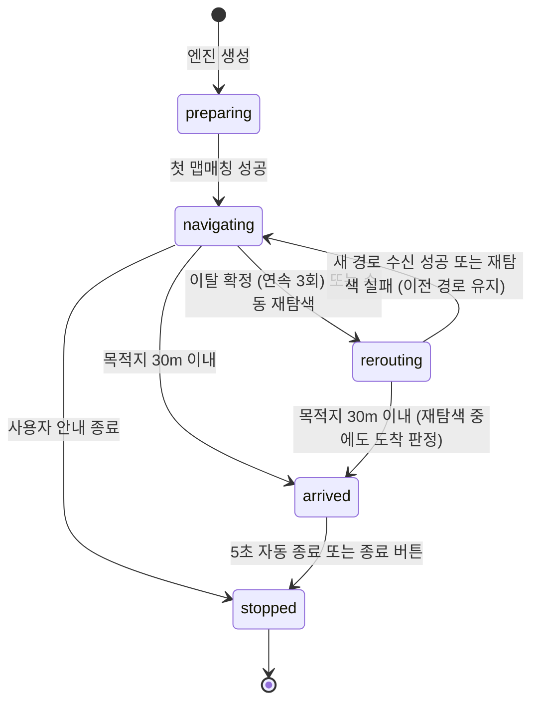

### 3.2 상태별 UI 매핑

```
┌─────────────┬────────────────────────────────────────────┐
│ 상태         │ UI 동작                                     │
├─────────────┼────────────────────────────────────────────┤
│ preparing   │ ManeuverBanner: "경로를 준비 중입니다"        │
│             │ BottomBar: 표시                              │
│             │ 지도: 경로 폴리라인 + 출발지/목적지 마커       │
│             │ 아바타: 현재 GPS 위치                         │
├─────────────┼────────────────────────────────────────────┤
│ navigating  │ ManeuverBanner: current + next 안내          │
│             │ BottomBar: ETA + 남은 거리/시간               │
│             │ 속도계: 현재 속도                             │
│             │ 지도: 아바타 추적 + 카메라 자동                │
│             │ 음성: 거리별 안내                             │
├─────────────┼────────────────────────────────────────────┤
│ rerouting   │ ManeuverBanner: 마지막 안내 유지              │
│             │ RerouteOverlay: "경로를 재탐색 중입니다"       │
│             │ BottomBar: 남은 거리/시간 = "--" 표시         │
│             │ 지도: 아바타 raw GPS 따라 이동 (매칭 없이)     │
│             │ 음성: "경로를 재탐색합니다"                    │
├─────────────┼────────────────────────────────────────────┤
│ arrived     │ ArrivalPopup: "목적지에 도착했습니다"          │
│             │ [주행 종료] 버튼 + 5초 카운트다운              │
│             │ 음성: "목적지에 도착했습니다"                  │
│             │ 지도: 카메라 추적 중단, 현위치 표시            │
├─────────────┼────────────────────────────────────────────┤
│ stopped     │ NavigationViewController dismiss             │
│             │ AppCoordinator → 홈 화면 복귀                │
└─────────────┴────────────────────────────────────────────┘
```

---

## 4. 엔진 컴포넌트 상세 설계

### 4.1 NavigationEngine (조합기)

```swift
final class NavigationEngine: Sendable {
    private let mapMatcher: MapMatcher
    private let routeTracker: RouteTracker
    private let offRouteDetector: OffRouteDetector
    private let stateManager: StateManager
    private let voiceEngine: VoiceEngine
    private let deadReckoning: DeadReckoning

    let guidePublisher = CurrentValueSubject<NavigationGuide, Never>(initial)

    private let route: Route
    private let transportMode: TransportMode

    func tick(gps: GPSData) {
        // GPS valid/invalid 분기 → 파이프라인 실행 → guidePublisher.send()
    }

    func stop() { ... }

    func requestReroute() { ... }
    // 재탐색: 최대 3회, 10초 간격 재시도
    // 3회 실패 시: .navigating 복귀 (이전 경로), OffRouteDetector.reset()
}
```

**책임**: 컴포넌트 조합만 담당, 자체 로직 최소화

### 4.2 MapMatcher

```swift
final class MapMatcher: Sendable {
    private let polyline: [CLLocationCoordinate2D]
    private let transportMode: TransportMode
    private var currentSegmentIndex: Int = 0
    private let threshold: CLLocationDistance = 50  // m
    private let maxAngleDelta: CLLocationDirection = 90  // degrees
    private let searchWindow: Int = 10             // ±10 세그먼트

    func match(_ gps: GPSData) -> MatchResult {
        // 1. currentSegmentIndex ± searchWindow 범위에서 탐색
        // 2. GPS → 각 세그먼트에 수선의 발 계산
        // 3. 가장 가까운 세그먼트 선택
        // 4. 거리 < 50m → 거리 통과
        // 5. 방향 검증:
        //    - 도보 모드 또는 speed < 1.4 m/s (5km/h): 방향 검증 스킵
        //    - 그 외: 각도차 < 90° 검증
        // 6. 모두 통과 → 매칭 성공, currentSegmentIndex 갱신
    }
}
```

**핵심 알고리즘**: 점-선분 최근접점 (perpendicular projection)

```
GPS 📍
 │╲
 │  ╲ d (수선의 발 거리)
 │    ╲
 P₁────P──────P₂  (폴리라인 세그먼트)
       ↑
    투영점 (매칭 좌표)
```

**맵매칭 시퀀스**:

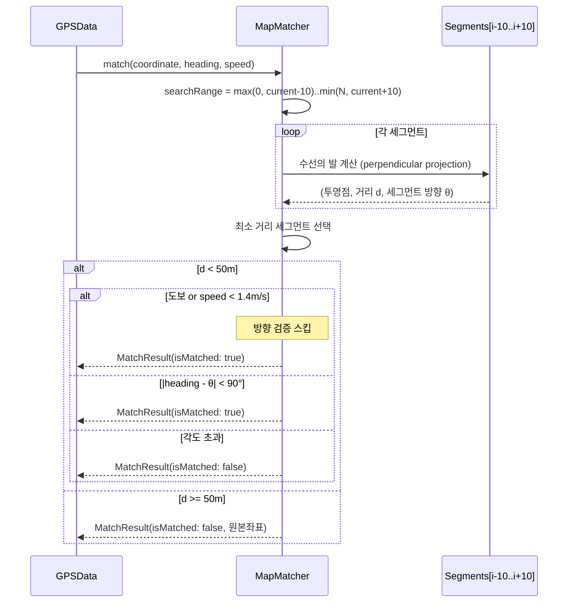

### 4.3 RouteTracker

```swift
final class RouteTracker {
    private let steps: [RouteStep]
    private var currentStepIndex: Int = 0
    private let stepEndSegmentIndices: [Int]  // 각 Step 끝의 전체 폴리라인 인덱스

    init(route: Route) {
        // 1. 각 Step의 끝 좌표 → 전체 폴리라인 인덱스 매핑
        // 2. 출발지 step 스킵 (polyline=1pts인 시작점 마커)
    }

    func update(matchedPosition: CLLocationCoordinate2D, segmentIndex: Int) -> RouteProgress {
        // 1. segmentIndex >= stepEndSegmentIndices[currentStep] → 전진 (TMAP 방식)
        // 2. current/next ManeuverInfo 생성
        // 3. 목적지까지 남은 거리 계산
        // 4. 남은 시간/ETA (카카오: duration 합산, Apple: 거리 비율)
    }
}
```

**스텝 전진 방식 (TMAP 참고 — segmentIndex 기반 통과 판정)**:

```
전체 폴리라인:  P0 ──── P1(G0) ──── P2(G1) ──── P3(G2)
segmentIndex:    0         1           2

Step 0: 출발지 (1pt, P0) → 스킵
Step 1: P0→G0, stepEndIndex=0
Step 2: G0→G1, stepEndIndex=1
Step 3: G1→G2, stepEndIndex=2

  🚗 segmentIndex=0    → Step 1 유지 (0 < stepEnd[1]=0? → 같으면 통과!)
  🚗 segmentIndex=1    → Step 2로 전진! (1 >= stepEnd[1])
  🚗 segmentIndex=2    → Step 3로 전진! (2 >= stepEnd[2])

장점 (vs 30m 임계값):
  - GPS 오차에 무관하게 "실제 통과"를 판정
  - 짧은 스텝(출발지 등)에서 오작동 없음
  - 카카오/Apple 모두 동일하게 동작
    (Apple Step polyline 좌표가 전체 polyline과 일치 확인됨)
```

### 4.4 OffRouteDetector

GPS valid일 때만 호출된다 (GPS invalid 시 이탈 감지 스킵).

```swift
final class OffRouteDetector: Sendable {
    private var consecutiveFailures: Int = 0
    private let requiredFailures: Int = 3
    private var navigationStartTime: Date?
    private var navigationStartDistance: CLLocationDistance = 0

    func update(matchResult: MatchResult, gpsAccuracy: CLLocationAccuracy) -> Bool {
        // 보호 조건 체크
        // 1. 출발 후 35m/5초 이내 → false
        // 2. GPS 정확도 > 120m → false (판정 보류)
        // 이탈 판정
        // 3. matchResult.isMatched → consecutiveFailures = 0, return false
        // 4. !isMatched → consecutiveFailures += 1
        // 5. consecutiveFailures >= 3 → return true (이탈 확정)
    }

    func reset() { consecutiveFailures = 0 }
}
```

**이탈 판정 시퀀스**:

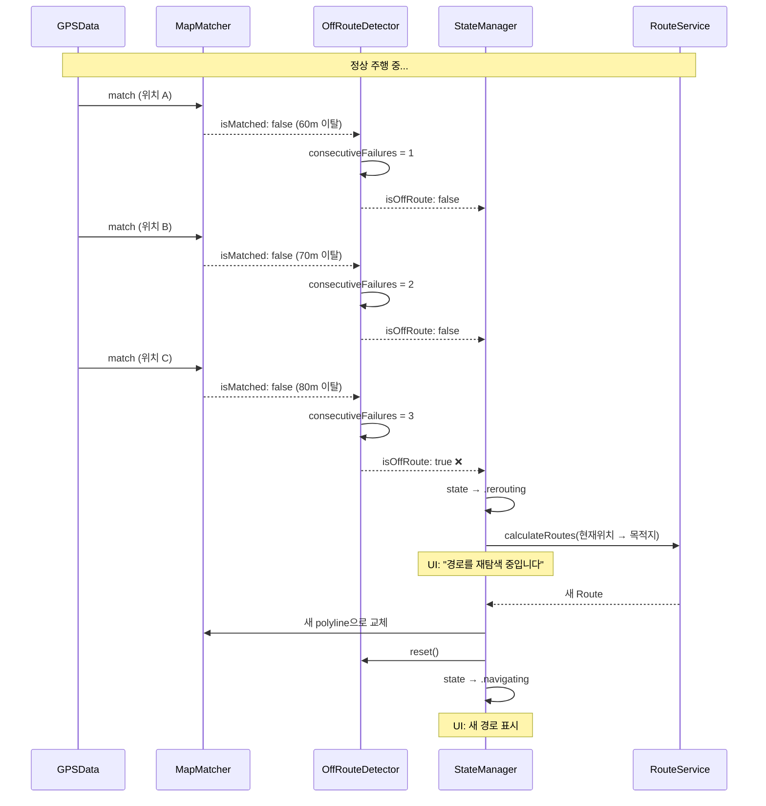

**보호 조건 플로우**:

```
GPS 업데이트 도착 (valid일 때만)
    │
    ├─ 출발 후 35m 이내? ──→ Yes → 판정 보류
    │                        No ↓
    ├─ 출발 후 5초 이내?  ──→ Yes → 판정 보류
    │                        No ↓
    ├─ GPS 정확도 > 120m? ─→ Yes → 판정 보류
    │                        No ↓
    ├─ 맵매칭 성공?  ──────→ Yes → consecutiveFailures = 0
    │                        No ↓
    ├─ consecutiveFailures++
    │
    └─ >= 3? ─────────────→ Yes → 이탈 확정!
                             No → 계속 관찰
```

### 4.5 StateManager

```swift
final class StateManager: Sendable {
    private(set) var state: NavigationState = .preparing
    private let arrivalThreshold: CLLocationDistance = 30

    func update(
        matchResult: MatchResult,
        isOffRoute: Bool,
        distanceToGoal: CLLocationDistance,
        isRerouting: Bool
    ) -> NavigationState {
        switch state {
        case .preparing:
            if matchResult.isMatched → .navigating

        case .navigating:
            if distanceToGoal <= 30 → .arrived
            if isOffRoute → .rerouting
            if isRerouting → .rerouting

        case .rerouting:
            if distanceToGoal <= 30 → .arrived  // 재탐색 중에도 도착 판정
            if 새 경로 수신 → .navigating
            if 재탐색 실패 (3회) → .navigating (이전 경로 유지)

        case .arrived, .stopped:
            // 최종 상태
        }
    }
}
```

### 4.6 VoiceEngine (트리거 판정만)

```swift
final class VoiceEngine: Sendable {
    private var announcedDistances: Set<AnnouncementKey> = []
    private var hasAnnouncedInitial: Bool = false

    func checkInitial() -> VoiceCommand? {
        // 주행 시작 시 1회: "경로 안내를 시작합니다"
        // 첫 회전이 1200m 이내면 즉시 해당 밴드 안내도 추가
    }

    func check(
        distanceToManeuver: CLLocationDistance,
        speed: CLLocationSpeed,
        stepIndex: Int,
        step: RouteStep,
        provider: RouteProvider
    ) -> VoiceCommand? {
        // 1. 속도로 도로 유형 추정 (> 80km/h = 고속도로)
        // 2. 거리 밴드 판정
        // 3. 짧은 스텝 처리: 현재 거리보다 큰 밴드는 스킵,
        //    가장 가까운 유효 밴드로 즉시 안내
        // 4. 이미 안내한 밴드인지 중복 체크
        // 5. 트리거 → VoiceCommand 생성 (텍스트는 provider별 분기)
    }

    func reset() { announcedDistances.removeAll(); hasAnnouncedInitial = false }
}
```

**음성 트리거 타이밍**:

```
🚗 현재 위치                                          🔄 회전 포인트
├────────────────────────────────────────────────────────┤

일반도로 (< 80km/h):
[1200m] "테헤란로 방면 우회전입니다"   ← preRoadName
           [300m] "300미터 앞 우회전"  ← preDistance
                    [120m] "전방 우회전"  ← imminent

고속도로 (≥ 80km/h):
[1200m] "경부고속도로 방면 출구입니다" ← preRoadName
      [500m] "500미터 앞 출구"       ← preDistance
               [200m] "전방 출구"      ← imminent

짧은 스텝 (예: 100m):
  → 1200m, 300m 밴드 스킵
  → 120m 밴드: 100m < 120m → 즉시 안내 "전방 우회전"

중복 방지:
  announcedDistances에 (stepIndex, band) 저장
  같은 step + 같은 band → 트리거 안 함
```

### 4.7 DeadReckoning

GPS invalid 시에만 호출된다. 폴리라인 위에서 마지막 속도/방향으로 추정 이동.

```swift
final class DeadReckoning: Sendable {
    private let polyline: [CLLocationCoordinate2D]
    private var lastValidPosition: CLLocationCoordinate2D?
    private var lastValidSpeed: CLLocationSpeed = 0
    private var lastValidSegmentIndex: Int = 0
    private var lastValidTime: Date?

    func estimate(currentTime: Date) -> DeadReckoningResult? {
        // 1. 마지막 유효 GPS로부터 경과시간 계산
        // 2. 이동 거리 = 마지막속도 × 경과시간
        // 3. 폴리라인 위에서 이동 거리만큼 전진
        // 4. 추정 좌표 + heading(세그먼트 방향) + segmentIndex 반환
    }

    func updateLastValid(position: CLLocationCoordinate2D,
                         speed: CLLocationSpeed,
                         segmentIndex: Int) { ... }
}
```

**Dead Reckoning 시퀀스**:

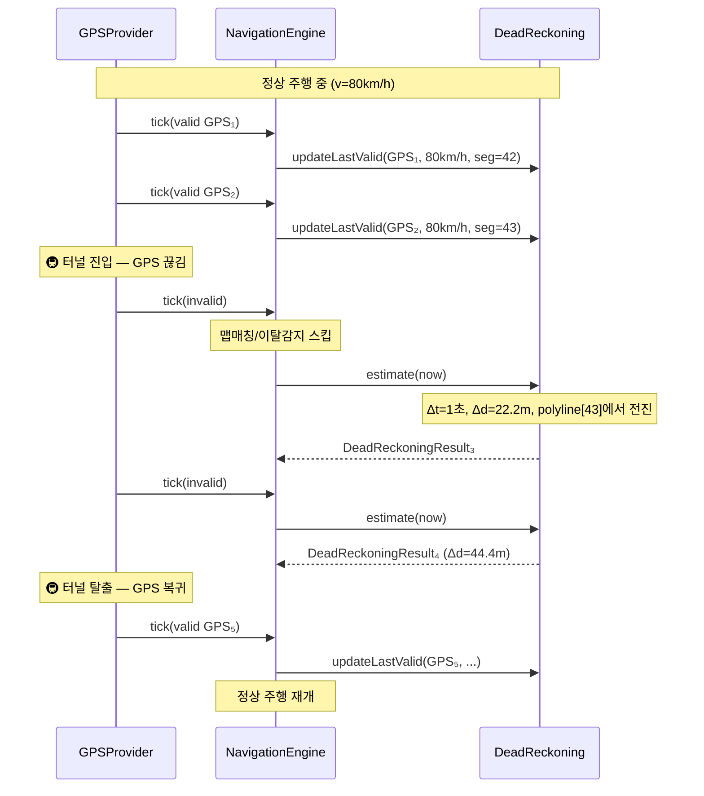

**폴리라인 위 전진 계산**:

```
마지막 유효 위치: polyline[43] 위의 P
이동 거리: 22.2m

polyline[43] ── P ──── polyline[44] ──── polyline[45]
                │ 10m │     15m     │      20m     │

  → [43]→[44] 남은 10m 소비 → 남은 12.2m
  → [44]→[45] 15m 중 12.2m 소비
  → polyline[44]에서 44→45 방향으로 12.2m 전진한 점 = 추정 좌표
```

---

## 5. GPS Provider 설계

### 5.1 프로토콜

```swift
protocol GPSProviding: Sendable {
    var gpsPublisher: AnyPublisher<GPSData, Never> { get }
    func start()
    func stop()
}
```

### 5.2 LocationSimulator (공통 재생 엔진)

```swift
/// CLLocation 배열을 타이밍에 맞게 재생하는 공통 시뮬레이터
/// SimulGPSProvider, FileGPSProvider 모두 이 클래스를 사용
final class LocationSimulator {
    // 출력
    let simulatedLocationPublisher: PassthroughSubject<CLLocation, Never>
    let isPlayingPublisher: CurrentValueSubject<Bool, Never>
    let progressPublisher: CurrentValueSubject<Double, Never>
    let speedMultiplierPublisher: CurrentValueSubject<Double, Never>

    // 입력
    func load(locations: [CLLocation])    // CLLocation 배열 직접 전달
    func load(gpxFileURL: URL) -> Bool    // GPX 파일 파싱 → CLLocation 배열

    // 제어
    func play() / pause() / stop() / reset()
    func cycleSpeed()  // 0.5x → 1x → 2x → 4x

    // 재생 방식: 포인트 간 타임스탬프 간격, speedMultiplier 적용
}
```

```
                  LocationSimulator
                 /                 \
  SimulGPSProvider               FileGPSProvider
  (폴리라인 → locations)         (GPX 파일 → locations)
        \                           /
         \                         /
          GPSProviding 프로토콜
                    │
            NavigationEngine
```

### 5.3 구현체

```swift
final class RealGPSProvider: GPSProviding { ... }
// CoreLocation + 1초 틱 타이머

final class SimulGPSProvider: GPSProviding { ... }
// 경로 폴리라인 → CLLocation 배열 변환 (속도 기반 타임스탬프 생성)
// → LocationSimulator.load(locations:) → 재생
// play/pause/cycleSpeed → LocationSimulator에 위임

final class FileGPSProvider: GPSProviding { ... }
// GPX 파일 → LocationSimulator.load(gpxFileURL:) → 재생
// play/pause/cycleSpeed → LocationSimulator에 위임
```

### 5.3 Provider별 진입점

```
┌──────────────┬──────────────────────┬──────────────────────┐
│ Provider      │ 진입점                │ 용도                  │
├──────────────┼──────────────────────┼──────────────────────┤
│ Real          │ 경로요약 → "안내 시작" │ 실제 주행             │
│ Simul         │ 경로요약 → "가상 주행" │ 경로 미리보기/데모     │
│ File          │ 개발자 메뉴 → File    │ 녹화된 GPS로 엔진 테스트│
└──────────────┴──────────────────────┴──────────────────────┘
```

**경로 요약 화면:**
```
┌─────────────────────────────────────────┐
│  추천  12.5km  18분                      │
│  최단시간  14.2km  15분                   │
│  ┌──────────┐  ┌──────────┐             │
│  │ 안내 시작  │  │ 가상 주행  │             │
│  └──────────┘  └──────────┘             │
└─────────────────────────────────────────┘
안내 시작 → RealGPSProvider (개발자 메뉴에서 File 선택 시 FileGPSProvider)
가상 주행 → SimulGPSProvider
```

**개발자 메뉴:**
```
┌─────────────────────────────────────────────┐
│ Location Type                               │
│   ○ Real (실제 GPS)                         │
│   ○ File (GPX 파일 재생)  → [파일 선택...]   │
├─────────────────────────────────────────────┤
│ GPX 녹화                                     │
│   [녹화 시작]  상태: 대기                     │
│   → 주행 시작 시 자동으로 녹화 시작            │
│   → 주행 종료 시 자동으로 녹화 중지 + 저장     │
├─────────────────────────────────────────────┤
│ GPX 파일 관리                                │
│   [파일 목록] (3개)                          │
└─────────────────────────────────────────────┘
```

### 5.4 1초 틱 보장 메커니즘 (RealGPSProvider)

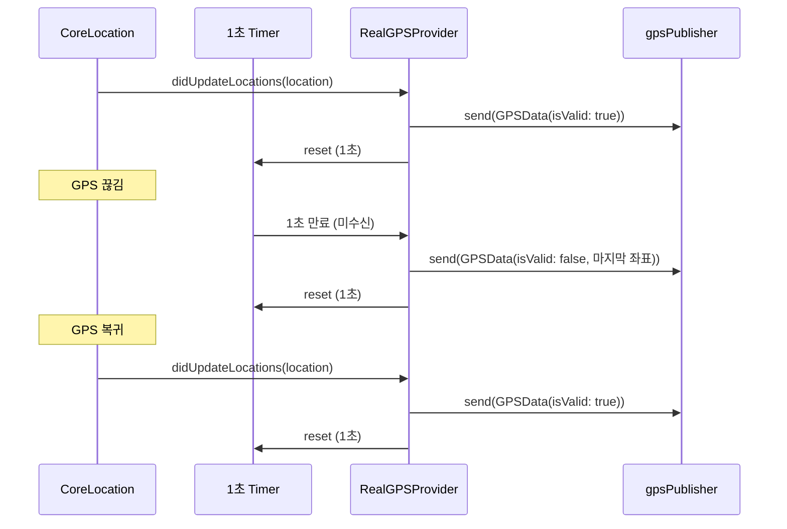

### 5.5 GPX 녹화 (1회 자동 녹화)

```
녹화 상태:  [OFF] → [ON 대기] → [녹화 중] → [OFF] (자동 복귀)
                 ↑ 개발자 메뉴    ↑ 주행 시작   ↑ 주행 종료
```

**실제 주행 녹화:**

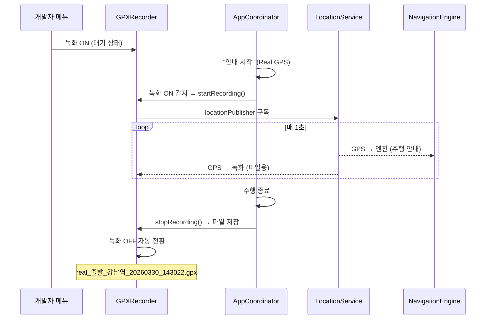

**가상 주행 녹화:**

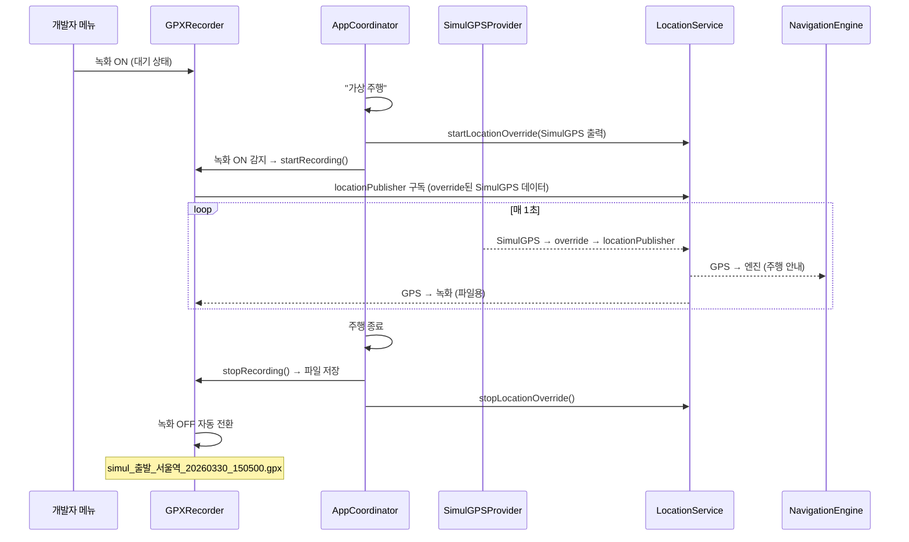

**파일명 규칙:**

```
{모드}_{출발지}_{도착지}_{날짜시간}.gpx

모드: real / simul
출발지: Place.name ?? "출발"
도착지: Place.name ?? "도착"
이름 내 공백/특수문자 제거

예: real_출발_강남역_20260330_143022.gpx
    simul_출발_서울역_20260330_150500.gpx
```

**GPXRecord 모델:**

```swift
// SwiftData
@Model class GPXRecord {
    // 기존
    var fileName: String
    var filePath: String
    var duration: TimeInterval
    var distance: CLLocationDistance
    var pointCount: Int
    var fileSize: Int64
    var recordedAt: Date

    // 추가
    var recordingMode: String      // "real" / "simul"
    var originName: String?        // 출발지명
    var destinationName: String?   // 도착지명
}
```

### 5.6 GPX 재생 (File 모드)

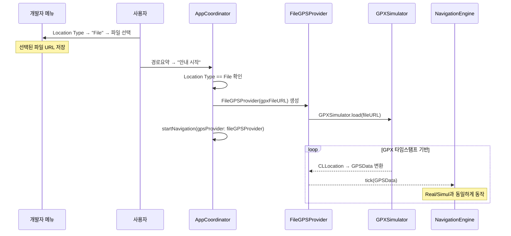

**파일 리스트 표시:**

```
┌─────────────────────────────────────────┐
│ 🔴 실제 │ 출발 → 강남역                  │
│ 3.5km  5분  2026.03.30 14:30            │
├─────────────────────────────────────────┤
│ 🔵 가상 │ 출발 → 서울역                  │
│ 12.5km  18분  2026.03.30 15:05          │
└─────────────────────────────────────────┘
```

### 5.7 개발자 메뉴 UI

```
┌─────────────────────────────────────────────┐
│ Location Type                               │
│   ○ Real (실제 GPS)                         │
│   ○ File (GPX 파일 재생)  → [파일 선택...]   │
├─────────────────────────────────────────────┤
│ GPX 녹화                         [OFF / ON] │
│   OFF: 녹화 안 함                            │
│   ON 대기: 다음 주행 시 자동 녹화             │
│   녹화 중: 주행 중 (종료 시 자동 OFF)         │
├─────────────────────────────────────────────┤
│ GPX 파일 관리                                │
│   [파일 목록] (3개)                          │
└─────────────────────────────────────────────┘
```

---

## 6. Presentation 계층 설계

### 6.1 주행 화면 구성

```
┌─────────────────────────────────────────────────────────┐
│ ┌─────────────────────────────────────────────────────┐ │
│ │  ┌────┐                                             │ │
│ │  │ ↱  │  300m  우회전하세요                          │ │ ← ManeuverBanner
│ │  └────┘  테헤란로 방면                               │ │    (current)
│ │     ↳ 이후 1.2km 좌회전                              │ │    (next)
│ ├─────────────────────────────────────────────────────┤ │
│ │                                                     │ │
│ │                    🗺️ MKMapView                      │ │
│ │                       🚗                            │ │ ← vehicleAnnotation
│ │                                                     │ │
│ │  ┌────────┐                                         │ │
│ │  │ 58     │                              [🔇]      │ │ ← SpeedometerView
│ │  │ km/h   │                                         │ │ ← MuteToggle
│ │  └────────┘                              [📍]      │ │ ← RecenterButton
│ │                                   [📡]             │ │ ← GPSStatusIcon
│ ├─────────────────────────────────────────────────────┤ │
│ │  🏁 강남역    │  12.5km  │  18분  │  도착 14:32     │ │ ← BottomBar
│ │                                       [안내 종료]   │ │
│ └─────────────────────────────────────────────────────┘ │
└─────────────────────────────────────────────────────────┘
```

### 6.2 재탐색 중 UI

```
┌─────────────────────────────────────────────────────────┐
│ ┌─────────────────────────────────────────────────────┐ │
│ │  ManeuverBanner (마지막 안내 유지)                    │ │
│ ├─────────────────────────────────────────────────────┤ │
│ │ ┌─────────────────────────────────────────────────┐ │ │
│ │ │  🔄  경로를 재탐색 중입니다...                    │ │ │ ← RerouteOverlay
│ │ └─────────────────────────────────────────────────┘ │ │
│ │                    🗺️ 🚗 (raw GPS 따라 이동)         │ │
│ ├─────────────────────────────────────────────────────┤ │
│ │  🏁 강남역    │  --km  │  --분  │  --:-- 도착      │ │
│ └─────────────────────────────────────────────────────┘ │
└─────────────────────────────────────────────────────────┘
```

### 6.3 도착 팝업 UI

```
┌─────────────────────────────────────────────────────────┐
│                    🗺️ MKMapView  🚗  📍 목적지           │
│  ┌───────────────────────────────────────────────────┐  │
│  │           🏁 목적지에 도착했습니다                   │  │
│  │              ┌──────────────┐                      │  │
│  │              │  주행 종료 (5)│                      │  │ ← 5초 카운트다운
│  │              └──────────────┘                      │  │
│  └───────────────────────────────────────────────────┘  │
└─────────────────────────────────────────────────────────┘
```

### 6.4 추적 모드별 화면 비교

```
┌──────────────────┬──────────────────┬──────────────────┐
│ 요소              │ 자동 추적 모드     │ 추적 해제 모드     │
├──────────────────┼──────────────────┼──────────────────┤
│ 카메라            │ 아바타 따라감      │ 사용자 제스처 따름 │
│ 아바타            │ 화면 중앙          │ 지도 위 실제 이동  │
│ 리센터 버튼       │ 숨김              │ 표시              │
│ ManeuverBanner   │ ✅ 유지           │ ✅ 유지           │
│ BottomBar        │ ✅ 유지           │ ✅ 유지           │
│ 속도계/음성/GPS   │ ✅ 유지           │ ✅ 유지           │
└──────────────────┴──────────────────┴──────────────────┘
→ 안내 UI는 모드에 관계없이 항상 동작, 지도와 아바타만 변화
```

### 6.5 뷰 계층 구조

```
NavigationViewController (UIViewController)
    ├─ MKMapView (경로 overlay, 출발지/목적지/차량 annotation)
    ├─ ManeuverBannerView (SwiftUI)
    ├─ NavigationBottomBar (SwiftUI)
    ├─ SpeedometerView (SwiftUI)
    ├─ RecenterButton, GPSStatusIcon, MuteToggleButton
    ├─ RerouteOverlay
    ├─ ArrivalPopupView (SwiftUI)
    ├─ PlaybackControlBar (Simul/File 모드에서만 표시)
    │   ├─ ▶️/⏸️ 재생/일시정지
    │   └─ [0.5x] [1x] [2x] [4x] 속도 조절
    └─ DebugOverlayView (개발자 메뉴 ON 시만 표시)
```
```

### 6.6 NavigationViewController 핵심 로직

```swift
final class NavigationViewController: UIViewController {
    private let mapView = MKMapView()
    private let vehicleAnnotation = MKPointAnnotation()
    private var displayLink: CADisplayLink?
    private let interpolator = LocationInterpolator()

    func bind(to engine: NavigationEngine) {
        engine.guidePublisher
            .receive(on: DispatchQueue.main)
            .sink { [weak self] guide in
                self?.updateUI(guide)
                self?.interpolator.setTarget(guide.matchedPosition, heading: guide.heading)
            }
            .store(in: &cancellables)
    }

    // CADisplayLink 콜백 (60fps)
    @objc func displayLinkFired() {
        let interpolated = interpolator.interpolate()
        vehicleAnnotation.coordinate = interpolated.coordinate
        if isAutoTracking {
            mapView.camera = MKMapCamera(/* interpolated */)
        }
    }

    // 백그라운드 복귀 시
    override func viewWillAppear(_ animated: Bool) {
        super.viewWillAppear(animated)
        // 보간기를 현재 위치로 리셋 → 점프 방지
        if let guide = currentGuide {
            interpolator.resetTo(guide.matchedPosition, guide.heading)
        }
    }
}
```

### 6.7 지도 조작 처리

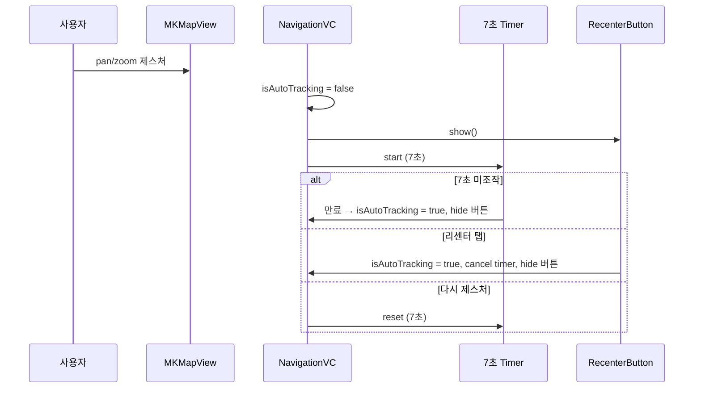

### 6.8 경로 전체 보기

```
경로 전체 보기 버튼 탭
  → isAutoTracking = false
  → mapView.setVisibleMapRect(routeRect, edgePadding, animated: true)
  → 리센터 버튼 또는 7초 타이머로 주행 모드 복귀
```

### 6.9 보간기

```swift
final class LocationInterpolator {
    func setTarget(_ coordinate: CLLocationCoordinate2D, heading: CLLocationDirection) { ... }
    func interpolate() -> (coordinate: CLLocationCoordinate2D, heading: CLLocationDirection) { ... }
    func resetTo(_ coordinate: CLLocationCoordinate2D, _ heading: CLLocationDirection) {
        previous = coordinate; target = coordinate
        previousHeading = heading; targetHeading = heading
    }
}
```

### 6.10 카메라 고도

```
자동차:  0~10km/h → 500m
        10~80km/h → 500~1000m (선형)
        80~120km/h → 1000~2000m (선형)
도보:   0~2km/h → 200m
       2~10km/h → 200~300m (선형)
피치: 자동차 45°, 도보 30°
```

---

## 7. 음성 재생 (Presentation 계층)

```swift
final class VoiceTTSPlayer {
    private let synthesizer = AVSpeechSynthesizer()
    private var queue: [VoiceCommand] = []
    private var isMuted: Bool = false

    func enqueue(_ command: VoiceCommand) { /* 큐에 추가, 재생 시도 */ }
    func toggleMute() { /* 음소거 토글, 즉시 중단 + 큐 클리어 */ }
    // AVSpeechSynthesizerDelegate.didFinish → playNextIfIdle()
}
```

---

## 8. CarPlay 연동

### 8.1 데이터 변환

```
NavigationGuide → CarPlayNavigationHandler
  ├─ currentManeuver → CPManeuver (instruction, symbol, distance)
  ├─ remaining → CPRouteInformation (tripTravelEstimates)
  └─ state → .rerouting: pause(.loading) / .arrived: finishTrip()
```

### 8.2 양방향 동기화

**iPhone → CarPlay:**
```
"안내 시작" → SessionManager.startNavigation(source: .phone)
  → navigationCommandPublisher.send(.started(.phone))
  → CarPlaySceneDelegate 감지 → CPNavigationSession 시작
```

**CarPlay → iPhone:**
```
CarPlay "출발" → SessionManager.startNavigation(source: .carPlay)
  → navigationCommandPublisher.send(.started(.carPlay))
  → AppCoordinator 감지 → NavigationViewController 생성
```

---

## 9. NavigationSessionManager 재설계

```swift
final class NavigationSessionManager {
    static let shared = NavigationSessionManager()
    private(set) var engine: NavigationEngine?
    let guidePublisher = CurrentValueSubject<NavigationGuide?, Never>(nil)
    let navigationCommandPublisher = PassthroughSubject<NavigationCommand, Never>()

    func startNavigation(route:, destination:, transportMode:, gpsProvider:, source:) {
        stopNavigation()
        engine = NavigationEngine(route: route, transportMode: transportMode)
        // GPS → 엔진 → guidePublisher 연결 (Combine)
        navigationCommandPublisher.send(.started(source: source))
    }

    func stopNavigation() { engine?.stop(); engine = nil; ... }
    func requestReroute() { engine?.requestReroute() }
}
```

---

## 10. 재탐색 플로우

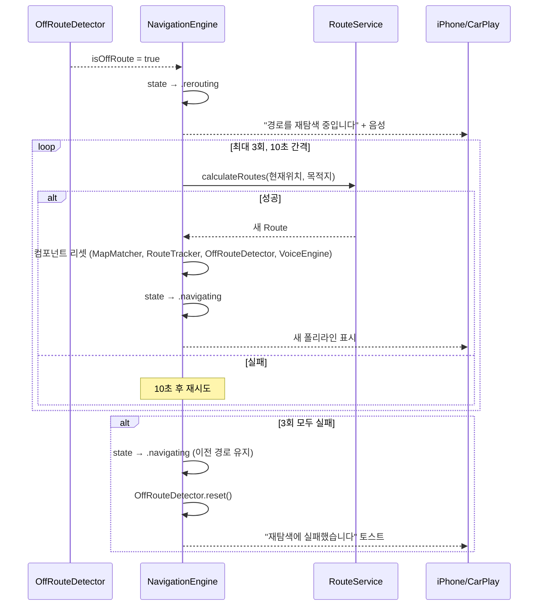

수동 재탐색: 사용자 버튼 → `requestReroute()` → 동일 플로우

---

## 11. 도착 처리 플로우

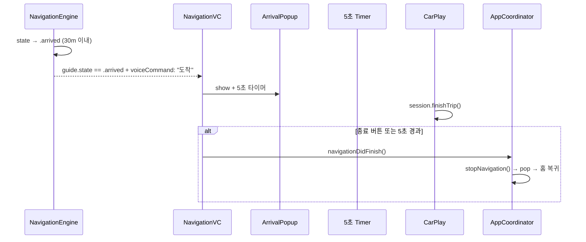

---

## 12. 주행 시작~종료 전체 시퀀스

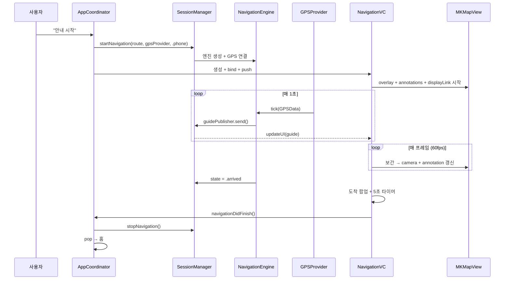

---

## 13. 파일 구조

```
Navigation/
├── Engine/                          ← Layer 1: 순수 Swift
│   ├── NavigationEngine.swift
│   ├── MapMatcher.swift
│   ├── RouteTracker.swift
│   ├── OffRouteDetector.swift
│   ├── StateManager.swift
│   ├── VoiceEngine.swift
│   ├── DeadReckoning.swift
│   └── Model/
│       ├── GPSData.swift
│       ├── NavigationGuide.swift
│       ├── ManeuverInfo.swift
│       ├── TurnType.swift
│       ├── VoiceCommand.swift
│       ├── NavigationState.swift
│       ├── MatchResult.swift
│       └── DeadReckoningResult.swift
│
├── GPS/
│   ├── GPSProviding.swift
│   ├── RealGPSProvider.swift
│   ├── SimulGPSProvider.swift       ← LocationSimulator 사용
│   ├── FileGPSProvider.swift        ← LocationSimulator 사용
│   └── LocationSimulator.swift      ← 공통 재생 엔진 (기존 GPXSimulator 리네임)
│
├── Voice/
│   ├── VoiceTTSPlayer.swift
│   └── GuidanceTextBuilder.swift
│
├── Common/UI/DesignSystem/
│   └── Theme+Navigation.swift       ← 주행 화면 전용 디자인 토큰
│
├── Feature/Navigation/
│   ├── NavigationViewController.swift
│   ├── View/
│   │   ├── ManeuverBannerView.swift
│   │   ├── NavigationBottomBar.swift
│   │   ├── SpeedometerView.swift
│   │   ├── ArrivalPopupView.swift
│   │   └── RouteOverviewButton.swift    ← 경로 전체 보기
│   └── Formatter/
│       └── UnitFormatter.swift          ← 거리/속도 단위 포맷
│   └── Helper/
│       ├── LocationInterpolator.swift
│       └── NavigationCameraHelper.swift
│
├── Service/CarPlay/
│   └── NavigationSessionManager.swift
│
└── Tests/EngineTests/
    ├── MapMatcherTests.swift
    ├── RouteTrackerTests.swift
    ├── OffRouteDetectorTests.swift
    ├── VoiceEngineTests.swift
    └── DeadReckoningTests.swift
```

---

## 14. 의존성 그래프

```
┌─────────────────────────────────────────────────────┐
│  Engine (Layer 1)                                    │
│  import CoreLocation (좌표 타입만) + Foundation       │
│  ❌ UIKit  ❌ MapKit  ❌ SwiftUI  ❌ AVFoundation    │
│         ▲              ▲              ▲              │
│  ┌──────┴──────┐ ┌─────┴─────┐ ┌─────┴──────┐      │
│  │ GPS Provider│ │Presentation│ │  CarPlay   │      │
│  │ CoreLocation│ │UIKit+Swift │ │CarPlay fw  │      │
│  │ Combine     │ │UI+MapKit  │ │Combine     │      │
│  └─────────────┘ │Combine    │ └────────────┘      │
│                  └─────┬─────┘                      │
│                  ┌─────┴─────┐                      │
│                  │   Voice   │                      │
│                  │AVFoundation│                      │
│                  └───────────┘                      │
└─────────────────────────────────────────────────────┘
```

---

## 15. 단위 설정

```
설정 옵션:
  ○ 시스템 설정 (Locale 기반, 기본값)
  ○ 미터법 (km, m, km/h)
  ○ 야드법 (mi, ft, mph)
```

### 15.1 UnitFormatter (Presentation 계층)

```swift
enum UnitSystem: String, Sendable {
    case system     // Locale.current.measurementSystem 따름
    case metric     // km, m, km/h
    case imperial   // mi, ft, mph
}

struct UnitFormatter {
    let unitSystem: UnitSystem

    /// 거리 표시 (ManeuverBanner, BottomBar)
    func formatDistance(_ meters: CLLocationDistance) -> String {
        // 미터법: < 1km → "300m", >= 1km → "1.2km"
        // 야드법: < 0.1mi → "1000ft", >= 0.1mi → "0.8mi"
    }

    /// 속도 표시 (속도계)
    func formatSpeed(_ mps: CLLocationSpeed) -> String {
        // 미터법: "58km/h"
        // 야드법: "36mph"
    }

    /// 음성 안내용 거리 텍스트
    func formatDistanceForVoice(_ meters: CLLocationDistance) -> String {
        // 미터법: "300미터" / "1.2킬로미터"
        // 야드법: "1000피트" / "0.8마일"
    }
}
```

### 15.2 적용 범위

```
┌──────────────────────┬──────────────────┬──────────────────┐
│ 요소                  │ 미터법            │ 야드법            │
├──────────────────────┼──────────────────┼──────────────────┤
│ ManeuverBanner 거리   │ 300m / 1.2km    │ 1000ft / 0.8mi  │
│ BottomBar 남은 거리   │ 12.5km           │ 7.8mi            │
│ 속도계               │ 58km/h           │ 36mph            │
│ 음성 안내            │ "300미터 앞"      │ "1000피트 앞"     │
│ ETA (시간)           │ 변화 없음         │ 변화 없음         │
│ 카메라 고도 (내부)    │ m/s 기준 (변화 없음)│ m/s 기준 (변화 없음)│
└──────────────────────┴──────────────────┴──────────────────┘

설정 저장: UserDefaults (앱 설정 화면에서 변경)
```

---

## 16. 다크모드

```
┌─────────────────┬──────────────────────────────────┐
│ 요소             │ 처리                              │
├─────────────────┼──────────────────────────────────┤
│ SwiftUI 뷰      │ 자동 대응 (Color.primary 등)       │
│ MKMapView       │ .overrideUserInterfaceStyle 따라감 │
│ 경로 폴리라인     │ light: .systemBlue / dark: .cyan  │
│ 마커/아바타      │ 시스템 색상 / light·dark 별도 이미지│
└─────────────────┴──────────────────────────────────┘
```

---

## 17. 시나리오 검증 결과

| 시나리오 | 결과 | 관련 섹션 |
|----------|------|-----------|
| 정상 주행 (출발→주행→도착) | ✅ | 4.6 초기 안내, 11 도착 처리 |
| 경로 이탈 → 자동 재탐색 | ✅ | 4.4 이탈 감지, 10 재탐색 (3회 재시도) |
| 터널 (GPS 손실 → DR → 복귀) | ✅ | 1.2 GPS valid/invalid 분기, 4.7 DR |
| GPS 깜빡임 | ✅ | 6.9 보간기가 자연스럽게 처리 |
| 출발 직후 U턴 (짧은 스텝) | ✅ | 4.6 짧은 스텝 처리 |
| 수동 재탐색 중 도착 | ✅ | 4.5 rerouting → arrived 전이 |
| CarPlay 연결/해제/재연결 | ✅ | 8 CarPlay (CurrentValueSubject 재구독) |
| 앱 백그라운드 → 포그라운드 | ✅ | 6.6 viewWillAppear 보간기 리셋 |
| 도보 모드 | ✅ | 4.2 도보/저속 시 방향 검증 스킵 |
| 장거리 직진 안내 공백 | Phase 2 | 5km마다 직진 안내 추가 예정 |
| 도착 접근 안내 | Phase 2 | "목적지 300m" 사전 안내 추가 예정 |
