# TMAP 네비게이션 기능 분석 및 RoutIn 적용 검토

> 작성일: 2026-03-27
> 목적: TMAP의 네비게이션 기능을 세부적으로 분석하고, RoutIn 앱에 적용 가능한 기능과 방법을 검토한다.

---

## 목차

1. [TMAP 네비게이션 전체 아키텍처](#1-tmap-네비게이션-전체-아키텍처)
2. [맵매칭 엔진 (MapMatch)](#2-맵매칭-엔진-mapmatch)
3. [경로 안내 엔진 (RouteGuidance)](#3-경로-안내-엔진-routeguidance)
4. [음성 안내 시스템](#4-음성-안내-시스템)
5. [안전운전 정보 (SDI)](#5-안전운전-정보-sdi)
6. [경로 데이터 모델 (Tvas)](#6-경로-데이터-모델-tvas)
7. [재탐색 시스템](#7-재탐색-시스템)
8. [네비게이션 UI 구조](#8-네비게이션-ui-구조)
9. [네비게이션 모드](#9-네비게이션-모드)
10. [차량 아바타 부드러운 이동 (Interpolation)](#10-차량-아바타-부드러운-이동-interpolation)
11. [교통 정보 시스템](#11-교통-정보-시스템)
12. [부가 기능](#12-부가-기능) *(CarPlay, Live Activity, Progress Bar, 대안경로, 톨비, 주행통계 등)*
13. [화면 표시 및 상태 관리](#13-화면-표시-및-상태-관리) *(화면 꺼짐 방지, 백그라운드, 다크모드, 제스처, 통화 등)*
14. [RoutIn 적용 검토](#14-routin-적용-검토)

---

## 1. TMAP 네비게이션 전체 아키텍처

### 1.1 계층 구조

```
┌─────────────────────────────────────────────────────────────┐
│                    Layer 5: UI (Swift)                       │
│  ┌──────────┐ ┌──────────┐ ┌──────────┐ ┌───────────────┐  │
│  │ TurnView │ │ LaneView │ │ SDIView  │ │ BottomBarView │  │
│  └────┬─────┘ └────┬─────┘ └────┬─────┘ └──────┬────────┘  │
│       └─────────────┴────────────┴──────────────┘           │
│                         ▲ DriveGuidePresentable              │
├─────────────────────────┼───────────────────────────────────┤
│              Layer 4: Swift Bridge                           │
│  ┌──────────────────────┴──────────────────────────┐        │
│  │           DriveGuideManager (싱글톤)              │        │
│  │  driveGuideSubject → DriveGuide struct 발행      │        │
│  └──────────────────────┬──────────────────────────┘        │
│  ┌──────────────────────┴──────────────────────────┐        │
│  │           DriveRouteManager                      │        │
│  │  tvasObservable → 경로 데이터 관리                │        │
│  └──────────────────────┬──────────────────────────┘        │
├─────────────────────────┼───────────────────────────────────┤
│              Layer 3: Legacy Engine (Objective-C)            │
│  ┌────────────┐  ┌───────────────┐  ┌──────────────────┐   │
│  │DriveManager│  │SimulationMgr  │  │ SafeDriveManager │   │
│  │ (실제 주행) │  │ (모의 주행)    │  │ (안전운전 모드)  │   │
│  └─────┬──────┘  └───────┬───────┘  └────────┬─────────┘   │
│        └─────────────────┼────────────────────┘             │
│                          ▼                                   │
│  ┌──────────────┐  ┌────────────────┐                       │
│  │MapMatchManager│  │ RGPlayerManager│                       │
│  └──────┬───────┘  └───────┬────────┘                       │
├─────────┼──────────────────┼────────────────────────────────┤
│         │    Layer 2: iOS Binding (ObjC ↔ C++)              │
│         │    NavigationSDK.h                                 │
├─────────┼──────────────────┼────────────────────────────────┤
│         ▼                  ▼      Layer 1: C++ Core Engine  │
│  ┌──────────────┐  ┌────────────────┐  ┌─────────────────┐ │
│  │   MapMatch    │  │ RouteGuidance  │  │RouteGuidVoice   │ │
│  │ (도로 매칭)   │  │ (경로 안내)     │  │(음성 안내)      │ │
│  └──────────────┘  └────────────────┘  └─────────────────┘ │
└─────────────────────────────────────────────────────────────┘
```

### 1.2 핵심 데이터 플로우

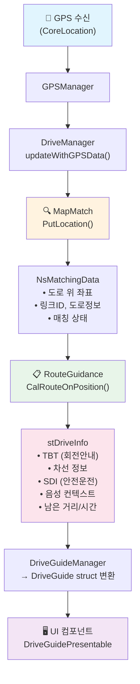

### 1.3 GPS 업데이트 1회당 처리 시퀀스

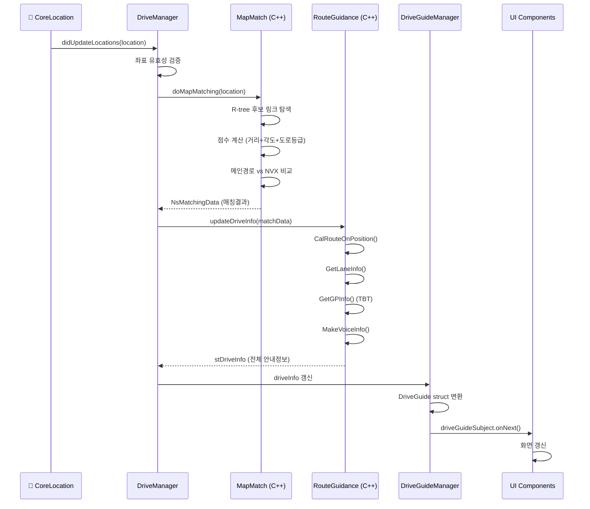

---

## 2. 맵매칭 엔진 (MapMatch)

### 2.1 개요

GPS 좌표를 도로 네트워크 위의 정확한 위치로 변환하는 엔진이다.
TMAP은 자체 도로 네트워크 데이터와 R-tree 공간 인덱스를 사용한다.

### 2.2 매칭 알고리즘 3단계

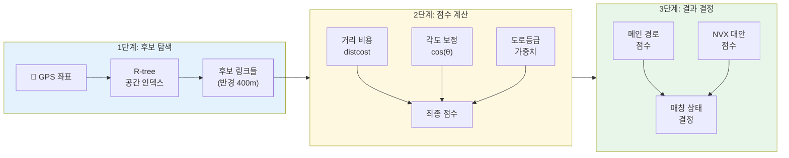

### 2.3 점수 산출 공식 (시각화)

```
                          거리 비용 (distcost)
    ◄─── 차선폭 ───►◄──────── +100m ────────►
    ┃               ┃                         ┃
200 ┃───────────────┃                         ┃
    ┃ ████████████ ▓┃▓▓▓▓▓▓▓▓▓▓▓▓▓▓▓▓▓▓▓▓▓▓▓┃
    ┃ ████████████ ▓┃▓▓▓▓▓▓▓▓▓▓▓▓▓▓▓▓▓▓▓▓▓▓▓┃
100 ┃ ████████████ ▓┃▓▓▓▓▓▓▓▓▓▓▓▓▓▓▓▓▓▓▓▓▓▓▓┃
    ┃ ████████████ ▓┃▓▓▓▓▓▓▓▓▓▓▓▓▓▓▓▓▓▓▓▓▓▓▓┃
    ┃ ████████████ ▓┃▓▓▓▓▓▓▓▓▓▓▓▓▓▓▓▓▓▓▓▓▓▓▓┃  ← score = 0
  0 ┗━━━━━━━━━━━━━━━┻━━━━━━━━━━━━━━━━━━━━━━━━━┛
    0m        차선폭                 차선폭+100m

    ████ = 200 + 차선폭 - 거리  (차선 내부: 높은 점수)
    ▓▓▓▓ = 200 - 거리           (도로 근처: 중간 점수)
    차선폭 = 차선수 × 3.5m

    ── 최종 점수 ──
    score = distcost × cos(GPS각도 - 링크각도)

    ── 도로등급 가중치 ──
    고속도로:        × 1.20
    4차로 이상 도시: × 1.15
    기타:            × 1.00
```

### 2.4 매칭 상태 머신

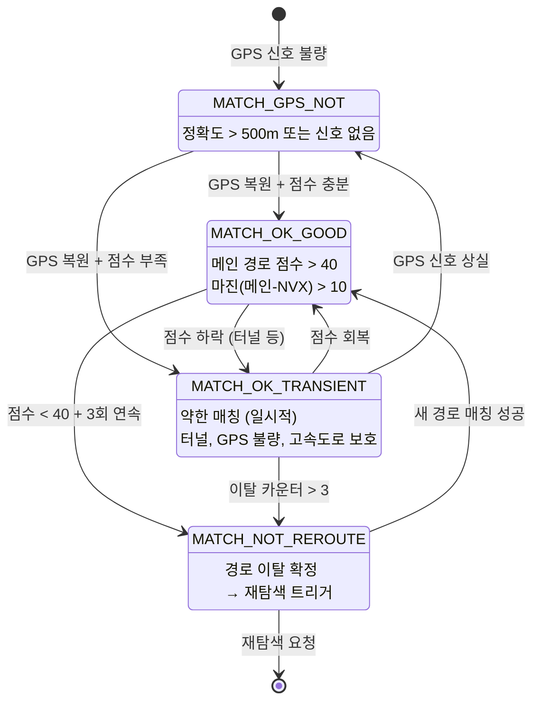

### 2.5 메인 경로 vs NVX (인근 대안) 비교

```
    ─── 메인 경로 ─────────────────────────────
                     ╲
                      ╲  NVX (인근 대안 링크)
                       ╲
                        ───────────────────────

    ┌─────────────────────────────────────────────────────┐
    │  비교 로직:                                          │
    │                                                      │
    │  메인 > 40 && (메인 + 10) > NVX                      │
    │  ──→ MATCH_OK_GOOD  ✅ "경로 위에 있음"              │
    │                                                      │
    │  메인 < 40 && NVX > 40                               │
    │  ──→ blockCount++ (3회까지 유예)                      │
    │  ──→ 3회 초과 시 MATCH_NOT_REROUTE ❌ "이탈!"        │
    │                                                      │
    │  메인 < 10 && 터널 아님                               │
    │  ──→ MATCH_NOT_REROUTE ❌ "즉시 이탈 판정"           │
    └─────────────────────────────────────────────────────┘

    핵심 임계값:
    ┌────────────────┬───────┐
    │ REROUTE_SCORE  │  40   │ ← 최소 유효 점수
    │ NVX_GOOD_SCORE │  85   │ ← NVX 강력 선호
    │ 점수 마진       │  10   │ ← 메인 경로 우대폭
    │ 이탈 유예 횟수   │  3회  │ ← 연속 실패 허용
    └────────────────┴───────┘
```

### 2.6 특수 상황 처리

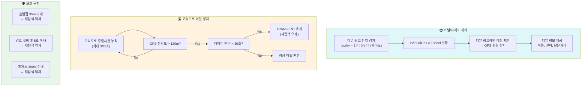

### 2.7 도로 분류 체계

```
    ── 도로등급 (roadcate) ──────────────────────────────────

    0 ━━━━━━━━ 고속국도          ┃  고속도로급
    1 ━━━━━━━━ 도시고속화도로     ┃  (가중치 ×1.20)
    ─────────────────────────────┃────────────────
    2 ──────── 국도              ┃
    3 ──────── 국가지원지방도     ┃  주요도로
    4 ──────── 지방도            ┃  (4차로↑ ×1.15)
    5~7 ────── 주요도로          ┃
    ─────────────────────────────┃────────────────
    8 ········ 기타도로          ┃  일반도로
    9 ········ 이면도로          ┃  (가중치 ×1.00)
    10 ······· 페리항로          ┃

    ── 시설유형 (linkfacil) ─────   ── 링크유형 (linkcate) ──
    0: 일반도로                     1: 본선비분리
    1: 교량  🌉                     2: 본선분리
    2: 터널  🚇  ← 매칭 특수처리    3: JC 연결로
    3: 고가도로                     4: 교차점내링크
    4: 지하도로 ← 매칭 특수처리     5: IC 연결로
    5: 교차로내통과                  6: P-Turn
    8: 톨게이트                     7: 휴게소(SA) ← 재탐색 억제
    9: 신호                         8: 로터리
    10: 표지                        9: U-Turn
```

---

## 3. 경로 안내 엔진 (RouteGuidance)

### 3.1 안내 처리 파이프라인

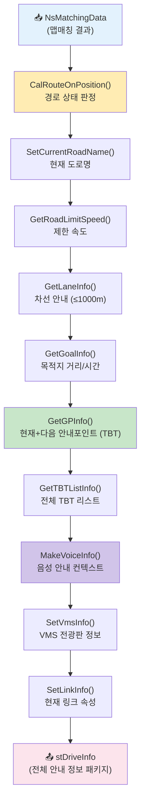

### 3.2 경로 상태 전이도

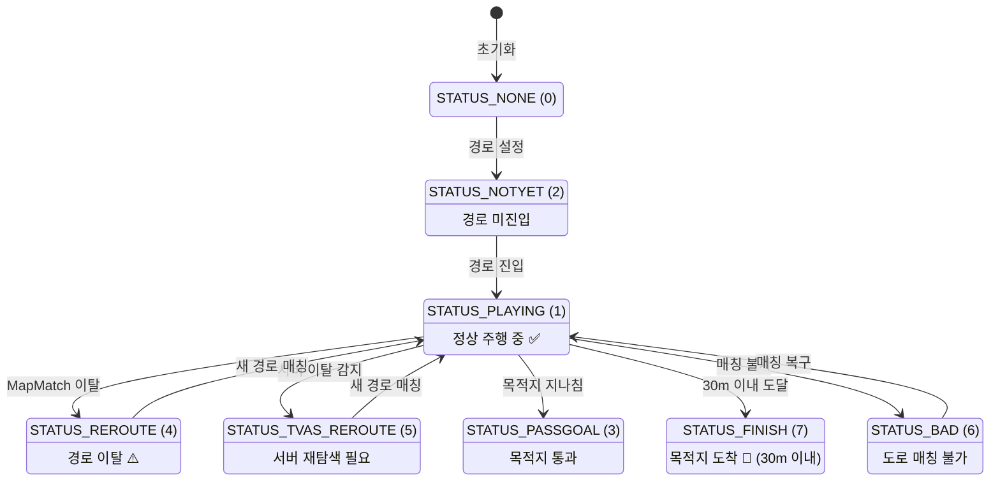

### 3.3 TBT (Turn-By-Turn) 회전 유형 맵

```
    ── 기본 회전 (6종) ──────────────────────────────

         12시(직진)
            ↑
    9시 ←── ╋ ──→ 3시
    (좌회전) │   (우회전)
            ↓
         6시(U턴)

    11 직진 │ 12 좌회전 │ 13 우회전 │ 14 U턴 │ 15 P턴

    ── 12방향 회전 (ID: 31~42) ─────────────────────

              42(12시)
          41 ╱    ╲ 31
        40╱          ╲32
       39╱     차량     ╲33
        38╲     🚗     ╱34
          39╲        ╱35
            38 ╲  ╱ 36
              37(6시)

    ── 고속도로 전용 (40종+) ────────────────────────

    ┌─────────────────────────────────────────────┐
    │  진입/출구          │  시설                   │
    │  101~106 고속도로   │  151 휴게소(SA)         │
    │  111~116 도시고속   │  153 톨게이트(고속)     │
    │  80~82  하이패스    │  154 톨게이트(일반)     │
    │  119 지하도         │  155 페리 진입          │
    │  120 고가도로       │  156 페리 출구          │
    │  121 터널           │                         │
    │  122 교량           │                         │
    ├─────────────────────┼─────────────────────────┤
    │  로터리 (12방향)    │  출발/목적지            │
    │  131~142            │  200 출발지             │
    │  (1시~12시 방향)    │  201 목적지             │
    │                     │  185~189 경유지 1~5     │
    └─────────────────────┴─────────────────────────┘

    총 150+ 종류의 세밀한 회전 유형 정의
```

### 3.4 차선 안내 구조

```
    ── 교차로 접근 시 차선 안내 ──────────────────────

    거리: 1000m 이내부터 표시, 300m 이내 음성 안내

    ┌──────────────────────────────────────────────┐
    │         교차로까지 450m                        │
    │  ┌────┬────┬════╤════╤════╤────┐             │
    │  │ ←  │ ←↑ │ ↑  │ ↑  │ ↑→ │ →  │             │
    │  │    │    │████│████│████│    │             │
    │  └────┴────┴════╧════╧════╧────┘             │
    │  비활성  비활성 ◄── 추천 차선 ──► 비활성       │
    └──────────────────────────────────────────────┘

    차선별 회전 정보 (비트마스크):
    ┌─────────────────────────────────────────┐
    │  bit 1:  U턴     │  bit 16: 우측       │
    │  bit 2:  좌회전   │  bit 32: 우회전     │
    │  bit 4:  좌측     │                     │
    │  bit 8:  직진     │                     │
    ├─────────────────────────────────────────┤
    │  부가 정보:                              │
    │  bit 1:  좌측포켓  │  bit 64: 버스전용   │
    │  bit 2:  우측포켓  │  bit 0x80: 추천차선 │
    └─────────────────────────────────────────┘

    최대 16차선, 표시 조건: 도로등급 ≥ 2 (국도 이상)
```

### 3.5 안내 포인트 (Guide Point) 유형

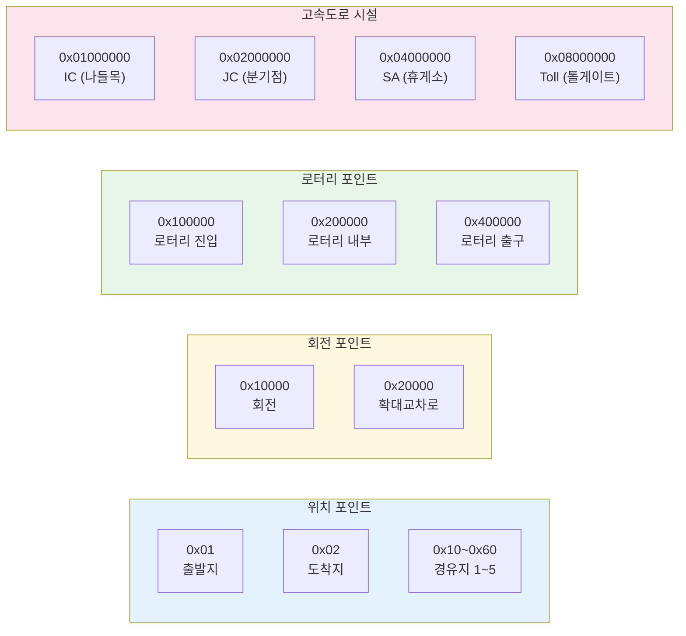

### 3.6 고속도로 모드 UI 데이터

```
    ── 고속도로 진입 시 전환되는 안내 모드 ──

    ┌─────────────────────────────────┐
    │  nShowHighway = 1 (ON)          │
    │                                  │
    │  고속도로 시설 리스트:            │
    │  ┌───────────────────────────┐  │
    │  │ 🔵 서울TG     2.3km  ━━  │  │
    │  │ 🟢 기흥IC      15km  ━━  │  │
    │  │ 🟡 용인JC      28km  ━━  │  │ ← 정체 색상
    │  │ 🔴 기흥휴게소   35km  ━━  │  │
    │  │ 🟢 수원IC      42km  ━━  │  │
    │  └───────────────────────────┘  │
    │                                  │
    │  시설 코드:                       │
    │  0=휴게소  1=개방톨  2=폐쇄톨    │
    │  3=IC      4=JC      5=IC출구    │
    └─────────────────────────────────┘
```

---

## 4. 음성 안내 시스템

### 4.1 거리별 음성 트리거

```
    ── 경로 위의 음성 안내 트리거 포인트 ──────────────────────

    현재 위치                                          회전 포인트
    🚗 ─────────────────────────────────────────────── 🔄
    │                                                    │
    │◄──────────── 1200m: 도로명 사전 안내 ─────────────►│
    │              "○○로 방면"                            │
    │                                                    │
    │              ◄─── 300m: SDI 카메라 안내 ──────────►│
    │              "전방 과속 카메라"                      │
    │                                                    │
    │                    ◄── 200m: 고속도로 ───────────►│
    │                    "200m 앞 출구"      (+10m 버퍼) │
    │                                                    │
    │                         ◄── 120m: 일반도로 ─────►│
    │                         "전방 우회전"   (+10m 버퍼) │
    │                                                    │
    │                              ◄── 80m: 복잡교차로 ►│
    │                              "곧 좌회전" (+10m 버퍼)│
    │                                                    │

    ┌──────────────────────────────────────────────────────┐
    │  과속 카메라 안내 거리 (사용자 설정):                   │
    │  ┌──────────────┬────────────────────────────────┐  │
    │  │ 고속도로      │  600m 또는 1000m (기본: 1km)   │  │
    │  │ 일반도로      │  300m 또는 600m (기본: 600m)   │  │
    │  │ 경고 임계값   │  0%, 5%, 10% 초과 시           │  │
    │  └──────────────┴────────────────────────────────┘  │
    └──────────────────────────────────────────────────────┘
```

### 4.2 음성 안내 컨텍스트 구조

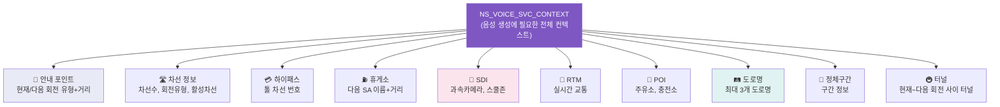

### 4.3 TTS 처리 파이프라인

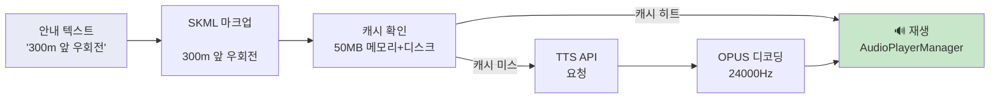

```
    ── 오디오 세션 관리 ──────────────────────────────

    ┌─────────────────────────────────────────────┐
    │  기본 모드: mixWithOthers                    │
    │  → 배경 음악과 동시 재생                      │
    │                                              │
    │  옵션 모드:                                   │
    │  ┌─────────────┬────────────────────────┐   │
    │  │ duckOthers  │ 음성 시 배경 음량 낮춤   │   │
    │  │ voicePrompt │ CarPlay 전용 모드       │   │
    │  │ A2DP        │ Bluetooth 오디오        │   │
    │  │ AirPlay     │ AirPlay 라우팅          │   │
    │  └─────────────┴────────────────────────┘   │
    │                                              │
    │  화자 옵션: 여성 / 남성 / 어린이 / 셀럽       │
    └─────────────────────────────────────────────┘
```

---

## 5. 안전운전 정보 (SDI)

### 5.1 SDI 유형 분류도

```mermaid
flowchart TD
    SDI["SDI\n안전운전 정보\n(80+ 유형)"]

    CAM["📸 단속 장비"]
    SEC["📏 구간 단속"]
    SAFE["🏫 안전 구역"]
    DANGER["⚠️ 위험 구간"]
    FACIL["🏗️ 시설물"]
    TRUCK["🚛 화물차 제한"]

    SDI --> CAM
    SDI --> SEC
    SDI --> SAFE
    SDI --> DANGER
    SDI --> FACIL
    SDI --> TRUCK

    CAM --> C1["c_01 고정식 카메라"]
    CAM --> C2["c_02 신호위반 카메라"]
    CAM --> C5["c_05 이동식 카메라"]
    CAM --> C16["c_16 박스형 카메라"]
    CAM --> C6["c_06 버스전용차로"]
    CAM --> C8["c_08 갓길 단속"]

    SEC --> S_START["구간 시작 (2)\n제한속도 표시"]
    SEC --> S_MID["구간 중간 (4)\n평균속도+남은거리"]
    SEC --> S_END["구간 종료 (3)\n구간 평균속도"]

    SAFE --> SCHOOL["s_20~21 어린이보호구역"]
    SAFE --> ELDER["68~69 노인보호구역"]
    SAFE --> VILLAGE["70~71 마을보호구역"]

    DANGER --> CURVE["s_01 급커브"]
    DANGER --> ACCIDENT["s_02 사고다발"]
    DANGER --> FOG["s_03 안개지역"]
    DANGER --> SLOPE["30 급경사"]
    DANGER --> ANIMAL["33 야생동물"]

    FACIL --> TUNNEL["24 터널"]
    FACIL --> TOLLGATE["26 톨게이트"]
    FACIL --> RAILWAY["19 철도건널목"]

    TRUCK --> HEIGHT["72 높이 제한"]
    TRUCK --> WEIGHT["73 중량 제한"]
    TRUCK --> WIDTH["74 폭 제한"]

    style SDI fill:#d32f2f,color:#fff
    style CAM fill:#ffcdd2
    style SEC fill:#f8bbd0
    style SAFE fill:#c8e6c9
    style DANGER fill:#fff9c4
    style FACIL fill:#bbdefb
    style TRUCK fill:#d7ccc8
```

### 5.2 SDI 데이터 구조

```
    ── OsSDI 구조체 ──────────────────────────────────

    ┌──────────────────────────────────────────────────┐
    │  📸 기본 정보                                     │
    │  ┌────────────────────────────────────────────┐  │
    │  │ nSdiType          │ 단속/위험 유형 코드     │  │
    │  │ vpSdiPoint        │ 설치 좌표 (WGS84)      │  │
    │  │ nSdiDist          │ 현재 위치→카메라 거리(m)│  │
    │  │ nSdiSpeedLimit    │ 제한 속도 (30~120km/h) │  │
    │  │ bIsChangeableSpeed│ 가변 속도 구간 여부     │  │
    │  │ bIsInSchoolZone   │ 어린이보호구역 내 여부  │  │
    │  └────────────────────────────────────────────┘  │
    │                                                   │
    │  📏 구간 단속 정보 (bSdiBlockSection = true 일때)  │
    │  ┌────────────────────────────────────────────┐  │
    │  │ vpSdiBlockEndPoint│ 구간 종료 좌표          │  │
    │  │ nSdiBlockDist     │ 구간 남은 거리 (m)      │  │
    │  │ nSdiBlockSpeed    │ 구간 제한 속도          │  │
    │  │ nSdiBlockAvgSpeed │ 구간 평균 속도          │  │
    │  │ nSdiBlockTime     │ 구간 남은 시간 (초)     │  │
    │  └────────────────────────────────────────────┘  │
    └──────────────────────────────────────────────────┘

    배열: stSDI[20]     → 최대 20개 SDI 동시 추적
          stSDIPlus[20] → 과속방지턱 최대 20개
```

### 5.3 SDI UI 표시 예시

```
    ── 일반 과속카메라 ──   ── 구간 단속 ──────────────

    ┌───────────────┐      ┌─────────────────────────┐
    │   ┌───────┐   │      │  구간단속 시작           │
    │   │  60   │   │      │  ┌──────┐  제한 80km/h  │
    │   │ km/h  │   │      │  │  80  │               │
    │   └───────┘   │      │  └──────┘               │
    │   📸 300m     │      │  남은거리: 2.3km         │
    └───────────────┘      │  평균속도: 75km/h        │
                           │  남은시간: 1분 42초       │
    ── 어린이보호구역 ──    │  (2초마다 교대 표시)      │
    ┌───────────────┐      └─────────────────────────┘
    │   ┌───────┐   │
    │   │  30   │   │      ── 과속 경고 ──────────────
    │   │ km/h  │   │      ┌─────────────────────────┐
    │   └───────┘   │      │  ⚠️ 과속! (깜빡임 표시)   │
    │   🏫 150m     │      │  현재: 95km/h            │
    │  어린이보호구역 │      │  제한: 80km/h            │
    └───────────────┘      └─────────────────────────┘
```

---

## 6. 경로 데이터 모델 (Tvas)

### 6.1 Tvas 구조 다이어그램

```mermaid
flowchart TD
    ROOT["TvasContainer\n(경로 데이터 루트)"]

    HEADER["TvasHeader\n경로 메타데이터"]
    VERTEX["TvasVertex\n경로 정점 배열"]
    LINK["TvasRPLink\n경로 링크 배열"]
    GP["TvasGuidePoint\n안내 포인트"]
    ROAD["TvasRoad\n도로 정보"]
    SUMMARY["TvasRouteSummary\n경로 요약"]
    WP["TvasWayPoint\n경유지"]
    GAS["TvasGas\n주유소 POI"]
    DRG["TvasDRG\n강제 재탐색 구간"]

    ROOT --> HEADER
    ROOT --> VERTEX
    ROOT --> LINK
    ROOT --> GP
    ROOT --> ROAD
    ROOT --> SUMMARY
    ROOT --> WP
    ROOT --> GAS
    ROOT --> DRG

    HEADER --> H1["rpType: 경로 유형"]
    HEADER --> H2["totalLength: 총 거리(m)"]
    HEADER --> H3["totalTime: 총 시간(s)"]
    HEADER --> H4["routeType: 1추천/2대안/3테마"]

    VERTEX --> V1["tileXPos, tileYPos"]
    VERTEX --> V2["spentDistance: 구간 거리"]
    VERTEX --> V3["accumulatedDistance: 누적 거리"]

    LINK --> L1["rid: 도로 ID"]
    LINK --> L2["linkId: 링크 ID"]
    LINK --> L3["dir: 방향 (0정방향/1역방향)"]
    LINK --> L4["meshCode: 지도 메시 코드"]

    style ROOT fill:#5c6bc0,color:#fff
    style HEADER fill:#e8eaf6
    style VERTEX fill:#e0f2f1
    style LINK fill:#fff3e0
    style GP fill:#fce4ec
```

### 6.2 경로 위의 데이터 시각화

```
    출발 ──→──→──→──→──→──→──→──→──→──→──→──→──→ 도착
    🚗                                              🏁

    ┌─ Vertex (정점) ─────────────────────────────────┐
    │  V0 ──── V1 ──── V2 ──── V3 ──── V4 ──── V5   │
    │  │  50m  │  80m  │ 120m  │  90m  │  60m  │     │
    │  │  3s   │  5s   │  8s   │  6s   │  4s   │     │
    │  (각 정점: 좌표, 구간거리, 구간시간, 누적거리)    │
    └─────────────────────────────────────────────────┘

    ┌─ RPLink (도로 링크) ────────────────────────────┐
    │  Link A (V0~V2)     Link B (V2~V4)   Link C    │
    │  rid=1234           rid=5678         rid=9012   │
    │  도로: 강남대로       도로: 테헤란로    도로: 역삼로│
    └─────────────────────────────────────────────────┘

    ┌─ GuidePoint (안내 포인트) ──────────────────────┐
    │       GP1 (V2)              GP2 (V4)            │
    │       🔄 우회전              🔄 좌회전           │
    │       차선안내 포함           확대교차로 이미지    │
    └─────────────────────────────────────────────────┘

    ┌─ SDI (안전운전) ───────────────────────────────┐
    │            📸 (V1~V2 사이)                      │
    │            과속카메라 60km/h                     │
    └─────────────────────────────────────────────────┘
```

### 6.3 경로 탐색 옵션

```
    ── 12가지 경로 탐색 옵션 ──────────────────────────

    ┌──────────────────────────────────────────────────┐
    │  기본 옵션                                        │
    │  ┌──────────┐ ┌──────────┐ ┌──────────────────┐ │
    │  │ 추천경로  │ │ 최단시간  │ │ 최단거리          │ │
    │  │recommend │ │ minTime  │ │ shortest         │ │
    │  └──────────┘ └──────────┘ └──────────────────┘ │
    │                                                   │
    │  도로 선호                                         │
    │  ┌──────────┐ ┌──────────┐ ┌──────────────────┐ │
    │  │ 무료도로  │ │ 고속도로  │ │ 일반도로          │ │
    │  │  free    │ │ highway  │ │ generalRoad      │ │
    │  └──────────┘ └──────────┘ └──────────────────┘ │
    │                                                   │
    │  특수 옵션                                         │
    │  ┌──────────┐ ┌──────────┐ ┌──────────────────┐ │
    │  │ 화물차   │ │ 스쿨존회피│ │ ECO 추천          │ │
    │  │ truck   │ │avoidSchool│ │ ecoRecommend     │ │
    │  └──────────┘ └──────────┘ └──────────────────┘ │
    │                                                   │
    │  테마 경로                                         │
    │  ┌──────────┐ ┌──────────┐                       │
    │  │ 슬로우로드│ │ 아름다운길│                       │
    │  │ slowRoad │ │themeRoad │                       │
    │  └──────────┘ └──────────┘                       │
    └──────────────────────────────────────────────────┘
```

---

## 7. 재탐색 시스템

### 7.1 재탐색 유형 전체 맵

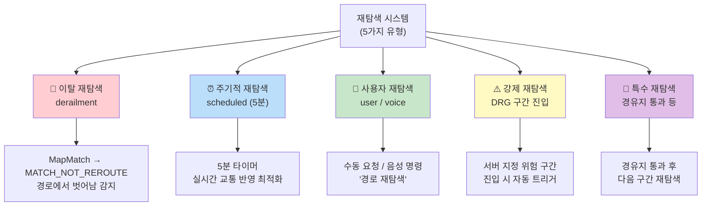

### 7.2 이탈 감지 → 재탐색 전체 플로우

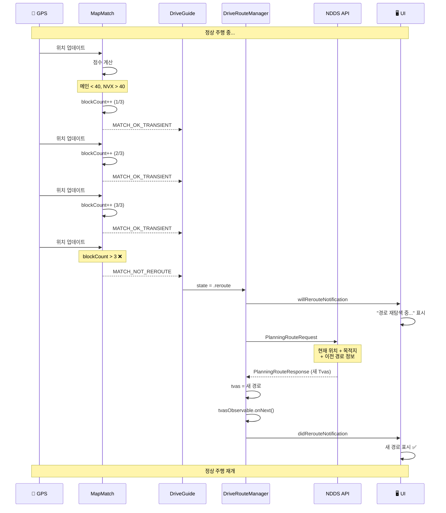

### 7.3 재탐색 억제 조건 다이어그램

```
    ── 재탐색이 억제되는 상황들 ──────────────────────────

    🚗 출발!
    │
    │◄── 35m ──►│  출발점 보호: 재탐색 억제
    │◄── 5초 ──►│  시간 보호: 재탐색 억제
    │
    ├───────────── 일반 구간: 정상 이탈 판정 ─────────
    │
    │  🚇 터널 진입
    │  ├─────────── 터널 내부: 이탈 판정 보류 ──────────
    │  🚇 터널 탈출
    │
    ├───────────── 일반 구간 ─────────────────────────
    │
    │  🛣️ 고속도로 진입
    │  ├─────────── GPS>120m: 타이머 기반 유예 ────────
    │  │            (주행시간 > 30초 누적 시)
    │  🛣️ 고속도로 이탈
    │
    ├───────────── 일반 구간 ─────────────────────────
    │
    │  ⛽ 휴게소 접근
    │  │◄── 300m ──►│  휴게소 보호: 재탐색 억제
    │  ⛽ 휴게소 이탈
    │
    ├───────────── 일반 구간 ─────────────────────────
    │
    🏁 도착 (30m 이내)

    ┌────────────────────────────────────────────────┐
    │  억제 임계값 요약:                               │
    │  출발점:    < 35m  또는 < 5초                    │
    │  고속도로:  GPS정확도 > 120m + 주행시간 > 30초    │
    │  휴게소:    NVX 거리 < 300m                      │
    │  터널:      shade link 매칭 중                    │
    └────────────────────────────────────────────────┘
```

### 7.4 재탐색 요청 구성

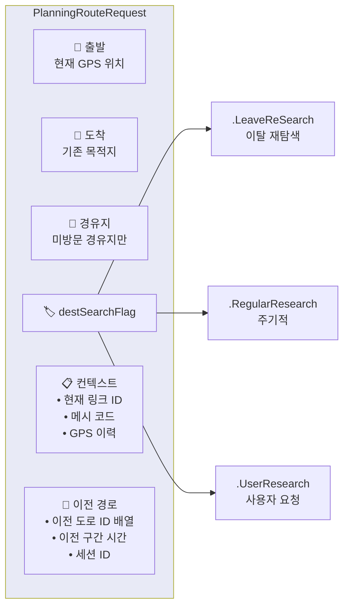

---

## 8. 네비게이션 UI 구조

### 8.1 화면 구성 (Guide 모드)

```
    ┌─────────────────────────────────────────────┐
    │ ┌─────────────────────────────────────────┐ │
    │ │          TurnView (회전 안내)             │ │
    │ │  🔄 우회전           450m               │ │
    │ │  테헤란로 방면                            │ │
    │ ├─────────────────────────────────────────┤ │
    │ │          LaneView (차선 안내)             │ │
    │ │  ┌──┬──┬══╤══╤══╤──┐                   │ │
    │ │  │← │←↑│ ↑│ ↑│↑→│ →│                   │ │
    │ │  └──┴──┴══╧══╧══╧──┘                   │ │
    │ ├─────────────────────────────────────────┤ │
    │ │                                         │ │
    │ │                                         │ │
    │ │          JunctionImageView              │ │
    │ │          (교차로 확대 이미지)              │ │
    │ │          135×200 또는 전체화면            │ │
    │ │                                         │ │
    │ │                                         │ │
    │ │                                         │ │
    │ │           🗺️ 지도 (MapView)              │ │
    │ │               🚗                        │ │
    │ │                                         │ │
    │ │  ┌───────────┐                          │ │
    │ │  │ 📸 60km/h │  SafeDriveInfoView       │ │
    │ │  │   300m    │  (SDI 안전운전 정보)      │ │
    │ │  └───────────┘                          │ │
    │ │                                         │ │
    │ │  ┌────────┐  SpeedometerView            │ │
    │ │  │ 58km/h │  (현재 속도)                │ │
    │ │  └────────┘                             │ │
    │ ├─────────────────────────────────────────┤ │
    │ │       DriveBottomBarHeaderView           │ │
    │ │  강남역 │ 12.5km │ 18분 │ 도착 14:32    │ │
    │ └─────────────────────────────────────────┘ │
    └─────────────────────────────────────────────┘
```

### 8.2 화면 구성 (Highway 모드)

```
    ┌─────────────────────────────────────────────┐
    │ ┌─────────────────────────────────────────┐ │
    │ │          TurnView (회전 안내)             │ │
    │ │  🔄 직진            15km               │ │
    │ │  경부고속도로                             │ │
    │ ├──────────────────┬──────────────────────┤ │
    │ │                  │  Highway 리스트       │ │
    │ │                  │ ┌──────────────────┐ │ │
    │ │                  │ │ ━━ 서울TG  2.3km │ │ │
    │ │                  │ │ ━━ 기흥IC   15km │ │ │
    │ │  🗺️ 지도          │ │ ━━ 용인JC   28km │ │ │
    │ │                  │ │ ━━ 기흥휴게소 35km│ │ │
    │ │     🚗           │ │ ━━ 수원IC   42km │ │ │
    │ │                  │ └──────────────────┘ │ │
    │ │                  │  정체:               │ │
    │ │                  │  ━━ 원활  ━━ 서행    │ │
    │ │                  │  ━━ 정체  ━━ 지정체  │ │
    │ ├──────────────────┴──────────────────────┤ │
    │ │  강남역 │ 52km │ 48분 │ 도착 15:12      │ │
    │ └─────────────────────────────────────────┘ │
    └─────────────────────────────────────────────┘
```

### 8.3 화면 구성 (Map 모드 - 지도 터치 시)

```
    ┌─────────────────────────────────────────────┐
    │ ┌─────────────────────────────────────────┐ │
    │ │   TopTurnView (컴팩트 안내)               │ │
    │ │   🔄 450m 우회전 │ 📸 60 300m            │ │
    │ ├─────────────────────────────────────────┤ │
    │ │                                         │ │
    │ │                                         │ │
    │ │                                         │ │
    │ │           🗺️ 전체화면 지도                │ │
    │ │            (터치 조작 가능)               │ │
    │ │               🚗                        │ │
    │ │                                         │ │
    │ │                                         │ │
    │ │                                         │ │
    │ │                                         │ │
    │ ├─────────────────────────────────────────┤ │
    │ │  강남역 │ 12.5km │ 18분 │ 도착 14:32    │ │
    │ └─────────────────────────────────────────┘ │
    └─────────────────────────────────────────────┘

    7초 미조작 → 자동으로 Guide 모드 복귀
```

### 8.4 뷰 모드 전환 흐름

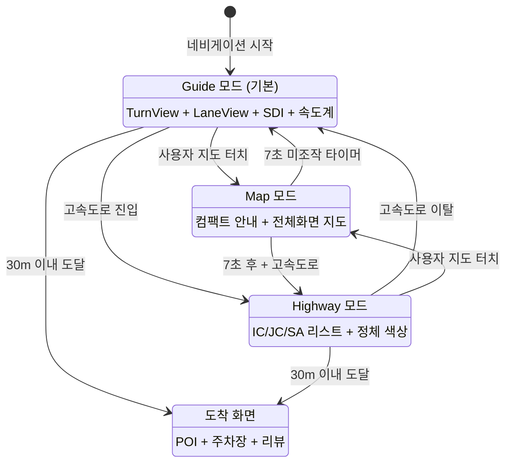

### 8.5 데이터 바인딩 패턴

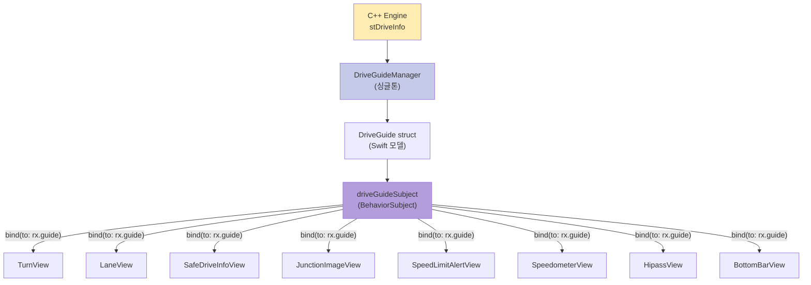

```swift
// 모든 안내 UI가 구현하는 프로토콜
protocol DriveGuidePresentable: AnyObject {
    var guide: DriveGuide? { get set }
}

// RxSwift 자동 바인딩 → didSet에서 UI 갱신
```

### 8.6 도착 화면

```
    ┌─────────────────────────────────────────────┐
    │                                              │
    │         🏁 목적지에 도착했습니다               │
    │                                              │
    │  ┌─────────────────────────────────────────┐│
    │  │  ArrivalPlaceView                       ││
    │  │  📍 강남역 2번 출구                       ││
    │  │  서울시 강남구 강남대로 396                 ││
    │  └─────────────────────────────────────────┘│
    │  ┌─────────────────────────────────────────┐│
    │  │  ArrivalParkingLotView                  ││
    │  │  🅿️ 인근 주차장                          ││
    │  │  강남역 공영주차장 (200m, 2000원/시간)     ││
    │  └─────────────────────────────────────────┘│
    │  ┌─────────────────────────────────────────┐│
    │  │  ArrivalPlaceReviewView                 ││
    │  │  ⭐ 4.2 (리뷰 128개)                    ││
    │  └─────────────────────────────────────────┘│
    │  ┌─────────────────────────────────────────┐│
    │  │  ArrivalRecommendedPlaceView            ││
    │  │  📍 주변 추천 장소                        ││
    │  └─────────────────────────────────────────┘│
    └─────────────────────────────────────────────┘
```

---

## 9. 네비게이션 모드

### 9.1 모드별 비교

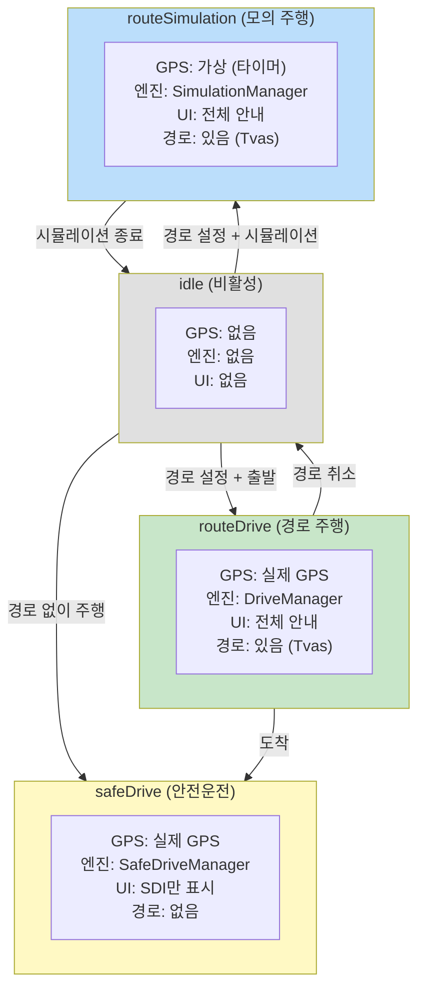

### 9.2 실제 주행 vs 모의 주행 데이터 플로우

```
    ── 실제 주행 (routeDrive) ──────────────────────

    📡 CoreLocation
        ↓ 실제 GPS 좌표
    GPSManager
        ↓ didUpdateLocations
    DriveManager
        ↓ 좌표 유효성 검증 (한국 좌표계)
    MapMatchManager.doMapMatching()
        ↓ 도로 매칭
    RGPlayerManager.updateDriveInfo()
        ↓ 안내 정보 생성
    DriveGuideManager → UI

    ── 모의 주행 (routeSimulation) ────────────────

    ⏱️ 타이머 (1초 간격)
        ↓ 속도 기반 이동거리 계산
        ↓ moveDistance = speed × 1000 / 3600
    SimulationManager
        ↓ 경로 정점(vertex) 따라 이동
        ↓ 가상 GPS 데이터 생성
    RGPlayerManager.updateDriveInfo()
        ↓ 안내 정보 생성 (동일 파이프라인)
    DriveGuideManager → UI

    시뮬레이션 제어:
    ┌───────────────────────────────────────┐
    │  ▶️ start  ⏸️ pause  ⏹️ stop          │
    │  🔄 setSpeed(km/h)                   │
    │  📍 setDistance(m) / setPercent(%)    │
    └───────────────────────────────────────┘
```

---

## 10. 차량 아바타 부드러운 이동 (Interpolation)

### 10.1 문제와 해결 방식

```
    ── GPS는 1초마다 업데이트, 화면은 60fps ────────

    GPS 업데이트 간격:  |─────── 1초 ───────|─────── 1초 ───────|
                       📍                   📍                   📍
                       GPS₁                 GPS₂                 GPS₃

    문제: GPS 사이 60프레임을 어떻게 채울 것인가?

    ┌──────────────────────────────────────────────────────────────┐
    │  GPS₁                                              GPS₂     │
    │   📍                                                📍      │
    │   │  프레임 1                                               │
    │   │  ├── 프레임 2                                           │
    │   │  │   ├── 프레임 3                                       │
    │   │  │   │   ├── ...                                       │
    │   │  │   │   │         ├── 프레임 58                        │
    │   │  │   │   │         │   ├── 프레임 59                    │
    │   │  │   │   │         │   │   ├── 프레임 60               │
    │   ▼  ▼   ▼   ▼         ▼   ▼   ▼                          │
    │   🚗→ 🚗→ 🚗→ 🚗→ ... 🚗→ 🚗→ 🚗                         │
    │                                                             │
    │  각 프레임: 선형 보간으로 중간 위치 계산                      │
    │  t = elapsed / duration (0.0 ~ 1.0)                        │
    │  position = GPS₁ + (GPS₂ - GPS₁) × t                      │
    └──────────────────────────────────────────────────────────────┘
```

### 10.2 TMAP의 이중 보간 전략

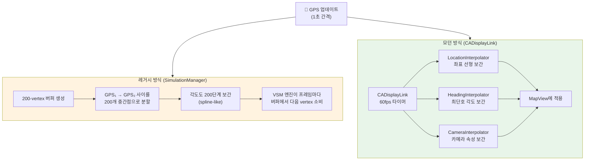

### 10.3 레거시 방식: 200-vertex 버퍼 (SimulationManager)

```
    ── 1초간 GPS₁ → GPS₂ 이동을 200개 점으로 분할 ──

    GPS₁                                              GPS₂
    📍──·──·──·──·──·──·──·──·──·──·──·──·──·──·──·──📍
    v₀  v₁ v₂ v₃ v₄ v₅    ...    v₁₉₆ v₁₉₇ v₁₉₈ v₁₉₉

    좌표 보간 (선형):
    ┌────────────────────────────────────────────────┐
    │  fx = (GPS₂.x - GPS₁.x) / 200                 │
    │  fy = (GPS₂.y - GPS₁.y) / 200                 │
    │                                                 │
    │  v[i].x = GPS₁.x + fx × i                     │
    │  v[i].y = GPS₁.y + fy × i                     │
    └────────────────────────────────────────────────┘

    각도 보간 (최단호):
    ┌────────────────────────────────────────────────┐
    │  anglesBetweenAngle0:angle1:count:200          │
    │                                                 │
    │  예) 350° → 10° 회전 시:                        │
    │      350° → 352° → 354° → ... → 8° → 10°      │
    │      (시계방향 20° 회전, 반시계 340° 아님)        │
    └────────────────────────────────────────────────┘

    다중 vertex 통과 시 (forwardSimulation):
    ┌────────────────────────────────────────────────┐
    │  경로 vertex를 여러 개 지나는 경우:              │
    │                                                 │
    │  V₁───V₂───V₃───V₄                            │
    │  │ 30m │ 50m │ 20m │                            │
    │                                                 │
    │  각 구간에 비례하여 200개 점 분배:               │
    │  V₁~V₂: 60개, V₂~V₃: 100개, V₃~V₄: 40개      │
    │  → 구간별 각도 변화를 자연스럽게 반영            │
    └────────────────────────────────────────────────┘

    VSM 엔진 소비:
    ┌────────────────────────────────────────────────┐
    │  renderTime = 20ms (50Hz) ~ 60ms (16Hz)        │
    │  매 렌더 프레임마다 버퍼에서 다음 vertex 사용    │
    │  200 vertices / 50Hz = 4 vertices/frame         │
    └────────────────────────────────────────────────┘
```

### 10.4 모던 방식: CADisplayLink 60fps 보간

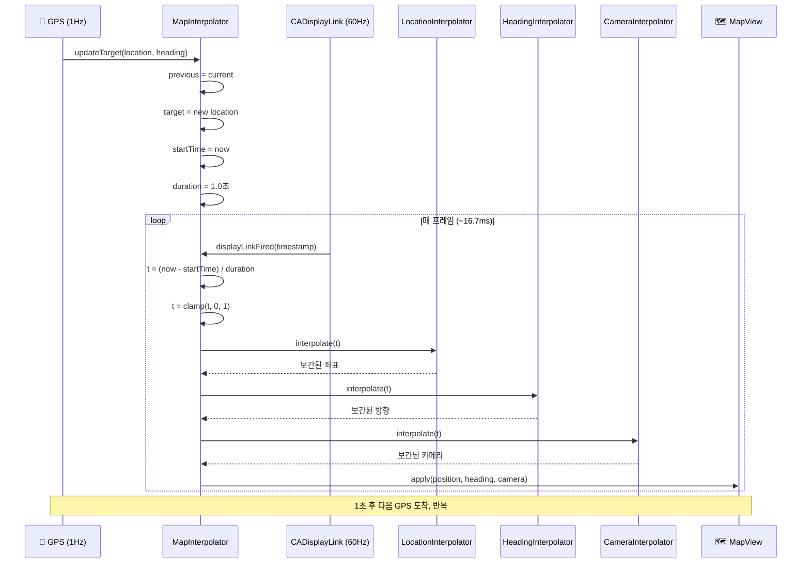

### 10.5 3가지 보간기 상세

```
    ── LocationInterpolator (좌표 보간) ──────────

    duration = 1.0초

    t = 0.0            t = 0.5            t = 1.0
    GPS₁ ──────────── 중간점 ──────────── GPS₂
    (37.5000, 127.0000)                   (37.5010, 127.0020)

    lat = prev.lat + (target.lat - prev.lat) × t
    lon = prev.lon + (target.lon - prev.lon) × t

    t=0.5 → (37.5005, 127.0010)


    ── HeadingInterpolator (방향 보간) ───────────

    ★ 핵심: 최단호(shortest-arc) 보간

    ┌────────────────────────────────────────────┐
    │  delta = ((target - prev + 540) % 360) - 180│
    │  result = prev + delta × t                  │
    └────────────────────────────────────────────┘

    예1) 10° → 350° (반시계 20° 회전)
         delta = ((350 - 10 + 540) % 360) - 180
               = (880 % 360) - 180
               = 160 - 180 = -20°
         t=0.5 → 10° + (-20° × 0.5) = 0° ✅

    예2) 10° → 350° (잘못된 방식: 시계 340° 회전)
         단순 보간: 10° + (340° × 0.5) = 180° ❌

         ┌─── 0°/360° ───┐
         │    ╱ ↺ 20° ╲   │
         │ 350°      10°  │
         │    ╲ ↻ 340° ╱  │  ← 이쪽으로 가면 안 됨!
         └────────────────┘


    ── CameraInterpolator (카메라 보간) ──────────

    동시에 4가지 속성 보간:
    ┌──────────────┬────────────────────────────┐
    │ center       │ 좌표 선형 보간 (lat, lon)   │
    │ heading      │ 최단호 보간 (위와 동일)     │
    │ altitude     │ 선형 보간 (줌 레벨)         │
    │ pitch        │ 선형 보간 (기울기)          │
    └──────────────┴────────────────────────────┘

    auto-tracking 활성 시에만 동작
    사용자가 지도 터치 → 보간 중단 → 7초 후 재개
```

### 10.6 터널/GPS 손실 시 Dead Reckoning

```mermaid
flowchart TD
    subgraph normal["정상 GPS"]
        N1["📡 GPS 수신"]
        N2["MapMatch → 도로 매칭"]
        N3["매칭 좌표로 보간"]
    end

    subgraph tunnel["🚇 터널/GPS 손실"]
        T1["GPS 정확도 급락\n또는 업데이트 중단"]
        T2["eVirtualGps = Tunnel"]
        T3["getAutoDrivePosition()"]
        T4["마지막 속도 + 방향으로\n위치 추정"]
        T5["경로 vertex를 따라\n가상 이동"]
    end

    N1 --> N2 --> N3
    N1 -->|GPS 손실| T1
    T1 --> T2 --> T3 --> T4 --> T5
    T5 -->|GPS 복원| N1

    style normal fill:#c8e6c9
    style tunnel fill:#fff3e0
```

```
    ── Dead Reckoning 계산 ─────────────────────────

    마지막 유효 GPS:
    • 위치: (lat₀, lon₀)
    • 속도: v = 80 km/h = 22.2 m/s
    • 방향: θ = 45°

    경과 시간 Δt = 3초 후:

    이동거리 = v × Δt = 22.2 × 3 = 66.6m

    추정 위치:
    lat₁ = lat₀ + (66.6 × cos(θ)) / 111,320
    lon₁ = lon₀ + (66.6 × sin(θ)) / (111,320 × cos(lat₀))

    실제로는 경로 vertex를 따라 이동하여
    곡선 도로도 정확하게 추적
```

### 10.7 렌더링 프레임레이트 설정

```
    ── 상황별 FPS 설정 ─────────────────────────────

    ┌────────────────────┬────────┬────────────────┐
    │ 상황                │ FPS    │ renderTime     │
    ├────────────────────┼────────┼────────────────┤
    │ 주행 안내 (track)   │ 50 Hz  │ 20ms           │
    │ 주행 안내 (headUp)  │ 50 Hz  │ 20ms           │
    │ 지도 탐색 (normal)  │ ~16 Hz │ 60ms           │
    │ CarPlay             │ 30-60  │ 적응형          │
    │ CADisplayLink       │ 60 Hz  │ ~16.7ms        │
    └────────────────────┴────────┴────────────────┘

    VSM 엔진: renderTime(ms)으로 제어
    CADisplayLink: preferredFrameRateRange(30~60)으로 제어

    200-vertex 버퍼 소비율:
    ┌────────────────────────────────────────────┐
    │  50Hz에서 1초간 200 vertices 소비           │
    │  = 프레임당 4 vertices 소비                 │
    │  = 5ms 간격의 위치 변화                     │
    │  → 매우 부드러운 이동                       │
    └────────────────────────────────────────────┘
```

### 10.8 차량 아바타 렌더링

```
    ── 차량 아이콘 관리 ────────────────────────────

    ┌─────────────────────────────────────────────┐
    │  VSMLocationManager                          │
    │  ├─ locationComponent.icon = 🚗 (차량 아이콘) │
    │  ├─ iconSize = 95 × 95                      │
    │  ├─ iconVisible = true                      │
    │  └─ 위치/방향: 보간 결과 적용                 │
    │                                              │
    │  아이콘 종류:                                  │
    │  • 정상 GPS: 일반 차량 아이콘 🚗              │
    │  • 약한 GPS: 반투명/다른 아이콘 🚗💨          │
    │                                              │
    │  positionDataDelegate:                       │
    │  DriveGuideManager → TmapNavigation          │
    │  → 보간된 위치를 VSM 엔진에 전달              │
    └─────────────────────────────────────────────┘
```

---

## 11. 교통 정보 시스템

### 11.1 교통 정보 소스 전체 맵

```mermaid
flowchart TD
    subgraph realtime["실시간 교통"]
        REROUTE["⏰ 주기적 재탐색\n(5분 간격)"]
        TRAFFIC["🚦 정체 구간 색상\n(ProgressBar)"]
        ETA["⏱️ ETA 실시간 재계산"]
    end

    subgraph vms["VMS (도로 전광판)"]
        VMS_Q["NDDS API 조회\n(RSE ID 기반)"]
        VMS_D["7초 표시 후 자동 숨김"]
        VMS_T["고속도로 교통정보판"]
    end

    subgraph v2x["V2X / C-ITS"]
        BRAKE["급정거 감지"]
        ACCIDENT["사고 감지"]
        EMERGENCY["긴급차량 접근"]
        SPAT["신호등 정보 (SPaT)"]
    end

    REROUTE --> TRAFFIC
    REROUTE --> ETA
    VMS_Q --> VMS_D --> VMS_T

    style realtime fill:#e8f5e9
    style vms fill:#e3f2fd
    style v2x fill:#fce4ec
```

### 11.2 신호등 정보 (SPaT)

```
    ── V2X 신호등 표시 ──────────────────────────────

    ┌──────────────────────────────────────────────┐
    │  교차로까지 150m                               │
    │                                               │
    │  ┌─────────┐  ┌─────────┐  ┌─────────┐      │
    │  │ 직진 🟢 │  │ 좌회전🔴│  │ 우회전🟢│      │
    │  │  23초   │  │  45초   │  │  23초   │      │
    │  └─────────┘  └─────────┘  └─────────┘      │
    │                                               │
    │  표시 조건: 잔여 5초 이상 & 300초 미만          │
    └──────────────────────────────────────────────┘

    movement 코드:
    1=직진  2=좌회전  3=보행자  4=자전거
    5=우회전 6=버스    7=U턴

    state 코드:
    3=정지(적색)  6=진행(녹색)  7=주의(황색)  8=점멸
```

---

## 12. 부가 기능

### 12.1 전체 부가 기능 맵

```mermaid
flowchart TD
    NAV["TMAP 네비게이션\n부가 기능"]

    subgraph platform["멀티 플랫폼"]
        CP["🚘 CarPlay 연동"]
        LA["📱 Live Activity\n잠금화면/다이나믹 아일랜드"]
        DM["🌙 다크모드"]
    end

    subgraph during["주행 중 정보"]
        PB["📊 Progress Bar\n정체 색상 + 경유지"]
        ALT["🔀 대안 경로 표시"]
        TOLL["💰 톨비 표시"]
        RC["📋 경로 변경 알림\n시간/비용 차이"]
        OPP["↔️ 반대편 도착 처리"]
        FAV["⭐ 즐겨찾기 경로 비교"]
    end

    subgraph poi["경로 위 POI"]
        GAS["⛽ 주유소 마커"]
        EV["🔋 EV 충전소 마커"]
        WP["📍 경유지 (1~5)"]
    end

    subgraph after["주행 종료"]
        TRIP["📈 주행 통계\nCO2, 연비, 평균속도"]
        ARR["🏁 도착 화면\nPOI + 주차장 + 리뷰"]
    end

    subgraph voice["음성 확장"]
        CELEB["🎤 셀럽 음성팩"]
    end

    NAV --> platform
    NAV --> during
    NAV --> poi
    NAV --> after
    NAV --> voice

    style platform fill:#e3f2fd
    style during fill:#e8f5e9
    style poi fill:#fff8e1
    style after fill:#fce4ec
    style voice fill:#f3e5f5
```

### 12.2 CarPlay 연동

```mermaid
sequenceDiagram
    participant iPhone as 📱 iPhone
    participant DGM as DriveGuideManager
    participant CPM as CarPlayNavigationManager
    participant CP as 🚘 CarPlay 화면

    iPhone->>DGM: 네비게이션 시작
    DGM->>CPM: 세션 생성 (CPNavigationSession)
    CPM->>CP: Trip Preview 표시

    loop 매 GPS 업데이트
        DGM->>CPM: DriveGuide 업데이트
        CPM->>CP: Maneuver 업데이트 (회전 안내)
        CPM->>CP: TripEstimate 업데이트 (남은거리/시간)
        CPM->>CP: SafeDriveInfo 업데이트 (SDI)
    end

    DGM->>CPM: 도착
    CPM->>CP: Trip 종료
```

```
    ── CarPlay 화면 구성 ────────────────────────────

    ┌─────────────────────────────────────────────┐
    │  ┌─────────────────────────────────────────┐│
    │  │  🔄 300m 앞 우회전                       ││
    │  │  테헤란로 방면                            ││
    │  ├─────────────────────────────────────────┤│
    │  │                                         ││
    │  │              🗺️ 지도                     ││
    │  │                🚗                       ││
    │  │                                         ││
    │  │  ┌──────────┐                           ││
    │  │  │📸 60km/h │  CarPlaySafeDriveInfoView ││
    │  │  │  300m    │                           ││
    │  │  └──────────┘                           ││
    │  ├─────────────────────────────────────────┤│
    │  │  🏁 강남역  │  12.5km  │  도착 14:32    ││
    │  └─────────────────────────────────────────┘│
    └─────────────────────────────────────────────┘

    특징:
    • TripEstimate 스타일: 다크모드 자동 전환 (.dark / .light)
    • CPManeuver: TMAP TBT → CarPlay 회전 안내 변환
    • SafeDriveInfo: iPhone과 동일한 SDI 표시
    • 세션 동기화: iPhone ↔ CarPlay 상태 공유
```

### 12.3 Live Activity (잠금화면 / 다이나믹 아일랜드)

```
    ── iOS 16.1+ ActivityKit 연동 ───────────────────

    ┌─ 다이나믹 아일랜드 (컴팩트) ───────────────────┐
    │  🔄 300m 우회전  │  12.5km  14:32 도착         │
    └────────────────────────────────────────────────┘

    ┌─ 잠금화면 위젯 ───────────────────────────────┐
    │  ┌──────────────────────────────────────────┐ │
    │  │  🔄 우회전 300m                           │ │
    │  │  테헤란로 방면                             │ │
    │  │  ─────────────────────────────────────── │ │
    │  │  🏁 강남역  │  12.5km  │  도착 14:32     │ │
    │  └──────────────────────────────────────────┘ │
    └───────────────────────────────────────────────┘

    구현:
    • TBTWidgetAttributes: Activity 표시 데이터
    • DriveLiveActivityController: Activity 생명주기 관리
    • 드라이브 모드 변경/백그라운드 진입 시 업데이트
    • 설정: DriveSettings.isUseVoiceOnBackground
```

### 12.4 경로 Progress Bar (정체 색상)

```
    ── 수직 게이지 형태의 진행률 표시 ────────────────

    출발 ▼
    ┌───┐
    │███│ ← 🟢 원활 (Green)
    │███│
    │▓▓▓│ ← 🟡 서행 (Yellow)
    │▓▓▓│
    │ 1 │ ← 📍 경유지 1
    │▓▓▓│
    │███│ ← 🟢 원활
    │███│
    │░░░│ ← 🔴 정체 (Red)
    │░░░│
    │ 2 │ ← 📍 경유지 2
    │███│
    │███│ ← 🟢 원활
    │   │ ← 🔵 정보없음 (Blue)
    └───┘
    도착 ▲

    ── 데이터 구조 ──────────────────────────────────

    ProgressBar (@Published):
    ├─ congestions: [CongestionInfo]
    │   └─ 구간별 정체 색상 (Green/Yellow/Red/Blue)
    ├─ waypoints: [WaypointInfo]
    │   ├─ remainingDistanceRatio (0.0~1.0)
    │   └─ number (1~5)
    ├─ elapsedRatioForProgress: Double
    │   └─ 현재 위치 비율 (게이지 채움)
    └─ elapsedRatioForRouteInfo: Double
        └─ 경로 정보 표시용 비율

    DriveProgressBarView (SwiftUI):
    → 수직 게이지 + 경유지 마커 + 정체 색상
```

### 12.5 대안 경로 표시

```mermaid
flowchart LR
    subgraph main["메인 경로"]
        M1["A"] --> M2["B"] --> M3["C"] --> M4["D"]
    end

    subgraph alt["대안 경로"]
        A1["A"] --> A2["B'"] --> A3["C'"] --> A4["D"]
    end

    DG["DriveGuide.\nAlternativeRouteJunction"]
    DG --> SHOW{"shouldDisplay\nAlternativeRoute()?"}
    SHOW -->|Yes| DISPLAY["지도에 대안 경로 표시\n+ 남은 거리 비교"]
    SHOW -->|No| HIDE["숨김"]

    style main fill:#c8e6c9
    style alt fill:#bbdefb
```

```
    특징:
    • 주행 중 대안 경로가 존재하면 지도에 동시 표시
    • AlternativeRouteJunction: 분기점 + 남은 거리
    • DriveRouteManager에서 alternativeTvas 관리
    • 사용자가 대안 경로 선택 시 즉시 전환
```

### 12.6 반대편 도착 처리

```
    ── 목적지가 도로 반대편에 있을 때 ─────────────

    ═══════════════╤══════════════════ 도로
                   │
              🏁 목적지              🚗 현재 위치
                   │                 (도로 이쪽)
    ═══════════════╧══════════════════

    안내 시퀀스:
    ┌──────────────────────────────────────────────┐
    │  600m: "목적지가 반대편에 있습니다"            │
    │  300m: "목적지가 반대편에 있습니다"            │
    │  도착:  팝업 표시                             │
    │  ┌────────────────────────────────────────┐  │
    │  │  목적지가 도로 반대편에 있습니다          │  │
    │  │                                        │  │
    │  │  남은시간: 3분  남은거리: 1.2km          │  │
    │  │  추가 톨비: 0원                         │  │
    │  │                                        │  │
    │  │  [도착 완료]        [반대편으로 안내]     │  │
    │  └────────────────────────────────────────┘  │
    └──────────────────────────────────────────────┘
```

### 12.7 톨비 표시 및 추적

```
    ── 톨게이트 접근 시 ──────────────────────────────

    ┌─ 회전 안내 ─────────────────────────────────┐
    │  🔄 직진 800m                                │
    │  경부고속도로 톨게이트                         │
    ├──────────────────────────────────────────────┤
    │  ┌────────────┐                              │
    │  │ 💰 4,800원 │  TollFareView                │
    │  └────────────┘  (검정 라운드 배경)           │
    ├──────────────────────────────────────────────┤
    │  하이패스 차로:                                │
    │  ┌──┬══╤══╤──┬──┐                            │
    │  │1 │2 │3 │4 │5 │  HipassView               │
    │  └──┴══╧══╧──┴──┘  (2,3번 하이패스)          │
    └──────────────────────────────────────────────┘

    데이터:
    • OsTBT.nTollFee: 톨게이트 요금 (원)
    • 하이패스 차로: nHiPassArry[16]
    • 스마트톨링: nSmartTallingLaneArry
    • 경로 전체 톨비: stDriveInfo.remainingToll
```

### 12.8 경로 변경 알림

```
    ── 주기적 재탐색 후 경로 변경 시 ──────────────

    ┌──────────────────────────────────────────────┐
    │  📋 실시간 교통정보 반영                       │
    │                                               │
    │  시간: 🟢 -5분 (감소)  또는  🔴 +8분 (증가)   │
    │  비용: 🟢 -2,000원     또는  🔴 +1,500원      │
    │                                               │
    │  경유 도로: 경부고속 → 영동고속                  │
    │  경로 옵션: [무료] [추천]                       │
    │                                               │
    │  변경 유형:                                    │
    │  • minor: 동일 도로, 시간/비용만 변경           │
    │  • major: 경로 자체 변경 (도로 요약 다름)       │
    │  ※ 5분 이상 차이 시 "유의미한 변경"으로 표시     │
    └──────────────────────────────────────────────┘
```

### 12.9 경로 위 POI (주유소 / EV 충전소)

```mermaid
flowchart TD
    ROUTE["경로"]

    subgraph onroute["경로 위 POI"]
        GAS_R["⛽ 주유소\nDRIVE_GAS_ROUTE"]
        EV_R["🔋 EV 충전소\nDRIVE_EV_ROUTE"]
    end

    subgraph around["주변 POI (최대 20개)"]
        GAS_A["⛽ 주유소\nDRIVE_GAS_AROUND"]
        EV_A["🔋 EV 충전소\nDRIVE_EV_AROUND"]
    end

    ROUTE --> onroute
    ROUTE --> around

    style onroute fill:#c8e6c9
    style around fill:#e3f2fd
```

```
    EV 충전소 운영사 (19개+):
    ┌──────────────────────────────────────────────┐
    │ ChargeV │ KEPCO  │ 에버온  │ GS     │ 환경부 │
    │ KEVCS  │ Clean  │ 제주   │ 대영   │ iCar  │
    │ Volvo  │ Star   │ KEVIT  │ eTraffic│ChargeIn│
    │ LG     │ HUMAX  │ PowerCube│SK Energy│      │
    └──────────────────────────────────────────────┘

    도착지가 EV 충전소인 경우:
    dataKind == "6" → isDestinationEvChargeStation = true
    → 도착 화면에서 충전소 정보 표시
```

### 12.10 주행 통계 (Trip Summary)

```
    ── 주행 종료 후 수집되는 통계 ──────────────────

    ┌──────────────────────────────────────────────┐
    │  📈 주행 통계 (TripInfoData)                   │
    │                                               │
    │  ┌─ 기본 정보 ─────────────────────────────┐ │
    │  │ 출발 시각    │ 2026-03-27 14:00          │ │
    │  │ 도착 시각    │ 2026-03-27 14:48          │ │
    │  │ 주행 시간    │ 48분                       │ │
    │  │ 주행 거리    │ 35.2km                     │ │
    │  │ 평균 속도    │ 44 km/h                    │ │
    │  │ 최고 속도    │ 102 km/h                   │ │
    │  └──────────────────────────────────────────┘ │
    │                                               │
    │  ┌─ 경로 정보 ─────────────────────────────┐ │
    │  │ 재탐색 횟수  │ 2회                        │ │
    │  │ 이탈 횟수    │ 1회                        │ │
    │  │ 도착 여부    │ ✅                         │ │
    │  └──────────────────────────────────────────┘ │
    │                                               │
    │  ┌─ 환경 정보 ─────────────────────────────┐ │
    │  │ CO2 배출량   │ 5.8 kg                     │ │
    │  │ 연료 소비    │ 3.2 L                      │ │
    │  │ 연비         │ 11.0 km/L                  │ │
    │  └──────────────────────────────────────────┘ │
    │                                               │
    │  CO2 계산 공식:                                │
    │  dAsF = f(속도) → 속도별 연료 효율 모델        │
    └──────────────────────────────────────────────┘
```

### 12.11 즐겨찾기 경로 비교

```
    ── 이탈 재탐색 시 즐겨찾기 경로와 비교 ──────────

    ┌──────────────────────────────────────────────┐
    │  DriveRouteFavoriteDerailmentView             │
    │                                               │
    │  "자주 가는 경로와 비교"                        │
    │                                               │
    │  ┌────────────────┬────────────────────────┐ │
    │  │ 시간 차이       │ 🟢 -3분 빠름           │ │
    │  │ 거리 차이       │ 🔴 +1.2km 멀어짐       │ │
    │  └────────────────┴────────────────────────┘ │
    │                                               │
    │  3초 후 자동 숨김                              │
    │  재탐색 시 lastResponse.usedFavoriteRouteList  │
    └──────────────────────────────────────────────┘
```

### 12.12 셀럽 음성팩 / 다크모드

```
    ── 셀럽 음성팩 ────────────   ── 다크모드 ──────────
    ┌───────────────────────┐    ┌───────────────────────┐
    │  ┌────┐               │    │  적용 범위:            │
    │  │ 📷 │ 홍길동        │    │  • 교차로 이미지       │
    │  │    │ "길안내 시작"  │    │    (주간/야간 URL)     │
    │  └────┘               │    │  • CarPlay TripEstimate│
    │                       │    │    (.dark / .light)    │
    │  2.5초 후 페이드아웃   │    │  • SDI 표시 색상       │
    │  그라데이션 애니메이션  │    │  • 셀럽 음성팩 배경    │
    │  다크모드 배경 대응    │    │  • Status Bar 스타일   │
    └───────────────────────┘    └───────────────────────┘
```

---

## 13. 화면 표시 및 상태 관리

### 13.1 전체 화면 상태 관리 맵

```mermaid
flowchart TD
    NAV["네비게이션 화면\n상태 관리"]

    subgraph screen["화면 제어"]
        AWAKE["💡 화면 꺼짐 방지\nisIdleTimerDisabled"]
        DARK["🌙 다크모드\n자동 전환"]
        STATUS["📊 상태바\n동적 스타일"]
        ORIENT["📱 화면 방향\n전 방향 지원"]
    end

    subgraph lifecycle["앱 생명주기"]
        BG["📴 백그라운드\n네비 계속 동작"]
        FG["📱 포그라운드\n복귀 처리"]
        AUDIO_BG["🔊 백그라운드\n음성 안내 유지"]
    end

    subgraph interaction["사용자 인터랙션"]
        GESTURE["👆 제스처 처리\n7초 자동 복귀"]
        CALL["📞 통화 감지\nCallKit"]
        SPEED_UI["🚗 속도 기반\n색상 변경"]
    end

    NAV --> screen
    NAV --> lifecycle
    NAV --> interaction

    style screen fill:#e3f2fd
    style lifecycle fill:#e8f5e9
    style interaction fill:#fff8e1
```

### 13.2 화면 꺼짐 방지 (Always-On)

```
    ── 네비게이션 중 화면 유지 ──────────────────────

    ┌──────────────────────────────────────────────┐
    │  MainNavigationController.viewDidLoad():      │
    │                                               │
    │  UIApplication.shared.isIdleTimerDisabled     │
    │    = true                                     │
    │                                               │
    │  → 앱 실행 시 전역 설정                        │
    │  → 네비게이션 중 화면 절대 꺼지지 않음           │
    │  → 별도 해제 로직 없음 (앱 종료까지 유지)        │
    └──────────────────────────────────────────────┘

    RoutIn 적용 시 개선 포인트:
    ┌──────────────────────────────────────────────┐
    │  TMAP: 전역 항상 ON (과도함)                   │
    │  RoutIn: 네비게이션 시작 시 ON, 종료 시 OFF    │
    │                                               │
    │  NavigationViewController.viewDidAppear:      │
    │    isIdleTimerDisabled = true                  │
    │  NavigationViewController.viewDidDisappear:    │
    │    isIdleTimerDisabled = false                 │
    └──────────────────────────────────────────────┘
```

### 13.3 다크모드 / 야간모드 자동 전환

```mermaid
flowchart TD
    CHECK["DarkModeManager.check()\n(매초 호출)"]

    MODE{"darkModeUsage\n설정값?"}

    AUTO["automatic\n(자동)"]
    ALWAYS["always\n(항상 다크)"]
    NEVER["never\n(항상 라이트)"]

    TUNNEL{"터널 내부?"}
    CARPLAY{"CarPlay\n연결됨?"}
    SUNRISE{"현재 시각 vs\n일출/일몰 시간"}

    DARK_ON["🌙 다크모드 ON"]
    DARK_OFF["☀️ 라이트모드"]

    CHECK --> MODE
    MODE --> AUTO
    MODE --> ALWAYS --> DARK_ON
    MODE --> NEVER --> DARK_OFF

    AUTO --> TUNNEL
    TUNNEL -->|Yes| DARK_ON
    TUNNEL -->|No| CARPLAY
    CARPLAY -->|Yes| CP_STYLE{"차량 테마?"}
    CP_STYLE -->|.dark| DARK_ON
    CP_STYLE -->|.light| DARK_OFF
    CARPLAY -->|No| SUNRISE
    SUNRISE -->|야간| DARK_ON
    SUNRISE -->|주간| DARK_OFF

    style DARK_ON fill:#1a237e,color:#fff
    style DARK_OFF fill:#fff9c4
```

```
    ── 다크모드 영향 범위 ─────────────────────────

    ┌──────────────────────────────────────────────┐
    │  다크모드 전환 시 변경되는 요소:                │
    │                                               │
    │  📸 교차로 이미지  → 주간/야간 URL 전환         │
    │  📊 상태바 스타일  → .lightContent 전환         │
    │  🚗 SDI 표시      → 다크 색상 테마              │
    │  🚘 CarPlay       → TripEstimate .dark 스타일  │
    │  🎤 셀럽 음성팩    → 배경 색상 변경             │
    │  🗺️ 지도          → VSM 다크 테마 적용          │
    │                                               │
    │  터널 진입 시:                                  │
    │  → 즉시 다크모드 강제 전환                      │
    │  → 터널 탈출 시 원래 모드 복귀                   │
    └──────────────────────────────────────────────┘
```

### 13.4 백그라운드 / 포그라운드 처리

```mermaid
sequenceDiagram
    participant USER as 👤 사용자
    participant APP as 📱 TMAP App
    participant NAV as 🧭 Navigation Engine
    participant GPS as 📡 GPS
    participant AUDIO as 🔊 Audio Session
    participant LA as 🔒 Live Activity

    Note over APP: 네비게이션 주행 중

    USER->>APP: 홈 버튼 / 앱 전환
    APP->>APP: sceneDidEnterBackground

    rect rgb(255, 243, 224)
        Note over APP,LA: 백그라운드 상태
        APP->>GPS: 비주행 GPS 중단\n(NonDrivingGpsLog.stop)
        NAV->>NAV: 주행 GPS는 계속 유지 ✅
        AUDIO->>AUDIO: 음성 안내 계속 ✅\n(Background Audio)
        LA->>LA: Live Activity 업데이트 ✅\n(잠금화면 TBT)
        Note over APP: 지도 렌더링: 시스템 최적화에 의존
    end

    USER->>APP: 앱 복귀
    APP->>APP: sceneWillEnterForeground
    APP->>GPS: 비주행 GPS 재시작
    APP->>NAV: 상태 동기화
    APP->>APP: 화면 갱신
```

```
    ── 백그라운드 동작 요약 ─────────────────────────

    ┌────────────────────┬───────────┬──────────────┐
    │ 기능                │ 백그라운드 │ 비고          │
    ├────────────────────┼───────────┼──────────────┤
    │ GPS 위치 추적       │ ✅ 계속   │ 주행 모드 한정│
    │ 맵매칭 + 경로 안내  │ ✅ 계속   │ 엔진 동작     │
    │ 음성 안내           │ ✅ 계속   │ Audio Session │
    │ Live Activity      │ ✅ 업데이트│ 잠금화면 TBT  │
    │ 지도 렌더링         │ ⚠️ 시스템 │ OS 최적화     │
    │ CarPlay            │ ✅ 동기화  │ 별도 Scene    │
    │ 비주행 GPS 로그     │ ❌ 중단   │ 배터리 절약   │
    └────────────────────┴───────────┴──────────────┘

    CarPlay + 백그라운드 특수 처리:
    ┌──────────────────────────────────────────────┐
    │  CarPlay 연결 해제 + 백그라운드 진입 시:        │
    │  → 네비게이션 모드를 .idle로 리셋              │
    └──────────────────────────────────────────────┘
```

### 13.5 상태바 동적 스타일

```
    ── 상황별 상태바 스타일 ─────────────────────────

    ┌───────────────────┬──────────────────────────┐
    │ 상황               │ 상태바 스타일             │
    ├───────────────────┼──────────────────────────┤
    │ Guide 모드 (주간)  │ .darkContent (검정 텍스트)│
    │ Guide 모드 (야간)  │ .lightContent (흰색 텍스트)│
    │ Map 모드           │ .lightContent (흰색)     │
    │ Highway 모드       │ .lightContent (흰색)     │
    │ 안전운전 (주간)    │ .darkContent (검정)      │
    │ 안전운전 (야간)    │ .lightContent (흰색)     │
    └───────────────────┴──────────────────────────┘

    판정 로직:
    경로주행 && (Map || Highway) → .lightContent
    다크모드 → .lightContent
    그 외 → .darkContent
```

### 13.6 화면 방향 (Orientation)

```
    ── 방향 전환 시 레이아웃 ────────────────────────

    세로 (Portrait)              가로 (Landscape)
    ┌──────────────┐            ┌──────────────────────┐
    │ [TurnView   ]│            │ [Turn] │             │
    │              │            │        │             │
    │    🗺️ 지도   │            │  🗺️    │  Highway   │
    │     🚗       │            │   🚗   │  리스트     │
    │              │            │        │             │
    │ [BottomBar  ]│            │ [BottomBar          ]│
    └──────────────┘            └──────────────────────┘

    supportedInterfaceOrientations = .all (전 방향)
    preferredOrientation = .portrait (기본 세로)
    shouldAutorotate = true (자동 회전)

    지도 중심점, 교차로 이미지 크기 등 동적 재계산
```

### 13.7 제스처 처리 및 자동 추적

```mermaid
stateDiagram-v2
    [*] --> AutoTracking: 네비게이션 시작

    AutoTracking: 자동 추적 모드
    AutoTracking: trackMode = .trackAndHeadUp
    AutoTracking: 카메라가 차량 따라감

    UserTouch: 사용자 조작 모드
    UserTouch: trackMode = .normal
    UserTouch: 자유 지도 탐색

    AutoTracking --> UserTouch: 사용자가 지도 터치\n(pan/pinch/rotate)
    UserTouch --> UserTouch: 계속 조작 중\n(타이머 리셋)
    UserTouch --> AutoTracking: 7초 미조작\n(viewModeTimer)
```

```
    ── 제스처 상세 처리 ─────────────────────────────

    터치 시작:
    ┌──────────────────────────────────────────────┐
    │  1. viewModeTimer 중지                        │
    │  2. DriveViewManager.setMapMode()             │
    │  3. trackMode = .normal (자유 이동)            │
    │  4. Guide UI → 축소 모드 (TopTurnView)        │
    └──────────────────────────────────────────────┘

    7초 미조작:
    ┌──────────────────────────────────────────────┐
    │  1. viewMode = .guide (안내 모드 복귀)         │
    │  2. trackMode = .trackAndHeadUp (추적 복귀)   │
    │  3. 카메라 차량 위치로 자동 이동                │
    └──────────────────────────────────────────────┘

    맵 트랙모드 3가지:
    ┌──────────────┬──────────────┬──────────────┐
    │ track        │trackAndHeadUp│ normal       │
    │ 북쪽 고정     │ 진행방향 위   │ 자유 모드    │
    │   N↑         │    ↑차량     │  👆 터치     │
    │   🚗→        │    🚗       │    🚗       │
    │ 카메라: 수직  │ 카메라: 틸트  │ 추적 없음    │
    └──────────────┴──────────────┴──────────────┘

    시뮬레이션 모드: enableTouch = false (터치 비활성)
```

### 13.8 통화 감지 및 오디오 관리

```mermaid
flowchart TD
    subgraph call["📞 통화 감지"]
        CK["CXCallObserver\n(CallKit)"]
        IDLE{"isIdle?"}
        ACTIVE["통화 중"]
        FREE["통화 없음"]
    end

    subgraph audio["🔊 오디오 세션"]
        A1["기본: .playback\n+ mixWithOthers"]
        A2["음성 안내 중:\n+ duckOthers\n(배경 음악 볼륨↓)"]
        A3["CarPlay:\nvoicePrompt 모드"]
        A4["출력: 스피커 기본\n+ Bluetooth A2DP\n+ AirPlay"]
    end

    CK --> IDLE
    IDLE -->|No| ACTIVE
    IDLE -->|Yes| FREE
    FREE --> A1
    A1 --> A2
    A1 --> A3
    A1 --> A4

    style call fill:#fce4ec
    style audio fill:#e3f2fd
```

### 13.9 속도 기반 UI 변경

```
    ── 속도에 따른 시각 변화 ────────────────────────

    정상 속도           과속               가상 주행
    ┌────────┐        ┌────────┐        ┌────────┐
    │ 58     │        │ 95     │        │ 80     │
    │ km/h   │        │ km/h   │        │ km/h   │
    └────────┘        └────────┘        └────────┘
    색상: 기본          색상: 빨강 🔴      색상: 별도

    폰트: 32pt Bold (고정, 속도 무관)

    과속 판정:
    현재속도 > 제한속도 × (1 + 임계값%)
    임계값: 0% / 5% / 10% (사용자 설정)

    ⚠️ 과속 시 SpeedLimitAlertView 깜빡임 표시
```

### 13.10 전체 요약

```
    ┌──────────────────────┬────────────┬──────────────────────┐
    │ 기능                  │ TMAP 구현   │ RoutIn 적용 포인트    │
    ├──────────────────────┼────────────┼──────────────────────┤
    │ 화면 꺼짐 방지        │ ✅ 전역 ON  │ 네비 시작/종료 토글   │
    │ 백그라운드 GPS        │ ✅ 계속     │ Background Location  │
    │ 백그라운드 음성       │ ✅ 계속     │ Audio Background Mode│
    │ 다크모드 자동전환     │ ✅ 일출몰   │ iOS 시스템 + 터널감지 │
    │ 터널 → 다크모드       │ ✅ 즉시전환 │ GPS 손실 시 전환      │
    │ 상태바 동적 스타일    │ ✅ 모드별   │ 뷰모드별 전환         │
    │ 화면 방향            │ ✅ 전방향   │ Portrait + Landscape │
    │ 7초 자동복귀         │ ✅ 타이머   │ 동일 패턴 적용        │
    │ 맵 트랙모드 (3종)    │ ✅ 구현     │ MKMapView 카메라 추적 │
    │ 통화 감지            │ ✅ CallKit  │ 음성 안내 일시중단    │
    │ 배경음악 볼륨 조절    │ ✅ duck     │ AVAudioSession 설정  │
    │ 과속 색상 변경        │ ✅ 빨강     │ 색상 변경 적용        │
    │ 시뮬레이션 터치 잠금  │ ✅ 비활성   │ 모드별 제스처 제어    │
    │ HUD 모드             │ ❌ 없음     │ -                    │
    │ 밝기 제어            │ ❌ 시스템   │ 시스템 의존           │
    └──────────────────────┴────────────┴──────────────────────┘
```

---

## 14. RoutIn 적용 검토

### 14.1 기능별 적용 가능성 매트릭스

```
    적용 가능성: ○ 가능 / △ 제한적 / × 불가
    난이도:     🟢 낮음 / 🟡 중간 / 🔴 높음

    ┌────┬──────────────┬─────┬─────┬─────────────────────┐
    │ #  │ TMAP 기능     │적용  │난이도│ RoutIn 구현 방안     │
    ├────┼──────────────┼─────┼─────┼─────────────────────┤
    │  1 │ 맵매칭        │  △  │ 🔴  │ Polyline snap 구현  │
    │  2 │ TBT 안내      │  ○  │ 🟡  │ MKRoute.steps 활용  │
    │  3 │ 차선 안내      │  ×  │  -  │ 데이터 없음          │
    │  4 │ 음성 안내      │  ○  │ 🟡  │ AVSpeechSynthesizer │
    │  5 │ SDI 과속카메라 │  △  │ 🔴  │ 공공 데이터 필요     │
    │  6 │ 재탐색        │  ○  │ 🟡  │ OffRouteDetector 개선│
    │  7 │ 고속도로 모드  │  △  │ 🔴  │ GPS 속도로 추정      │
    │  8 │ 교차로 이미지  │  ×  │  -  │ 이미지 소스 없음     │
    │  9 │ VMS / V2X     │  ×  │  -  │ 인프라 연동 불가     │
    │ 10 │ 구간 단속      │  △  │ 🔴  │ 별도 데이터 필요     │
    │ 11 │ Progress Bar  │  ○  │ 🟢  │ 남은 거리 기반       │
    │ 12 │ 모의 주행      │  ○  │ 🟡  │ VirtualDrive 개선   │
    │ 13 │ 도착 화면      │  ○  │ 🟢  │ Apple Maps POI 표시 │
    │ 14 │ 터널 처리      │  △  │ 🟡  │ Dead reckoning 보간 │
    │ 15 │ 주기적 재탐색  │  ○  │ 🟢  │ 5분 타이머 + API    │
    │ 16 │ 아바타 보간   │  ○  │ 🟡  │ CADisplayLink 60fps │
    ├────┼──────────────┼─────┼─────┼─────────────────────┤
    │    │ ── 부가 기능 ─│─────│─────│─────────────────────│
    ├────┼──────────────┼─────┼─────┼─────────────────────┤
    │ 16 │ CarPlay 연동  │  ○  │ 🔴  │ CPNavigationSession │
    │ 17 │ Live Activity │  ○  │ 🟡  │ ActivityKit TBT     │
    │ 18 │ Progress Bar  │  ○  │ 🟢  │ 정체색상+경유지 게이지│
    │ 19 │ 대안 경로 표시 │  ○  │ 🟡  │ 복수 MKRoute 표시   │
    │ 20 │ 반대편 도착   │  ○  │ 🟢  │ 반대편 도달 팝업     │
    │ 21 │ 톨비 표시     │  △  │ 🟡  │ Kakao API 톨비 정보 │
    │ 22 │ 경로변경 알림  │  ○  │ 🟢  │ 재탐색 전후 비교     │
    │ 23 │ 경로 위 POI   │  ○  │ 🟡  │ 주유소/충전소 검색   │
    │ 24 │ 주행 통계     │  ○  │ 🟢  │ 거리/시간/속도 기록  │
    │ 25 │ 셀럽 음성팩   │  ×  │  -  │ 음성 데이터 없음     │
    │ 26 │ 다크모드      │  ○  │ 🟢  │ iOS 시스템 연동      │
    │ 27 │ 즐겨찾기 비교  │  ○  │ 🟡  │ 이전 경로와 시간 비교│
    ├────┼──────────────┼─────┼─────┼─────────────────────┤
    │    │ ── 화면 관리 ─│─────│─────│─────────────────────│
    ├────┼──────────────┼─────┼─────┼─────────────────────┤
    │ 28 │ 화면꺼짐 방지  │  ○  │ 🟢  │ isIdleTimerDisabled │
    │ 29 │ 백그라운드 GPS │  ○  │ 🟡  │ Background Location │
    │ 30 │ 백그라운드 음성│  ○  │ 🟡  │ Audio Background    │
    │ 31 │ 다크모드 전환  │  ○  │ 🟡  │ 일출몰+터널 감지     │
    │ 32 │ 7초 자동복귀   │  ○  │ 🟢  │ 타이머+트랙모드 전환 │
    │ 33 │ 맵 트랙모드    │  ○  │ 🟡  │ MKMapCamera 추적    │
    │ 34 │ 통화 감지      │  ○  │ 🟢  │ CallKit 연동        │
    │ 35 │ 배경음악 Duck  │  ○  │ 🟢  │ AVAudioSession      │
    └────┴──────────────┴─────┴─────┴─────────────────────┘
```

### 14.2 Phase 1: 즉시 적용 (효과 큰 기능)

```mermaid
flowchart LR
    subgraph phase1["Phase 1: 즉시 적용"]
        MM["1️⃣ 간이 맵매칭\nPolyline Snap"]
        TBT["2️⃣ TBT 안내 개선\nDual-point 추적"]
        VOICE["3️⃣ 음성 안내\n거리별 트리거"]
        REROUTE["4️⃣ 재탐색 안정화\nHysteresis 적용"]
        TUNNEL["5️⃣ 터널 보간\nDead Reckoning"]
    end

    style phase1 fill:#c8e6c9
```

#### 1) 간이 맵매칭 (Polyline Snap)

```
    ── TMAP 방식 (참조) ──         ── RoutIn 적용 ──

    자체 도로 네트워크 DB            MKRoute polyline 활용
    R-tree 공간 인덱스              선형 탐색 (좌표 배열)
    거리+각도+도로등급 점수          거리+진행방향 점수
    메인 vs NVX 비교               단일 경로 매칭

    ┌─────────────────────────────────────────────┐
    │  RoutIn 구현 방법:                            │
    │                                              │
    │  📍GPS ──── ? ──── polyline[i]               │
    │     │              │                         │
    │     └──── d(거리) ──┘                         │
    │                                              │
    │  1. polyline 좌표 배열에서 가장 가까운 점 탐색  │
    │  2. 거리 d < 50m → 경로 위에 있음              │
    │  3. 진행방향 각도차 < 90° → 올바른 방향         │
    │  4. 둘 다 만족 → matched position 반환         │
    │  5. d > 50m 연속 3회 → 이탈 판정              │
    │                                              │
    │  TMAP 참조 포인트:                             │
    │  • 이탈 카운터 3회 유예 (blockRerouteCount)    │
    │  • GPS 정확도 검증 (> 120m 시 판정 보류)       │
    │  • 출발점 보호 (35m / 5초)                    │
    └─────────────────────────────────────────────┘
```

#### 2) TBT 안내 개선

```
    ── TMAP의 Dual-point 방식 ──────────────────────

    현재 위치     현재 안내 포인트     다음 안내 포인트
    🚗 ─────────── 🔄 ─────────────── 🔄
                   │                   │
                450m 우회전           1.2km 좌회전
                테헤란로 방면          강남대로 방면

    RoutIn 적용:
    ┌──────────────────────────────────────────────┐
    │  현재 GuidanceEngine은 currentStep만 추적     │
    │  → currentStep + nextStep 동시 추적으로 개선   │
    │                                               │
    │  step 진행 감지:                               │
    │  TMAP: 30m 이내 도달 시 다음 step              │
    │  RoutIn: 동일 임계값 적용 (30m)                │
    │                                               │
    │  거리 계산:                                    │
    │  현재 위치 → step.polyline 끝점까지 누적 거리   │
    └──────────────────────────────────────────────┘
```

#### 3) 음성 안내 체계

```
    ── TMAP 음성 안내 거리를 RoutIn에 적용 ──────────

    🚗 현재 위치                          🔄 회전포인트
    ├────────────────────────────────────────┤

    [1200m] "테헤란로 방면 우회전입니다"     ← 사전 도로명 안내
              │
    [ 300m] "300미터 앞 우회전"            ← 사전 거리 안내
              │
    [ 120m] "전방 우회전"                  ← 직전 안내 (일반도로)
              │
    [  80m] "곧 우회전"                    ← 직전 안내 (복잡교차로)
              │
    [   0m]  🔄 회전 지점                  ← 회전 실행

    RoutIn 구현 (GuidanceTextBuilder 확장):
    ┌──────────────────────────────────────────────┐
    │  func buildGuidanceText(                      │
    │      instruction: String,                     │
    │      distance: CLLocationDistance,             │
    │      roadName: String?                        │
    │  ) -> String? {                               │
    │      switch distance {                        │
    │      case 1100...1300:  // 사전 도로명          │
    │          return "\(roadName) 방면 \(direction)"│
    │      case 250...350:    // 300m 안내           │
    │          return "300미터 앞 \(direction)"       │
    │      case 100...140:    // 직전 안내            │
    │          return "전방 \(direction)"             │
    │      case 60...90:      // 복잡 교차로          │
    │          return "곧 \(direction)"              │
    │      default: return nil                       │
    │      }                                        │
    │  }                                            │
    └──────────────────────────────────────────────┘
```

#### 4) 재탐색 안정화

```mermaid
flowchart TD
    GPS["📡 GPS 업데이트"]
    ACC{"GPS 정확도\n< 120m?"}
    DIST{"polyline\n거리 > 50m?"}
    START{"출발 후\n> 35m && > 5초?"}
    COUNT{"이탈 카운터\n> 3?"}
    REROUTE["🔄 재탐색 실행"]
    ONROUTE["✅ 경로 위"]
    SKIP["⏭️ 판정 보류\n(TRANSIENT)"]
    INC["카운터++"]

    GPS --> ACC
    ACC -->|No| SKIP
    ACC -->|Yes| DIST
    DIST -->|No| ONROUTE
    DIST -->|Yes| START
    START -->|No| SKIP
    START -->|Yes| INC
    INC --> COUNT
    COUNT -->|No| SKIP
    COUNT -->|Yes| REROUTE

    ONROUTE -->|"카운터 = 0"| GPS
    SKIP --> GPS
    REROUTE -->|"API 재요청"| GPS

    style REROUTE fill:#ffcdd2
    style ONROUTE fill:#c8e6c9
    style SKIP fill:#fff9c4
```

#### 5) 터널/GPS 손실 보간

```
    ── Dead Reckoning (추측 항법) ──────────────────

    GPS 정상        GPS 손실 구간          GPS 복원
    ┌──────────┐   ┌──────────────────┐   ┌──────┐
    🚗 ──────── 🚇 ─ ─ ─ ─ ─ ─ ─ ─ ─ 🚇 ──────
    v=80km/h     ← 마지막 속도/방향으로 추정 →
    θ=45°

    보간 공식:
    ┌──────────────────────────────────────────────┐
    │  Δt = 현재시간 - 마지막GPS시간                 │
    │  Δd = 마지막속도(m/s) × Δt                    │
    │  새 위치 = 마지막위치 + Δd × direction(θ)      │
    │                                               │
    │  GPS 손실 감지 조건:                            │
    │  • 정확도 급락 (> 500m)                        │
    │  • 업데이트 2초 이상 중단                       │
    │                                               │
    │  MapInterpolator 연동:                         │
    │  → 보간 위치를 MapInterpolator에 피딩           │
    │  → 60fps 부드러운 차량 이동 유지                │
    └──────────────────────────────────────────────┘
```

### 14.3 Phase 2: 중기 적용

```mermaid
flowchart LR
    subgraph phase2["Phase 2: 중기 적용"]
        HW["6️⃣ 고속도로 모드\n(간이 판별)"]
        SPEED["7️⃣ 과속 경고\n(공공 데이터)"]
        ARR["8️⃣ 도착 화면\n(POI + 주차장)"]
    end

    style phase2 fill:#bbdefb
```

```
    6) 고속도로 모드 (간이)
    ┌──────────────────────────────────────────────┐
    │  판별 기준:                                    │
    │  • GPS 속도 > 80km/h 연속 30초                │
    │  • 경로 직선 구간 연속                         │
    │  • Kakao 경로의 guide 정보에서 도로 유형 확인   │
    │                                               │
    │  표시: 간소화된 IC/JC/SA 리스트                  │
    └──────────────────────────────────────────────┘

    7) 과속 경고 (공공 데이터)
    ┌──────────────────────────────────────────────┐
    │  데이터: 공공데이터포털 과속카메라 위치 API      │
    │  안내: 600m (고속도로) / 300m (일반) 전 경고    │
    │  UI: SDI 스타일 속도제한 표시 + 음성 안내       │
    └──────────────────────────────────────────────┘

    8) 도착 화면
    ┌──────────────────────────────────────────────┐
    │  감지: 목적지 30m 이내                         │
    │  표시: Apple Maps POI 정보 + 주차장 검색        │
    │  TMAP 참조: ArrivalViewController 구조         │
    └──────────────────────────────────────────────┘
```

### 14.3.2 Phase 2 부가 기능

```mermaid
flowchart LR
    subgraph phase2b["Phase 2: 부가 기능"]
        LA["9️⃣ Live Activity\n잠금화면 TBT"]
        PB["🔟 Progress Bar\n정체 색상 게이지"]
        OPP["1️⃣1️⃣ 반대편 도착\n팝업 처리"]
        RC["1️⃣2️⃣ 경로변경 알림\n시간/비용 차이"]
        TRIP["1️⃣3️⃣ 주행 통계\n거리/시간/속도"]
    end

    style phase2b fill:#e1bee7
```

```
    9) Live Activity (잠금화면/다이나믹 아일랜드)
    ┌──────────────────────────────────────────────┐
    │  ActivityKit으로 TBT 위젯 표시                 │
    │  회전 안내 + 남은 거리/시간 + ETA              │
    │  TMAP 참조: DriveLiveActivityController       │
    └──────────────────────────────────────────────┘

    10) Progress Bar (정체 색상)
    ┌──────────────────────────────────────────────┐
    │  수직 게이지: 경유지 마커 + 정체 색상           │
    │  원활(🟢) / 서행(🟡) / 정체(🔴) / 정보없음(🔵) │
    │  현재 위치 비율 실시간 업데이트                  │
    └──────────────────────────────────────────────┘

    11) 반대편 도착 처리
    ┌──────────────────────────────────────────────┐
    │  목적지 반대편 도달 시 팝업                     │
    │  "도착 완료" / "반대편으로 안내" 선택           │
    │  TMAP 참조: 600m/300m 사전 음성 안내            │
    └──────────────────────────────────────────────┘

    12) 경로 변경 알림
    ┌──────────────────────────────────────────────┐
    │  주기적 재탐색 후 경로 변경 시                   │
    │  시간/비용 변화량 색상 표시 (증가🔴/감소🟢)      │
    │  major(경로변경) vs minor(교통반영) 구분         │
    └──────────────────────────────────────────────┘

    13) 주행 통계
    ┌──────────────────────────────────────────────┐
    │  주행 종료 시 수집:                             │
    │  거리, 시간, 평균속도, 최고속도                  │
    │  재탐색 횟수, 이탈 횟수, 도착 여부              │
    └──────────────────────────────────────────────┘
```

### 14.3.3 Phase 3: 장기 적용

```mermaid
flowchart LR
    subgraph phase3["Phase 3: 장기 적용"]
        CP["1️⃣4️⃣ CarPlay\nCPNavigationSession"]
        ALT["1️⃣5️⃣ 대안 경로\n복수 경로 표시"]
        POI_R["1️⃣6️⃣ 경로 위 POI\n주유소/충전소"]
        FAV["1️⃣7️⃣ 즐겨찾기 비교\n이전 경로 참조"]
    end

    style phase3 fill:#ffccbc
```

### 14.4 RoutIn 아키텍처 개선 제안

```mermaid
flowchart TD
    subgraph current["현재 RoutIn 구조"]
        C_LOC["LocationService"]
        C_GE["GuidanceEngine"]
        C_NVM["NavigationViewModel"]
        C_UI["NavigationViewController"]
        C_LOC --> C_GE --> C_NVM --> C_UI
    end

    subgraph improved["개선 제안 (TMAP 참조)"]
        I_LP["LocationProvider\n(추상화)\nReal / Virtual / GPX"]
        I_MM["RouteTracker\n(간이 맵매칭)\nPolyline Snap"]
        I_GE["GuidanceEngine\n(개선)\nDual-point TBT"]
        I_NS["NavigationState\n(통합 모델)\n= DriveGuide"]
        I_PROTO["NavigationDisplayable\n(프로토콜)\n= DriveGuidePresentable"]
        I_UI["UI Components\nManeuverBanner, BottomBar, etc."]

        I_LP --> I_MM --> I_GE --> I_NS
        I_NS --> I_PROTO --> I_UI
    end

    style current fill:#ffecb3
    style improved fill:#c8e6c9
```

```
    핵심 개선 포인트:

    1. NavigationState (= TMAP의 DriveGuide)
    ┌──────────────────────────────────────────────┐
    │  모든 안내 정보를 하나의 struct에 통합           │
    │  • 매칭 위치, 각도, 속도                       │
    │  • 현재/다음 회전 (TBT)                        │
    │  • 남은 거리/시간/ETA                          │
    │  • 도로명                                     │
    │  • 경로 진행률                                 │
    │  • 이탈 상태                                   │
    └──────────────────────────────────────────────┘

    2. NavigationDisplayable (= DriveGuidePresentable)
    ┌──────────────────────────────────────────────┐
    │  protocol NavigationDisplayable {             │
    │      var navigationState: NavigationState?    │
    │  }                                            │
    │  → 모든 UI 컴포넌트가 이 프로토콜을 채택        │
    │  → Combine Publisher로 자동 바인딩             │
    └──────────────────────────────────────────────┘

    3. LocationProvider (= DriveManager/SimulationManager)
    ┌──────────────────────────────────────────────┐
    │  protocol LocationProvider {                  │
    │      var locationPublisher: AnyPublisher      │
    │  }                                            │
    │  RealLocationProvider    → CoreLocation       │
    │  VirtualLocationProvider → 경로 정점 따라 이동  │
    │  GPXLocationProvider     → GPX 파일 재생       │
    └──────────────────────────────────────────────┘

    4. 재탐색 알림 (= will/did Notification)
    ┌──────────────────────────────────────────────┐
    │  Combine Publisher 기반:                       │
    │  rerouteStatePublisher:                       │
    │    .idle → .detecting → .requesting → .done  │
    └──────────────────────────────────────────────┘
```

---

## 참조 파일 위치

### TMAP 핵심 소스

```
tmap-client-ios/
├── navigation-sdk/TmapNavigationEngine/src/main/cpp/
│   ├── MapMatch.cpp                    # 맵매칭 엔진 (2177줄)
│   ├── RouteGuidance.cpp               # 경로 안내 엔진 (1142줄)
│   ├── RouteGuidanceVoice.cpp          # 음성 안내
│   └── includes/
│       ├── MapMatch.h                  # 맵매칭 헤더
│       ├── RouteGuidance.h             # 안내 헤더
│       ├── rgdata_def.h                # 안내 데이터 정의 (154KB)
│       ├── mapmatch_def.h              # 맵매칭 데이터 정의
│       └── RouteDataWrapper.h          # 경로 데이터 래퍼
│
├── Tmap/Tmap/
│   ├── Component/DriveGuide(Intermediate)/
│   │   ├── DriveGuideManager.swift     # 안내 매니저 (싱글톤)
│   │   ├── DriveRouteManager.swift     # 경로 + 재탐색
│   │   ├── DriveVoiceManager.swift     # 음성 안내
│   │   ├── VoiceSettings.swift         # 음성 설정
│   │   └── Types/
│   │       ├── TBTTurnType.swift       # 150+ 회전 유형
│   │       └── SDIType.swift           # 80+ SDI 유형
│   │
│   ├── Application/Drive/
│   │   ├── ViewController/             # 드라이브 화면
│   │   └── View/                       # UI 컴포넌트
│   │       ├── TurnView.swift
│   │       ├── LaneView.swift
│   │       ├── SafeDriveInfoView.swift
│   │       └── SpeedLimitAlertView.swift
│   │
│   ├── Component/Audio/
│   │   ├── AudioSessionManager.swift   # 오디오 세션
│   │   └── AudioPlayerManager.swift    # 재생 관리
│   │
│   ├── Component/TTS/
│   │   └── TTSManager.swift            # TTS API + OPUS
│   │
│   └── Legacy/Application/ApplicationCore/
│       ├── TmapNavigation.h            # 네비게이션 모드
│       ├── DriveManager.m              # 실제 주행
│       └── SimulationManager.m         # 모의 주행
│
└── NDDS/NDDS/Request/
    └── PlanningRouteRequest.swift      # 경로 탐색 API
```
