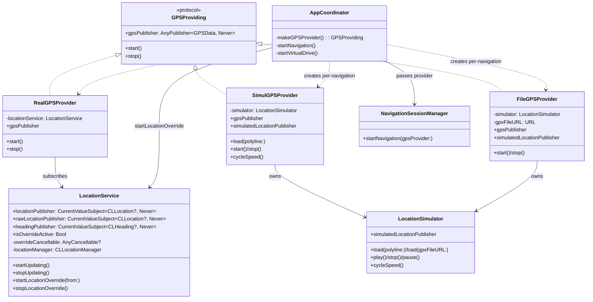
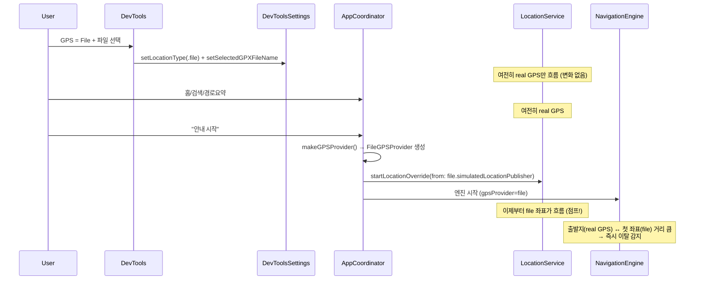
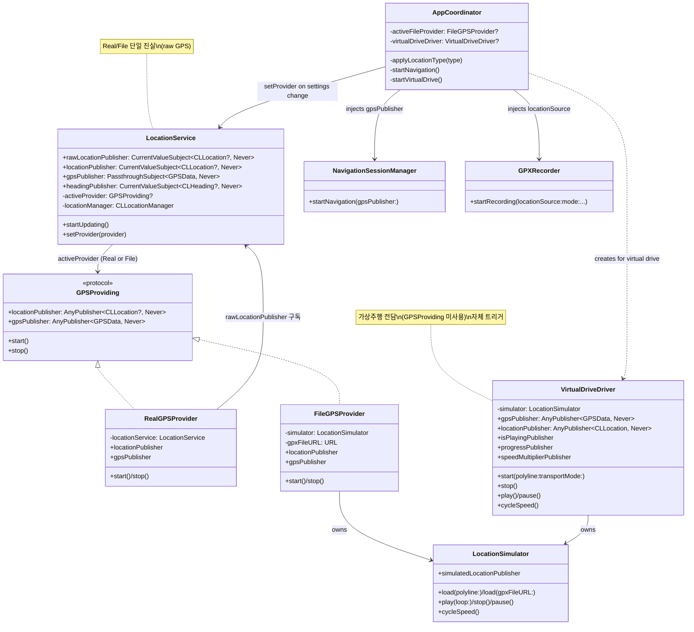
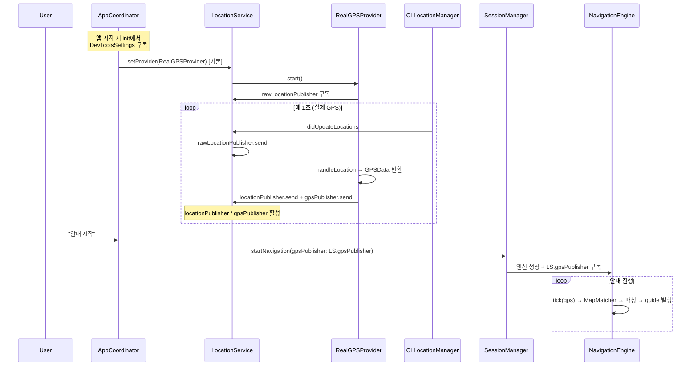
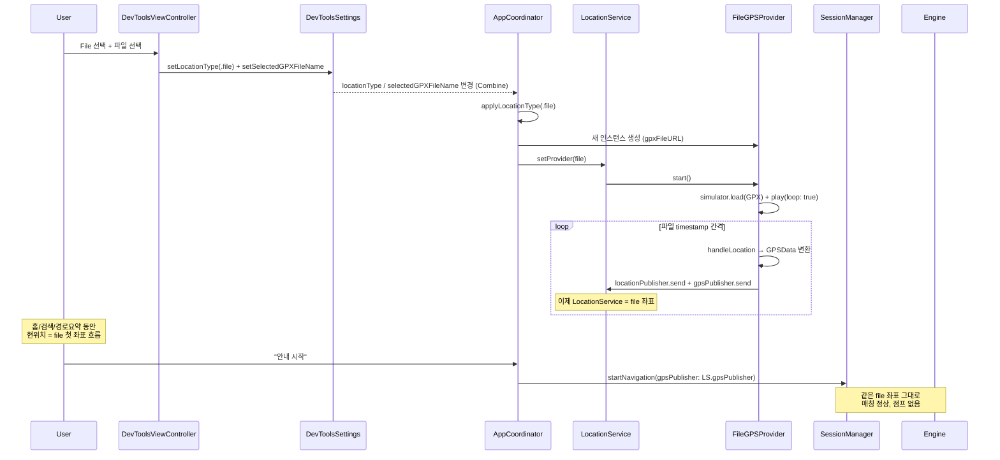
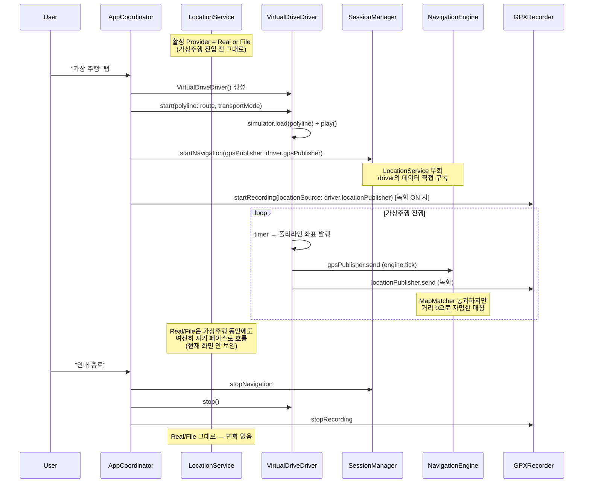
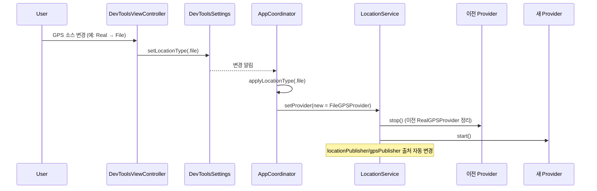

# LocationService 리팩토링 — Real/File/Simul 구조 분리

작성일: 2026-05-01
관련 코드: Step 12-3 후속 작업

---

## 1. 배경 / 문제점

### 1.1 현재 동작의 한계

DevTools에서 GPS 소스를 File로 선택해도, **실제로 file 좌표가 흐르는 시점은 "안내 시작" 버튼을 누른 이후**다. 그 전엔 LocationService에 real GPS만 흐른다.

```
사용자 흐름:
  1. DevTools → File 선택 + 파일 선택 (UserDefaults에 저장만)
  2. 홈 → 검색 → 경로요약  (현위치 = real GPS, 예: Apple Park)
  3. "안내 시작" 탭         (이때 비로소 FileGPSProvider 생성, 좌표 점프)
  4. 즉시 경로 이탈 발생    (출발지 = real GPS 기준이었으니 file 첫 좌표가 다름)
```

→ File 모드의 경로 이탈/매칭 테스트가 무의미해짐.

### 1.2 구조적 문제

| 항목 | 현재 |
|---|---|
| Provider 생성 시점 | 안내 시작 시 `makeGPSProvider()` 안에서 |
| Provider 폐기 시점 | 안내 종료 시 |
| `LocationService.locationPublisher` | Real GPS만 흐름 (override 활성 시 다른 소스) |
| 가상 좌표 주입 메커니즘 | `LocationService.startLocationOverride()` — 임시방편적 패턴 |

→ Real/File/Simul이 모두 "안내 시작 시 생성"되는 같은 lifecycle을 강제 받음. 데이터 의미와 트리거가 다른데도.

### 1.3 데이터 의미 차이

| Provider | 데이터 성격 | 트리거 | 매칭 필요 |
|---|---|---|---|
| **Real** | Raw GPS (도로 밖일 수도) | 외부: iOS CLLocationManager | 필요 (50m + 90°) |
| **File** | Raw GPS 기록 (재생) | 외부: 파일 timestamp | 필요 (실제 주행 데이터라서) |
| **Simul** | 폴리라인 위 좌표 (이미 매칭됨) | 내부: 자체 timer + 알고리즘 | 불필요 (항상 매칭됨) |

→ Real/File은 "raw 데이터", Simul은 "pre-matched 데이터"로 본질적 차이.

---

## 2. 현재 구조

### 2.1 현재 클래스 다이어그램



### 2.2 현재 데이터 흐름 (File 모드 예시)



→ **시점 어긋남** 때문에 즉시 이탈.

---

## 3. 새 구조

### 3.1 핵심 변경

1. **LocationService = Real/File 활성 Provider 보관소**
   - `activeProvider: GPSProviding` 추가
   - `setProvider(_)` 메서드로 전환
   - `override` 메커니즘 제거
2. **VirtualDriveDriver 신규** — 가상주행 전용
   - 자체 트리거 (timer + 폴리라인 알고리즘)
   - 별도 데이터 경로 (LocationService 우회)
   - 속도 조절 API 노출 (cycleSpeed, pause/play)
3. **SimulGPSProvider 제거** — VirtualDriveDriver로 흡수
4. **DevToolsSettings 변화 자동 반영**
   - `AppCoordinator.init`에서 구독
   - File 선택 시 즉시 `LocationService.setProvider`
5. **NavigationSessionManager 인터페이스 변경**
   - `startNavigation(gpsPublisher:)` — 외부에서 publisher 주입
   - 일반 안내: `LocationService.gpsPublisher`
   - 가상주행: `VirtualDriveDriver.gpsPublisher`
6. **GPXRecorder 인터페이스 변경**
   - `startRecording(locationSource:)` — source 외부에서 주입

### 3.2 새 클래스 다이어그램



### 3.3 책임 분리

| 컴포넌트 | 책임 |
|---|---|
| **LocationService** | Real/File 활성 Provider 보관 + raw GPS 데이터 단일 진실. CLLocationManager 보유 (auth, heading, raw GPS). |
| **RealGPSProvider** | `LocationService.rawLocationPublisher` 구독 → 1초 틱 보장 + GPSData 변환 |
| **FileGPSProvider** | LocationSimulator 보유 (file 재생) → loop 무한 반복, GPSData 변환 |
| **VirtualDriveDriver** | LocationSimulator 보유 (폴리라인 시뮬) → 가상주행 전용 lifecycle, 속도 조절 |
| **AppCoordinator** | DevToolsSettings 변화 구독 → `setProvider` 호출. 가상주행 시 driver 생성/주입. |
| **NavigationSessionManager** | gpsPublisher 인자 받아 engine 구동 |
| **GPXRecorder** | locationSource 인자 받아 좌표 녹화 |

---

## 4. 데이터 흐름 (시나리오별)

### 4.1 Real 모드 — 안내 시작



### 4.2 File 모드 — 선택 즉시 흐름 + 안내 시작



### 4.3 가상주행 — 별도 lifecycle



### 4.4 Real ↔ File 전환



---

## 5. 작업 계획

### 5.1 단계별 변경 (각 단계 빌드 가능)

| # | 변경 내용 | 영향 파일 |
|---|---|---|
| 1 | `GPSProviding` 프로토콜에 `locationPublisher` 추가 | GPSProviding.swift |
| 2 | RealGPSProvider, FileGPSProvider에 locationPublisher 노출 | RealGPSProvider.swift, FileGPSProvider.swift |
| 3 | LocationService 리팩토링: rawLocationPublisher 분리 + activeProvider 패턴 + override 제거 | LocationService.swift |
| 4 | RealGPSProvider 데이터 경로 변경 (rawLocationPublisher 구독) | RealGPSProvider.swift |
| 5 | LocationSimulator: `play(loop:)` 추가 + `stop()` 시 위치 유지로 변경 + reset() 추가 | LocationSimulator.swift |
| 6 | VirtualDriveDriver 신규 생성 (속도 조절 API 포함) | VirtualDriveDriver.swift (신규) |
| 7 | SimulGPSProvider 삭제 | SimulGPSProvider.swift (삭제) |
| 8 | NavigationSessionManager: `startNavigation(gpsPublisher:)` 인터페이스 | NavigationSessionManager.swift |
| 9 | GPXRecorder: `startRecording(locationSource:)` 인터페이스 | GPXRecorder.swift |
| 10 | AppCoordinator: DevToolsSettings 구독 + `applyLocationType` + 가상주행 흐름 | AppCoordinator.swift |
| 11 | HomeViewModel.startLocationUpdates 흐름 정리 | HomeViewModel.swift |
| 12 | 빌드 + 단위 테스트 + 시뮬레이터 검증 | - |

### 5.2 검증 시나리오

각 단계 통과 후:

| 시나리오 | 기대 결과 |
|---|---|
| 앱 첫 실행 (Real 기본) | LocationService.locationPublisher = real GPS 흐름 |
| DevTools → File 선택 + 파일 선택 | 즉시 LocationService.locationPublisher = file 좌표 |
| 홈 화면 현위치 | file 첫 좌표 (Real 모드면 실제 GPS) |
| 경로요약 출발지 | 위와 동일 좌표 — 일관성 |
| File 모드 + 안내 시작 | 좌표 점프 없음, 정상 매칭 |
| File 모드 + 녹화 ON + 안내 시작 | 같은 좌표 녹화 (file 복제 효과) |
| Real 모드 + 안내 시작 | 실제 GPS 매칭, 이탈 시 재탐색 |
| Real ↔ File 전환 | 즉시 좌표 소스 변경 |
| **가상주행** (Real 또는 File 모드 진행 중) | LocationService 그대로, 별도 driver로 안내 진행 |
| 가상주행 + 녹화 ON | driver 좌표 녹화 (`simul_xxx.gpx`) |
| 가상주행 종료 | driver 폐기, 안내 종료 |

---

## 6. 영향 / 호환성

### 6.1 영향받는 기능

| 기능 | 영향 |
|---|---|
| 안내 시작 (Real) | 동일 |
| 안내 시작 (File) | **개선** — 좌표 점프 없음 |
| 가상 주행 | 동일하나 별도 코드 경로 |
| GPX 녹화 (Real) | 동일 |
| GPX 녹화 (File) | 거의 복제 — 디버그 용도만 (현재와 동일) |
| GPX 녹화 (가상주행) | driver source로 변경 |
| 디버그 오버레이 | speed/progress publisher 그대로 |

### 6.2 제거되는 코드

- `LocationService.startLocationOverride(from:)`
- `LocationService.stopLocationOverride()`
- `LocationService.isOverrideActive`
- `SimulGPSProvider.swift` (전체 파일)
- `SimulGPSProviderTests.swift` (있다면)
- `AppCoordinator.makeGPSProvider()` (단순화 또는 제거)

### 6.3 추가되는 코드

- `VirtualDriveDriver.swift` (신규)
- `LocationService.activeProvider` + `setProvider`
- `GPSProviding.locationPublisher`
- `AppCoordinator.applyLocationType`

---

## 7. 향후 확장 포인트

| 확장 | 어디에 추가 |
|---|---|
| 가상주행 속도 조절 UI | NavigationViewController + `driver.cycleSpeed()` 호출 |
| 가상주행 일시정지/재개 | UI 버튼 + `driver.pause()/play()` |
| 가상주행 진행도 표시 | `driver.progressPublisher` 구독 |
| 가상주행 점프 (예: 70% 위치로) | LocationSimulator.seekTo(progress:) 추가 |
| File 모드에서 일정 거리 이탈 시뮬 | LocationSimulator에 noise 옵션 추가 |
| Engine 분기 (Simul은 MapMatcher 우회) | 추후 Step에서 GPSData에 isPreMatched 플래그 추가 |

---

## 8. 결론

이번 리팩토링으로:

1. **File 모드가 실제 운전 중처럼 동작** — DevTools에서 File 선택 즉시 좌표 흐름
2. **LocationService = raw GPS 단일 진실 (Real/File)**
3. **가상주행 = 자체 트리거 + pre-matched 데이터로 명확히 분리**
4. **override 메커니즘 제거** — 더 직관적
5. **속도 조절 등 가상주행 UX 확장 기반 마련**

문서 검토 후 작업 시작.
