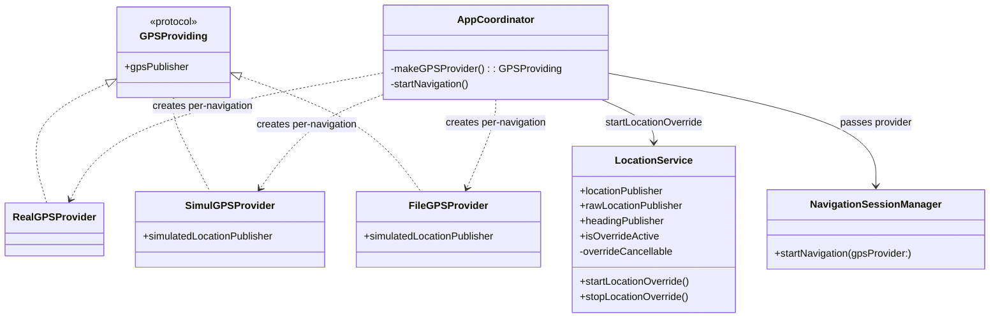
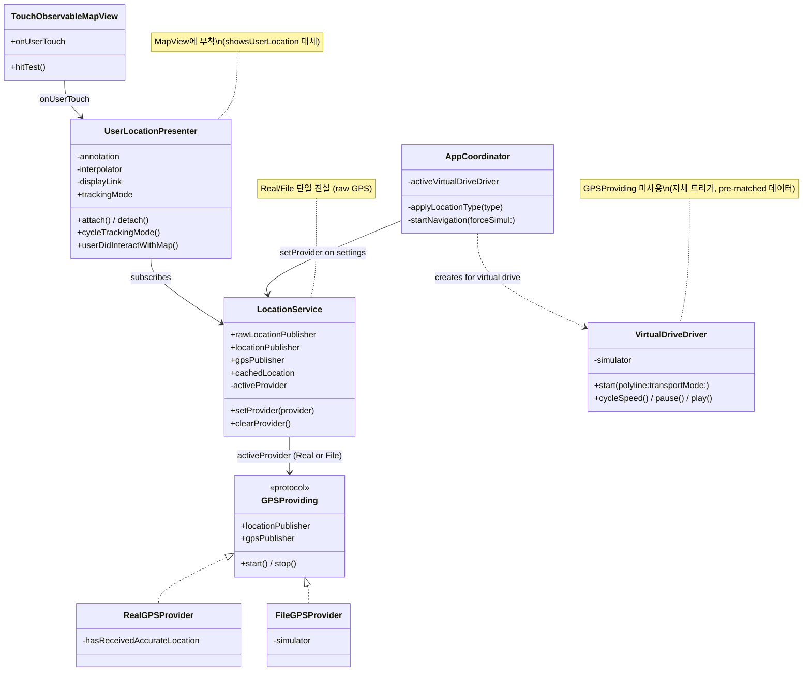
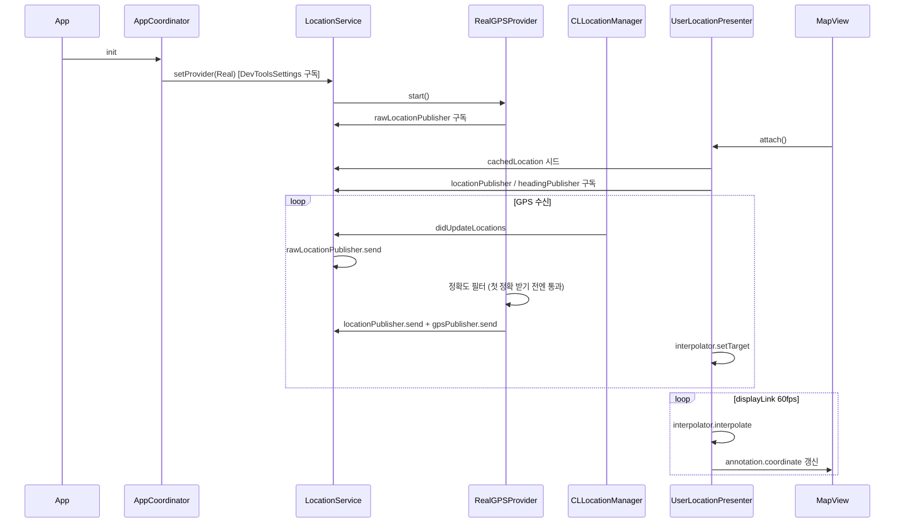
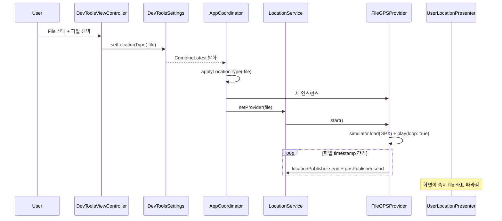
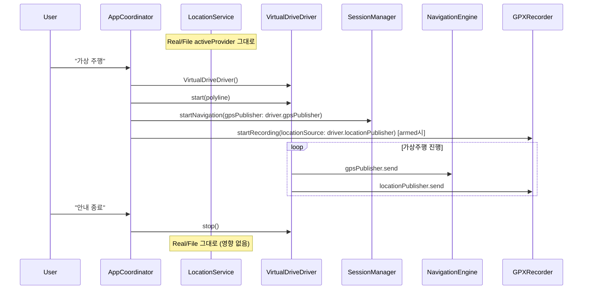
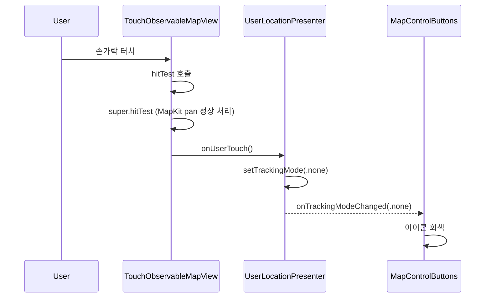
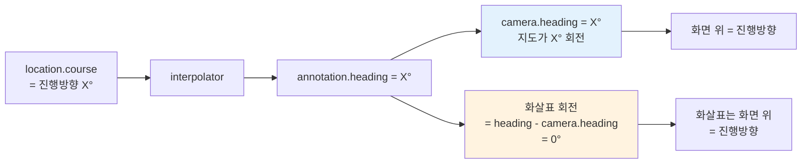

# LocationService 리팩토링 — 완료 보고서

작성일: 2026-05-02
브랜치: `feature/27-locationservice-refactoring`
관련 설계 문서: [01_LocationService_Refactoring.md](01_LocationService_Refactoring.md)

---

## 0. 요약

| 항목 | 결과 |
|---|---|
| 커밋 | 5개 (Phase A/B/C + UserLocationPresenter + dead code) |
| 신규 파일 | 5 (VirtualDriveDriver, TouchObservableMapView, UserLocationAnnotation/View/Presenter) |
| 삭제 파일 | 1 (SimulGPSProvider) |
| 수정 파일 | 14 |
| 코드 변경 | +763 / -247 lines |

---

## 1. 해결한 문제

### 1.1 File 모드 좌표 적용 시점 어긋남

**Before**: DevTools에서 File 선택 → 안내 시작까지는 real GPS만 흐름 → "안내 시작" 시 좌표 점프 → 즉시 경로 이탈
**After**: File 선택 즉시 LocationService에 file 좌표가 흘러 화면/검색/경로요약/안내가 일관된 출발지 사용

### 1.2 LocationService.override 임시방편 메커니즘

**Before**: 가상 좌표 주입을 위한 startLocationOverride/stopLocationOverride/isOverrideActive — 실제 GPS 차단 + 외부 주입 패턴
**After**: `activeProvider` 패턴으로 전환. Provider 자체가 데이터 소스. override 메커니즘 제거

### 1.3 Real/File과 Simul 데이터 의미 혼재

**Before**: Real/File/Simul 모두 GPSProviding으로 동일 처리. 데이터 의미 차이 불분명
**After**: Real/File은 GPSProviding (raw GPS). Simul은 별도 VirtualDriveDriver (pre-matched, 자체 트리거)

### 1.4 MapKit `showsUserLocation`이 LocationService 우회

**Before**: HomeView/CarPlay의 user dot은 시스템 GPS 직결 → File 모드 좌표가 화면에 반영 안 됨
**After**: 자체 UserLocationAnnotation + Presenter로 LocationService.locationPublisher 구독 → 모든 모드 일관

### 1.5 부수 발견 이슈

- 사용자 지도 터치 자동 cancel 미동작 → TouchObservableMapView로 hitTest 감지
- File 모드 heading 0 → GPXParser가 인접 좌표 bearing으로 채움
- followWithHeading 화살표 방향 어긋남 → MKAnnotationView가 지도 회전 안 따라감 → 카메라 heading 보정
- 첫 좌표 (0,0) → 실제 위치 보간 시 중국 통과 → CLLocationManager 캐시 + 플래그
- 실내에서 위치 미표시 → 정확도 100m 필터 차단 → 첫 정확 좌표 전엔 부정확 좌표도 통과

---

## 2. 구조 변경

### 2.1 Before

### 2.2 After

---

## 3. 데이터 흐름

### 3.1 Real 모드 — 앱 시작부터 안내

### 3.2 File 모드 — 즉시 흐름

### 3.3 가상주행 — 별도 lifecycle

### 3.4 사용자 지도 터치 → tracking 자동 해제

### 3.5 followWithHeading 카메라 + 화살표 회전 보정

`MKAnnotationView`가 지도 회전을 따라가지 않으므로 화살표 회전에서 `camera.heading`을 빼야 화면상 진행방향을 가리킴.

---

## 4. 책임 분리

| 컴포넌트 | 책임 |
|---|---|
| **LocationService** | Real/File `activeProvider` 보관 + raw GPS 단일 진실. CLLocationManager 보유 (auth, heading) |
| **RealGPSProvider** | `rawLocationPublisher` 구독 → GPSData 변환 + 정확도 fallback (첫 정확 좌표 전엔 부정확도 통과) |
| **FileGPSProvider** | LocationSimulator (file 재생, loop 무한 반복) |
| **VirtualDriveDriver** | LocationSimulator (폴리라인 시뮬) — 가상주행 전용 lifecycle, 속도 조절 |
| **UserLocationPresenter** | MKMapView 부착. annotation + 60fps 보간 + tracking mode (none/follow/followWithHeading) |
| **TouchObservableMapView** | hitTest로 사용자 터치 감지 (MapKit 동작 유지) |
| **AppCoordinator** | DevToolsSettings 구독 → setProvider 자동. 가상주행 시 driver 직접 주입 |
| **NavigationSessionManager** | gpsPublisher 인자 받아 engine 구동 |
| **GPXRecorder** | locationSource 인자 받아 좌표 녹화 |

---

## 5. 커밋 히스토리

| Commit | 내용 |
|---|---|
| **0a97a23** | refactor(location): Phase A — Provider 인터페이스 + LocationService activeProvider 패턴 |
| **8fba015** | feat(virtualdrive): Phase B — VirtualDriveDriver 신규 + LocationSimulator loop 옵션 |
| **2af3a19** | refactor: Phase C — 사용처 마이그레이션 + override 메커니즘 제거 |
| **cf97c30** | feat(map): UserLocationPresenter — MapView를 LocationService에 통일 |
| **636b96c** | chore: dead code 제거 — 미사용 simulationCancellables |

---

## 6. 신규/제거 파일

### 신규
- `Navigation/Map/TouchObservableMapView.swift`
- `Navigation/Map/UserLocation/UserLocationAnnotation.swift`
- `Navigation/Map/UserLocation/UserLocationAnnotationView.swift`
- `Navigation/Map/UserLocation/UserLocationPresenter.swift`
- `Navigation/Service/VirtualDrive/VirtualDriveDriver.swift`

### 제거
- `Navigation/GPS/SimulGPSProvider.swift` (VirtualDriveDriver로 흡수)

### 제거된 LocationService API
- `startLocationOverride(from:)`
- `stopLocationOverride()`
- `isOverrideActive`
- `overrideCancellable`

### 추가된 LocationService API
- `cachedLocation` (CLLocationManager 마지막 캐시)
- `gpsPublisher` (activeProvider 출력 forwarding)
- `setProvider(_)` / `clearProvider()`
- `activeProvider` (private(set))

---

## 7. 검증 결과 (시뮬레이터 + 실기기)

| 시나리오 | 결과 |
|---|---|
| 앱 첫 실행 (Real) | LocationService.locationPublisher = real GPS |
| DevTools → File 선택 즉시 | file 좌표 흐름 — 화면/검색/경로요약 모두 반영 |
| File 모드 + 안내 시작 | 좌표 점프 없음, 정상 매칭 |
| Real ↔ File 전환 | 즉시 좌표 소스 변경 |
| 가상주행 + 녹화 ON | driver 좌표 녹화 (`simul_xxx.gpx`) |
| 사용자 지도 터치 | tracking 자동 해제 + 지도 정상 panning |
| followWithHeading 화살표 | 진행방향 시각화 정상 |
| File 모드 followWithHeading | GPXParser course 계산으로 정상 회전 |
| 실내 (정확도 1414m) | 위치 표시됨 (첫 정확 좌표 전 fallback) |
| 첫 GPS 도착 (캐시 없음 케이스) | (0,0) 보간 회피 |

---

## 8. 향후 확장 포인트

| 확장 | 위치 |
|---|---|
| 가상주행 속도 조절 UI | NavigationViewController + `driver.cycleSpeed()` |
| 가상주행 일시정지/재개 UI | UI 버튼 + `driver.pause()/play()` |
| 가상주행 진행도 표시 | `driver.progressPublisher` 구독 |
| 가상주행 점프 (예: 70%로) | LocationSimulator.seekTo(progress:) 추가 |
| File 모드 이탈 시뮬 (테스트용) | LocationSimulator noise 옵션 |
| Engine 분기 (Simul은 MapMatcher 우회) | GPSData에 isPreMatched 플래그 |
| Apple Maps 스타일 cone 표시 | UserLocationAnnotationView 확장 |
| 7초 자동 복귀 (TMAP 패턴) | 안내 화면 한정으로 NavigationViewController에 추가 |

---

## 9. 결론

- **File 모드 = 실제 운전처럼 동작** (DevTools 선택 즉시 좌표 흐름)
- **LocationService = raw GPS 단일 진실** (Real/File)
- **가상주행 = 별도 lifecycle + pre-matched 데이터로 분리**
- **모든 MapView가 LocationService 통일** (UserLocationPresenter 패턴)
- **MapKit 직접 사용 회피** — TouchObservableMapView로 사용자 터치 명시 감지
- **정확도/캐시/heading 보정 등 다수 부수 이슈 동시 해결**
