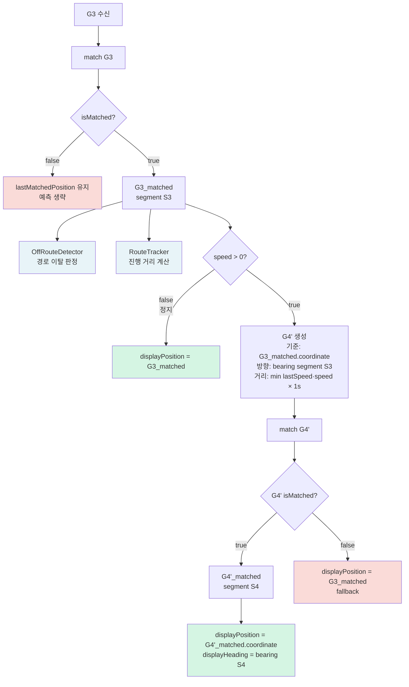
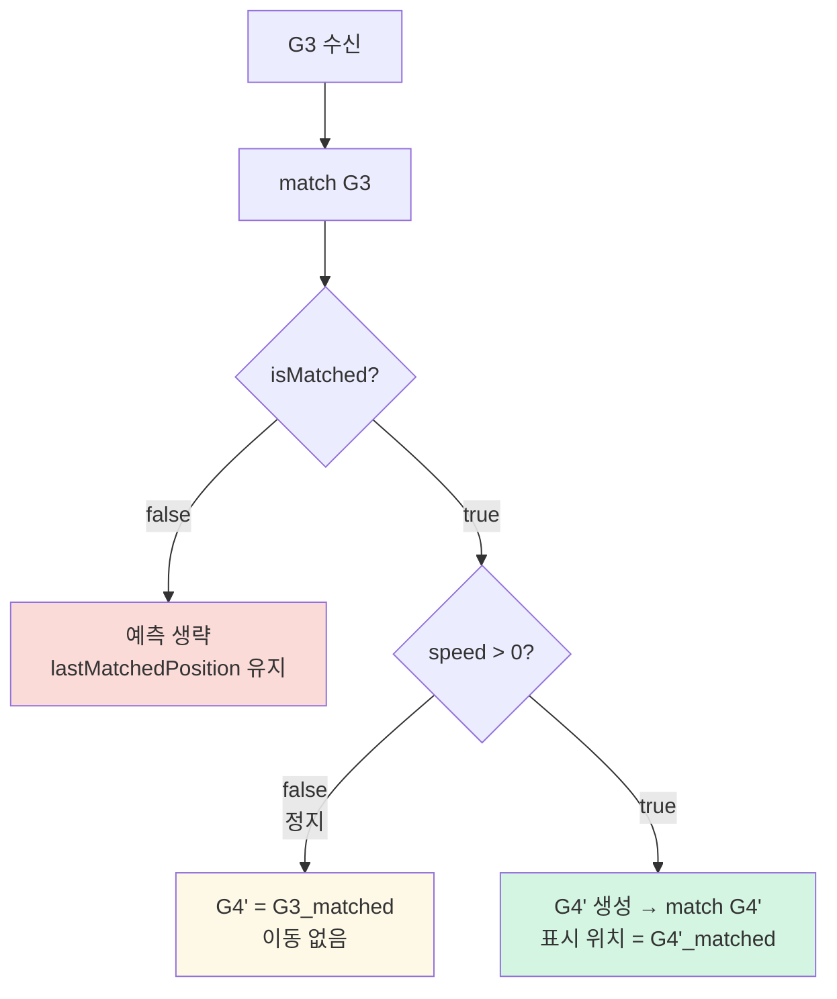

# 표시 위치 1초 예측 개선

## 1. 문제

### 현재 구조 — 1초 지연

GPS G3가 수신되는 시점에 `LocationInterpolator`의 `previous`는 G2 위치, `target`은 G3 위치로 설정된다.
이후 1초 동안 G2 → G3를 보간하므로, **아이콘은 항상 1 GPS 사이클(1초) 뒤처진다.**

```
 GPS:   🛰G1        🛰G2        🛰G3        🛰G4
         │           │           │           │
 시간: ──┼───────────┼───────────┼───────────┼──▶
        T-2         T-1         T          T+1

 아이콘이 G3에 도달하는 시점:
         │           │           │           │
         ▼           ▼           ▼           ▼
 아이콘: G1─────────▶G2─────────▶G3─────────▶G4
                                 ↑
                           T+1에 도달 (1초 지연)
```

T 시점 도로 위 상황 (60 km/h):

```
 도로  ──────────────[🚗]──────────────[🚙]──────────▶
                    아이콘              차량
                    (G2)      17m      (G3)
                         ◀────────▶
                           1초 지연
```

| 속도 | 시각적 지연 |
|------|-----------|
| 30 km/h | 8m |
| 60 km/h | 17m |
| 100 km/h | 28m |

---

### 갈림길 문제

G3 수신 후 G2 → G3 직선 보간 시, 차량은 이미 Road A로 진입했지만 아이콘이 1~2초간 엉뚱한 위치를 지난다.

```
 도로  ──────[G2]──────◇ ──────────────[G3]──▶  Road A
                       │╲
                       │ ╲ (아이콘 보간 경로 — 직선)
                       │  ╲
                       │   ╲ ← 갈림길 대각 통과
                       ▼
                       ──────────────────────▶  Road B
```

---

## 2. 개선 방안: 1초 예측 위치를 표시에 사용

G3 수신 시 표시용 위치로 G3_matched(현재)가 아닌 **G4'_matched(1초 후 예측)**를 사용한다.

```
 GPS:   🛰G1        🛰G2        🛰G3        🛰G4
         │           │           │           │
 시간: ──┼───────────┼───────────┼───────────┼──▶
        T-2         T-1         T          T+1

 아이콘 target이 항상 1초 앞 예측으로 설정됨:
         │           │           │
         ▼           ▼           ▼
 target: G2'        G3'         G4'
 아이콘: G1─────────▶G2─────────▶G3─────────▶G4'
```

T~T+1 구간 도로 위 상황 (60 km/h):

```
 T 시점:
 도로  ──────────────[🚗]──────────────[🚙]────────▶
                    아이콘(G2)  17m     차량(G3)

 T+0.5 시점:
 도로  ─────────────────────────[🚗][🚙]────────────▶
                                아이콘 ≈ 차량  ✅

 T+1 시점:
 도로  ──────────────────────────────[🚗🚙]──────────▶
                                    아이콘 ≈ 차량(G4)  ✅
```

---

## 3. G4' 생성 및 매칭 흐름



### 포인트

- **G4' 좌표**: 경로 위가 아닌 **좌표 공간상 예측값**. `match(G4')`로 폴리라인 위에 스냅됨
- **방향**: raw GPS course 대신 G3_matched의 세그먼트 bearing 사용. GPS course는 저속·터널 복귀 시 불안정하지만 세그먼트 방향은 안정적
- **경로 이탈 판정·라우팅**: G3 실제 매칭 결과 그대로. G4'_matched는 표시 전용

---

## 4. 거리 계산: min(lastSpeed, currentSpeed) × 1s

`G3.speed × 1s`는 다음 1초도 현재 속도가 유지된다고 가정한다. 속도 급변 시 오차가 발생한다.

```
 [감속 — 신호등 앞]

 도로  ──────────[G3]──────[정지선]──────────────▶
                  │                ↑ 실제 멈추는 곳
                  └────────────────────────[G4']
                            G3.speed 기준 예측 → 오버슈트!

 [min(lastSpeed, speed) 적용]

 도로  ──────────[G3]──[G4']─────────────────────▶
                  │     ↑ 보수적 예측 → 오버슈트 없음 ✅
```

| 상황 | lastSpeed | currentSpeed | 예측거리 | 효과 |
|------|---------|-------------|--------|------|
| 등속 60 | 16.7 m/s | 16.7 m/s | 16.7m | 정확 |
| 감속 60→0 | 16.7 m/s | 0 m/s | 0m | 오버슈트 없음 ✅ |
| 감속 60→30 | 16.7 m/s | 8.3 m/s | 8.3m | 오버슈트 완화 ✅ |
| 가속 0→60 | 0 m/s | 16.7 m/s | 0m | lag 있지만 안전 |

---

## 5. 가드 조건



---

## 6. 변경 범위

| 파일 | 변경 내용 |
|------|---------|
| `NavigationEngine` | `lastSpeed` 저장, G4' 생성 및 `mapMatcher.match(G4')` 호출 |
| `MapMatcher` | 변경 없음 (기존 match 재사용) |
| `MatchResult` | 변경 없음 |
| `LocationInterpolator` | 변경 없음 |
| `NavigationGuide` | 변경 없음 |

**NavigationEngine.resolveMatchedState 변경 핵심:**

```swift
if matchResult.isMatched {
    lastMatchedPosition = matchResult.coordinate

    let predictSpeed = min(lastSpeed, location.safeSpeed)
    lastSpeed = location.safeSpeed

    let displayResult: MatchResult
    if predictSpeed > 0 {
        let segmentBearing = bearingAtSegment(matchResult.segmentIndex)
        let g4prime = matchResult.coordinate.moved(
            distance: predictSpeed * 1.0,
            bearing: segmentBearing
        )
        let g4primeLocation = CLLocation(latitude: g4prime.latitude, longitude: g4prime.longitude)
        let g4primeMatch = mapMatcher.match(g4primeLocation)
        displayResult = g4primeMatch.isMatched ? g4primeMatch : matchResult
    } else {
        displayResult = matchResult
    }

    return MatchedState(
        position: displayResult.coordinate,
        heading: bearingAtSegment(displayResult.segmentIndex),
        isMatched: true,
        isOffRoute: isOffRoute
    )
}
// isMatched == false → lastMatchedPosition 유지, 예측 없음
```

- `MatchResult.coordinate` (G3 실제): `OffRouteDetector`, `RouteTracker` 영향 없음
- `MatchedState.position` (G4'_matched): 화면 표시, `NavigationGuide.matchedPosition` 전달

---

## 7. 남는 한계: 직선 보간

`LocationInterpolator`의 표시 경로는 직선이므로 코너에서 shortcut이 발생한다.

```
 [현재 방식] — shortcut이 코너 통과 이후 발생

 도로  ──[G2]──────◇──[G3]──────────────────────▶
                   │    ↑ G3 수신 시 G2→G3 직선 보간
         G2 ───────────▶ G3  (코너를 가로지름 ❌)


 [예측 방식] — shortcut이 코너 도달 이전 발생

 도로  ──[G2]──────◇──[G3]──[G4']───────────────▶
                   │           ↑ G2 수신 시 G2→G4' 직선 보간
         G2 ───────────────────▶ G4'  (코너를 가로지름 ❌)
                                 단, 진행 방향으로 앞서므로 덜 어색
```

| | 현재 방식 | 예측 방식 |
|--|---------|---------|
| shortcut 발생 시점 | 코너 통과 **이후** | 코너 도달 **이전** |
| 시각적 느낌 | 진행 방향 반대로 보임 (어색) | 진행 방향으로 앞서 보임 (덜 어색) |

근본 해결은 `LocationInterpolator`에 폴리라인을 전달해 도로를 따라 이동하는 것이나, 구조 변경이 수반되므로 이후 단계로 분리한다.

---

## 8. 구현 상세

### 8-1. CLLocationCoordinate2D+Geometry.swift

`moved(distance:bearing:)` 추가.
bearing(도) + distance(m) → 새 좌표. haversine 역산 공식 사용.

### 8-2. NavigationEngine.swift

**프로퍼티 추가:**
- `lastSpeed: CLLocationSpeed = 0` — 직전 GPS 속도 저장

**`resolveMatchedState` 수정:**
- `matchResult.isMatched == true` 분기에서 G4' 생성 및 `mapMatcher.match(G4')` 호출
- `predictSpeed = min(lastSpeed, location.safeSpeed)` 로 예측거리 계산
- G4' match 성공 시 → `displayPosition = G4'_matched`
- G4' match 실패 시 → fallback: `displayPosition = G3_matched`
- `lastSpeed` 갱신

**`applyNewRoute` 수정:**
- 재탐색 후 `lastSpeed = 0` 리셋 — 새 경로 첫 틱 과도한 예측 방지

---

## 9. 정차 중 차량 아이콘 회색 문제

### 9-1. 증상

신호 대기 등 정차 시 차량 아이콘이 회색으로 전환됨.

### 9-2. 원인 분석

**iPhone GPS 동작**

- `distanceFilter = kCLDistanceFilterNone`, `pausesLocationUpdatesAutomatically = false` 설정으로 정차 중에도 `didUpdateLocations` 콜백은 계속 발생
- 단, 도심 환경에서 GPS signal 불안정 시 `horizontalAccuracy = -1` 인 CLLocation 을 섞어서 전달함
- `accuracy = -1` 의 의미: "새 GPS fix는 못잡았지만, **좌표는 마지막 위치 그대로**"

**현재 앱 문제**

`RealGPSProvider.swift` 에서 `accuracy >= 0` 필터 적용:

```
iPhone accuracy=-1 → filter 차단 → lastGPSReceivedTime 리셋 안 됨
                                  → 1.1초 후 합성 invalid(accuracy=-1) 발행
                                  → isValidForDisplay = false
                                  → isMatched = false → 아이콘 회색
```

**TMAP 비교 (`RealGPSProvider.m`)**

TMAP은 `didUpdateLocations` 에서 accuracy 필터 없이 모든 업데이트로 타이머를 리셋:

```objc
self.gpsUpdateDate = [NSDate date];   // accuracy 관계없이 무조건 리셋
self.invalidGPSGenerateDate = nil;
```

TMAP `isValid` 기준: `horizontalAccuracy > 200`
- `accuracy = -1` → `-1 < 200` → **valid** (아이콘 정상 유지)
- `accuracy = 500` (합성) → `500 > 200` → **invalid** (아이콘 약화)

### 9-3. 수정 방향

**① `RealGPSProvider.swift` — 타이머 리셋 로직 수정**

iPhone `accuracy=-1` 도 타이머 리셋에 포함. 발행은 하지 않음.

```swift
// 변경 전
locationService.rawLocationPublisher
    .filter { $0.isValidForDisplay }
    .sink { self?.handleLocationUpdate(location) }

// 변경 후
locationService.rawLocationPublisher
    .sink { [weak self] location in
        guard let self else { return }
        lastGPSReceivedTime = Date()             // accuracy 무관 타이머 리셋
        if location.isValidForDisplay {
            handleLocationUpdate(location)       // valid만 엔진에 전달
        }
    }
```

**② `RealGPSProvider.swift` — 합성 invalid accuracy 변경**

```swift
// 변경 전
horizontalAccuracy: -1   // iPhone invalid 와 동일 → 구분 불가

// 변경 후
horizontalAccuracy: 300  // 앱 합성 GPS 손실 전용 sentinel 값
```

**③ `CLLocation+Navigation.swift` — isValidForDisplay 기준 변경**

TMAP 방식(`> 200`)에 맞춰 변경:

```swift
// 변경 전
var isValidForDisplay: Bool { horizontalAccuracy >= 0 }

// 변경 후
var isValidForDisplay: Bool { horizontalAccuracy <= 200 }
```

이로써:
- `accuracy = -1` (iPhone) → `-1 <= 200` → **valid** → 아이콘 정상
- `accuracy = 300` (앱 합성) → `300 > 200` → **invalid** → 아이콘 회색
- `accuracy = 5~50` (정상 GPS) → valid → 정상

**변경 파일 요약**

| 파일 | 변경 내용 |
|------|---------|
| `RealGPSProvider.swift` | 타이머 리셋 로직 + 합성 accuracy `-1` → `300` |
| `CLLocation+Navigation.swift` | `isValidForDisplay` 기준 `>= 0` → `<= 200` |

> `isValidForNavigation` (`accuracy >= 0 && accuracy <= 100`) 은 변경 없음.  
> `accuracy = -1` 은 맵매칭에는 여전히 사용되지 않음.

---

## 10. 검증 항목

### 9-1. 정상 주행 (등속)
- G4'_matched가 G3_matched보다 `speed × 1s` 만큼 앞에 위치하는지
- displayHeading이 G4'_matched 세그먼트 bearing과 일치하는지
- 실제 주행 시 T+0.5초에 아이콘이 현위치 근처에 있는지 (시각 확인)

### 9-2. 정지 (speed = 0)
- `predictSpeed == 0` → G4' 생성 없이 G3_matched 그대로 사용
- 아이콘이 앞으로 튀지 않고 멈추는지 (시각 확인)

### 9-3. 감속 (신호등 앞)
- `min(lastSpeed, speed)` 적용으로 예측거리가 줄어드는지
- 정지선을 넘어 오버슈트하지 않는지 (시각 확인)

### 9-4. 가속 (출발)
- 출발 직후 `lastSpeed=0` → `predictSpeed=0` → 예측 없음
- 2~3틱 이후 속도 올라가면서 예측 정상 재개되는지

### 9-5. isMatched == false
- G4' 생성 없이 `lastMatchedPosition` 유지되는지
- `OffRouteDetector`가 G3 실제 결과 기반으로 정상 감지하는지

### 9-6. 재탐색 후
- `lastSpeed = 0` 리셋으로 첫 틱 예측 없음
- 2~3틱 이후 새 경로에서 G4' 예측 정상 동작하는지

### 9-7. G4' match 실패 (fallback)
- G4'가 경로에서 벗어난 경우 displayPosition이 G3_matched로 fallback되는지
- 아이콘이 튀지 않는지 (시각 확인)
