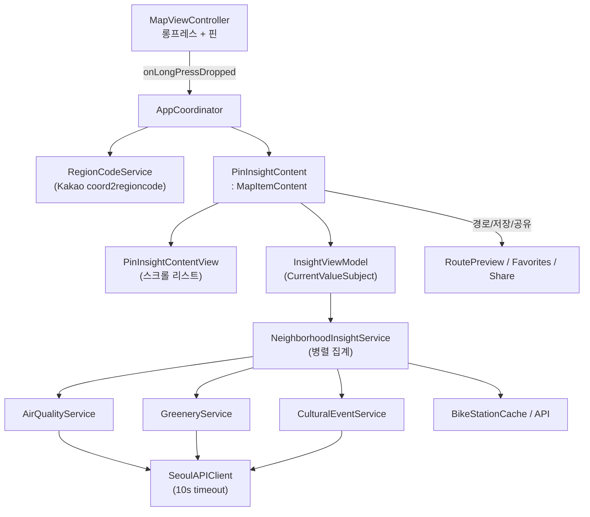
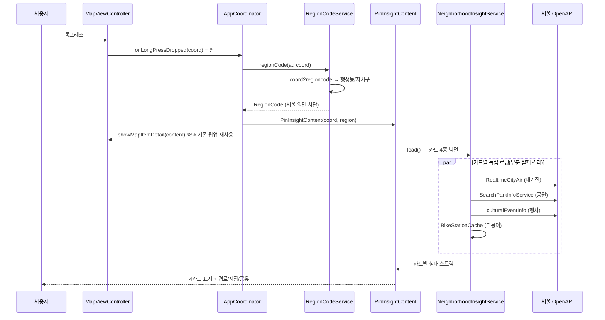
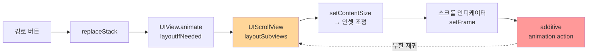

# 핀 기반 동네 인사이트 — 개발 완료 보고서

| 항목 | 내용 |
|---|---|
| 기능 | 핀 기반 동네 인사이트 (Pin Neighborhood Insight) |
| 브랜치 | `003-pin-insight` (main 대비 8 커밋) |
| 상태 | ✅ 라이브 4카드 + 경로·저장·공유 + 캐싱 + 안정성 **완료** / 정적데이터 3카드·요약·테스트 제외 |
| 작성일 | 2026-06-21 |
| 검증 | 시뮬레이터(iPhone 17 Pro) 로그 기반 |

---

## 1. 개요

지도를 **롱프레스**하면 그 위치의 동네 생활정보를 **기존 POI 상세 팝업**에 카드로 보여준다. 거대 지도앱이 "상호·리뷰"만 주는 자리에서 "이 동네는 어떤 곳인가"를 서울 공공데이터로 종합해 주는 것이 차별점.

- **핵심 전제**: 점(좌표) → 행정동 매핑(Kakao `coord2regioncode`) + 반경/구역 질의 → 행정구역 경계 일괄 전처리 불필요(가벼움)
- **신규 화면 0개**: `MapItemContent` 프로토콜에 `PinInsightContent`를 추가해 기존 `MapItemDetailViewController` 재사용 (따릉이·버스 상세와 동일 패턴)

---

## 2. 구현 범위

### ✅ 완료
| 영역 | 내용 |
|---|---|
| 카드 4종 | 🌫 대기질 · 🚲 따릉이 · 🌳 공원 · ✨ 지금 행사 |
| 액션 | 경로(RoutePreview 연결) · 관심 동네 저장(Favorites) · 공유 |
| 성능 | TTL 캐싱(대기질 10분 · 공원 1일 · 행사 1시간), 따릉이 캐시 재사용 |
| UX | 평평한 리스트 통일 · 스크롤 · 빈 지도 터치 시 핀 정리 · 디자인 토큰 |
| 안정성 | 경로 버튼 freeze 수정 + 10초 API 타임아웃 |

### ❌ 제외 (의도적)
| 항목 | 사유 |
|---|---|
| 🏥 편의 · 🛡 안전 · 🚶 활기 카드 | 서울 라이브 OpenAPI 없음(파일전용/종료/코드불일치) → 정적데이터 작업 필요로 **드롭** |
| 한 줄 요약 · 단위 테스트 | 후속 |

---

## 3. 아키텍처



- 기존 POI 팝업(`MapItemDetailViewController`) + 드로어(`DrawerContainerManager`) + 경로 미리보기 흐름 **전부 재사용**
- 패턴: UIKit programmatic + MVVM + Coordinator + Combine(`CurrentValueSubject`)

---

## 4. 동작 흐름



---

## 5. 데이터 소스 (서울 공공데이터, API 검증 완료)

| 카드 | 서비스 | 단위/좌표 | 캐시 |
|---|---|---|---|
| 대기질 | `RealtimeCityAir` (OA-1200) | 자치구 (CAI_GRD/CAI_IDX/MSRSTN_NM) | 10분 |
| 따릉이 | `bikeList` (OA-15493) | 반경(좌표) — 기존 `BikeStationCache` 재사용 | 세션 |
| 공원 | `SearchParkInfoService` | 최근접(PARK_NM, XCRD/YCRD) | 1일 |
| 행사 | `culturalEventInfo` (OA-15486) | 반경(TITLE/LAT/LOT) | 1시간 |
| 동네 식별 | Kakao `coord2regioncode` | 좌표→행정동/자치구 | — |

> 라이선스: 공공누리 1유형(상업 이용 가능). 둘레길·방범CCTV(4유형)·소음(S-DoT 좌표 비공개)은 미사용.

---

## 6. 주요 기술 결정 · 트러블슈팅

### 6.1 서울 API 필드명 동적 디코딩
서울 OpenAPI는 데이터셋마다 필드명이 제각각 → 각 행을 **키-값 사전(`DynamicCodingKey`)** 으로 디코딩하고, `[Insight] keys=[...]` 로깅으로 실제 필드명을 확인한 뒤 후보 키로 매핑. (대기질 `CAI_GRD`, 공원 `PARK_NM` 등 실측으로 확정)

### 6.2 좌표 LAT↔LOT 뒤바뀜
문화행사 API는 `LAT`에 경도, `LOT`에 위도가 들어오는 함정이 있음 → 이름을 믿지 않고 **값 범위로 위도(33~39)·경도(124~132)를 판별**(`resolveSeoulCoord`).

### 6.3 캐싱
정적/준정적 데이터는 위치 무관 fetch를 **TTL 캐시**(static)에 보관 후 위치별 계산만 재수행 → 반복 탭이 네트워크 없이 즉시.

### 6.4 ⭐ 경로 버튼 메인 스레드 freeze (핵심 버그)

**증상**: 인사이트 팝업에서 경로 버튼 → 앱 영구 멈춤.

**진단**: 단계 로그(하트비트·`[Route]`·`[Drawer]`)로 `drawerManager` 애니메이션의 `layoutIfNeeded`까지 좁히고, 일시정지 콜스택으로 확정.



**원인**: `PinInsightContentView`의 **UIScrollView**가 드로어 교체 애니메이션(`UIView.animate` 내 `layoutIfNeeded`) 중에 스크롤 인디케이터/인셋을 재계산 → `setFrame`이 또 애니메이션 액션을 만들어 **무한 재귀** → 메인 스레드 영구 블록. (다른 카드들은 스크롤뷰가 없어 무사)

**수정**: 재귀 경로 차단
```swift
scrollView.showsVerticalScrollIndicator = false
scrollView.contentInsetAdjustmentBehavior = .never
```

### 6.5 10초 API 타임아웃
서버 무응답 시 기본 60초 매달림 → `URLRequest.timeoutInterval = 10`으로 단축, 카드가 "정보 없음"으로 빠르게 떨어지게(graceful).

---

## 7. 커밋 이력

| 커밋 | 내용 |
|---|---|
| `ff55aa6` | 슬라이스1 — 롱프레스 → 동네명 + 대기질 카드 |
| `f69f22a` | chore — specs/ 추적 해제(로컬 전용) |
| `bbb27dd` | 슬라이스2 — 따릉이(교통) + 문화행사(지금) |
| `0e72eff` | 슬라이스3 — 공원(녹지) |
| `e92720e` | US2·US3 — 경로·저장·공유 |
| `82ad24a` | 캐싱(TTL) |
| `34c8796` | UX — 평평한 리스트·스크롤·핀 정리 |
| `cc0c5d1` | 버그 — 경로 freeze 수정 + 10초 타임아웃 |

---

## 8. 알려진 제약 · 후속

- ⚠️ **서버 의존**: 카드 데이터는 `openapi.seoul.go.kr:8088` 응답이 있어야 표시됨. 이 서버는 간헐적 불안정(평문 HTTP·비표준 포트). 코드와 무관.
- 개발용 `print` 로그(`[Insight]`/`[SeoulAPI]`/`[Bike]`) 잔존 → 정식 출시 전 정리 권장.
- 후속 후보: 한 줄 요약(FR-002), 단위 테스트, (정책 정해지면) 정적데이터 3카드.

---

## 9. 검증 (로그 기반)

```
[Insight] 1. longPress at 37.55…,126.83…
[Insight] 3. region = 강서구 발산1동
[Insight] card airQuality → loaded: 보통 (51)
[Insight] card transit → loaded: 따릉이 28대 대여 가능 (164m)
[Insight] card greenery → loaded: 서울식물원
[Insight] card events → loaded: 행사 1건
```
- 다지역 검증(강서·동작), 반복 탭 캐시 히트, 경로 버튼 freeze 해소(콜스택의 `AT3 → AT4` 정상 진행) 확인.
</content>
