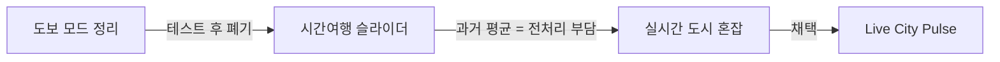
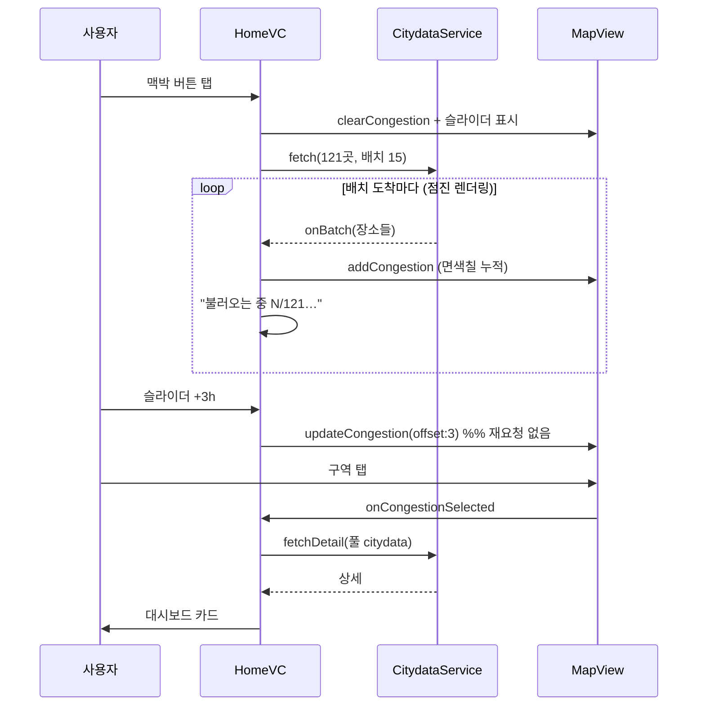
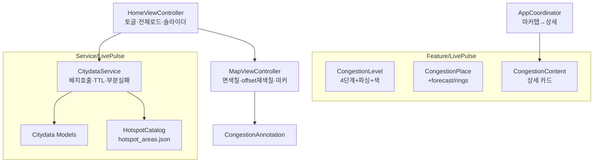

# 실시간 도시 혼잡 지도 (Live City Pulse) — 개발 완료

**브랜치**: `004-live-congestion` → `main`
**성격**: 신규 기능 (홈 지도 위 "실시간 혼잡" 모드)

---

## 1. 개요

서울 **실시간 도시데이터(citydata)** 로 주요 **121개 장소**의 **실시간 혼잡도 + 향후 12시간 예측**을 지도에 **면(구역) 색칠**로 표시한다. 슬라이더로 "지금 → +12시간"을 훑고, 구역을 탭하면 인구·연령·날씨 등 **라이브 대시보드 카드**가 나온다.

- **전처리·자체 예측 모델 없음** — 공공데이터가 혼잡단계·예측을 직접 제공, 앱은 받아서 표시.
- 핀 인사이트가 "점(핀) 정보"라면, 이건 **도시 전체의 실시간 맥동(면)**.

## 2. 배경 — 컨셉 변천



"촘촘한 통계(전처리 필요)" vs "실시간(성김)"의 트레이드오프 끝에, **전처리 0 · 라이브 + 예측**을 살리는 방향으로 확정.

## 3. 주요 기능

| 스토리 | 내용 |
|---|---|
| **US1** 실시간 혼잡 | 홈 전용 버튼 → 121구역 **면 색칠**(🔴붐빔 🟠약간 🟡보통 🟢여유) + 중심 마커 |
| **US2** 예측 슬라이더 | 상단 슬라이더로 **지금→+12h** 스크럽, 구역 색이 예측으로 즉시 변화(네트워크 0) |
| **US3** 구역 상세 | 마커 탭 → **라이브 대시보드**(인구·성별·연령·상주비율·12h 예측·날씨·미세먼지·UV·주차·따릉이) |
| 부가 | 진입 시 따릉이·버스 레이어 배타 OFF/복원 · 빈 곳 탭 닫힘 · 선택 시 지도 이동 (기존 POI와 일관) |

## 4. 데이터 소스 (전처리 0 · 라이브)

| 용도 | 데이터 | 성격 |
|---|---|---|
| 구역 색(다수) | `citydata_ppltn` — `AREA_CONGEST_LVL` + `FCST_PPLTN`(12h) | 실시간 (~5분) |
| 구역 상세(탭 1곳) | 풀 `citydata`(132KB) — 인구·날씨·대기·주차·따릉이 | 실시간 |
| 구역 경계·좌표 | 서울시 공식 **121장소 영역 Shapefile** → `hotspot_areas.json` | 정적(번들) |

> citydata 응답엔 좌표가 없어, 공식 영역 Shapefile(WGS84)에서 **이름·코드·카테고리·폴리곤·중심**을 추출해 번들에 동봉.

## 5. 동작 흐름



## 6. 화면 구성

```
┌──────────────────────────────┐
│        오후 5시 예측           │  ← 굵은 문구 (지금/예측 시각)
│   ●━━━━━━━━━━━━━━━━━━○         │  ← 슬라이더 (지금→+12h)
│  지금  오후6시  오후10시 오전2시│  ← 시각 눈금 (오전/오후)
└──────────────────────────────┘
        [ 서울 구역 면 색칠 지도 ]
        🔴강남  🟠여의도  🟡홍대 …

   구역 탭 ↓
┌──────────────────────────────┐
│ 강남역            기준 14:30   │
│ 🔴 붐빔  ·  92,000~94,000명    │
│ 성별  남 48% · 여 52%          │
│ 연령  30대 26% · 20대 25%      │
│ 12시간 예측  🔴🔴🟠🟡🟢…      │
│ 날씨  27° · 미세먼지 좋음 · UV↑│
│ 주변  주차장 95곳 · 따릉이 12대│
└──────────────────────────────┘
```

## 7. 구조 / 신규 파일



- 재사용: `SeoulAPIClient`(citydata 동일 호스트), 상세 팝업(`MapItemContent`), 어노테이션·오버레이 렌더러, 드로어, 레이어 토글 패턴.
- 전처리 스크립트(앱 외부): `Navigation/Scripts/build_hotspot_areas.py`(Shapefile 파서, 순수 파이썬).

## 8. 성능 / UX

- 121곳 = 고정 소집합 → **진입 시 전체 로드**(동시 15 배치, ~수초) + **5분 캐시**(재진입 즉시).
- **점진적 렌더링**: 배치 도착마다 지도가 차오름 → 빈 화면 없음.
- 슬라이더 이동은 **이미 받은 예측**을 재색칠 → 네트워크 0, 즉시.
- 서버 정중: 동시성 캡 + TTL 캐시 + 부분 실패 허용(받은 곳만 표시).

## 9. 테스트

- `CongestionLevelTests` — 4단계 파싱(공백·변형·결측→unknown), offset→단계 선택(0=실시간, N=예측[N-1], 초과=중립), 가시영역 필터.
- 회귀: `RouteTrackerTests` 등 기존 내비 테스트 green. 빌드·테스트 통과.

## 10. 한계 / Later

- **커버리지 ~121 거점** — 동네 골목 단위 촘촘함은 아님(citydata 특성). 인지된 트레이드오프.
- Later: 혼잡 색 디자인 토큰(현재 시맨틱 시스템색), 자동 주기 갱신(현재 수동+TTL), `LivePulseViewModel`/드로어로 구조 정식 분리, 상세에 도로소통·문화행사 추가.

## 11. 커밋

```
0502c02 feat: full load + progressive render + clearer slider UI
c91237d fix: detail popup UX parity with other POIs
d83a753 chore: merge polish — layer exclusivity, call cap, log trim
d0b5680 feat: US2 forecast slider (now -> +12h)
5f17e17 feat: official 121 area polygons + rich detail card
d3db86e feat: citydata data backbone
```

🤖 Generated with [Claude Code](https://claude.com/claude-code)
